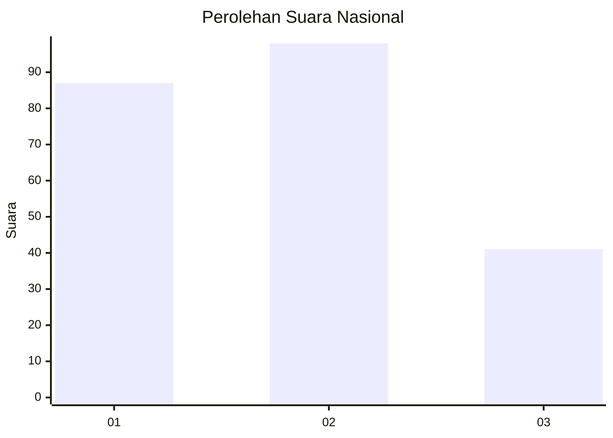
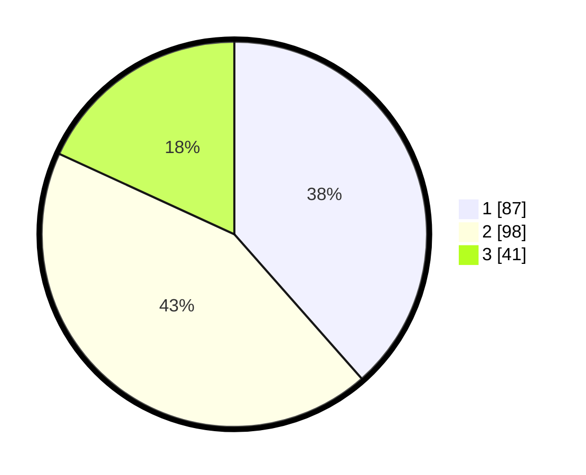

# Hasil

## Grafik

## Tabel

| No.    | Nama Paslon    | Suara | Suara (raw) | Persentase |
|:------ |:-------------- | -----:| -----------:| ----------:|
| 100025 | ANIES MUHAIMIN | 87    | [87][p-1]   | 38,50      |
| 100026 | PRABOWO GIBRAN | 98    | [98][p-2]   | 43,36      |
| 100027 | GANJAR MAHFUD  | 41    | [41][p-3]   | 18,14      |

[p-1]: https://github.com/gigit-pemilu/pemilu-2024/blob/main/pilpres/hitung-suara/sub/31-dki-jakarta/sub/73-jakarta-barat/sub/01-cengkareng/sub/1004-kedaung-kali-angke/sub/036-tps/sub/paslon-1.txt
[p-2]: https://github.com/gigit-pemilu/pemilu-2024/blob/main/pilpres/hitung-suara/sub/31-dki-jakarta/sub/73-jakarta-barat/sub/01-cengkareng/sub/1004-kedaung-kali-angke/sub/036-tps/sub/paslon-2.txt
[p-3]: https://github.com/gigit-pemilu/pemilu-2024/blob/main/pilpres/hitung-suara/sub/31-dki-jakarta/sub/73-jakarta-barat/sub/01-cengkareng/sub/1004-kedaung-kali-angke/sub/036-tps/sub/paslon-3.txt

## Foto C Plano

https://sirekap-obj-formc.kpu.go.id/b581/pemilu/ppwp/31/73/01/10/04/3173011004036-20240214-191803--6726a197-e34e-4987-a377-8d4edd793206.jpg

https://sirekap-obj-formc.kpu.go.id/b581/pemilu/ppwp/31/73/01/10/04/3173011004036-20240214-192856--d774fe76-4860-4418-a285-dc0850ae9391.jpg

https://sirekap-obj-formc.kpu.go.id/b581/pemilu/ppwp/31/73/01/10/04/3173011004036-20240214-203647--a1279c54-e754-41e2-9c01-4f04ae225f9e.jpg

## Metadata

| Key        | Value               |
| ---------- | ------------------- |
| Time Stamp | 2024-02-14 21:46:01 |

