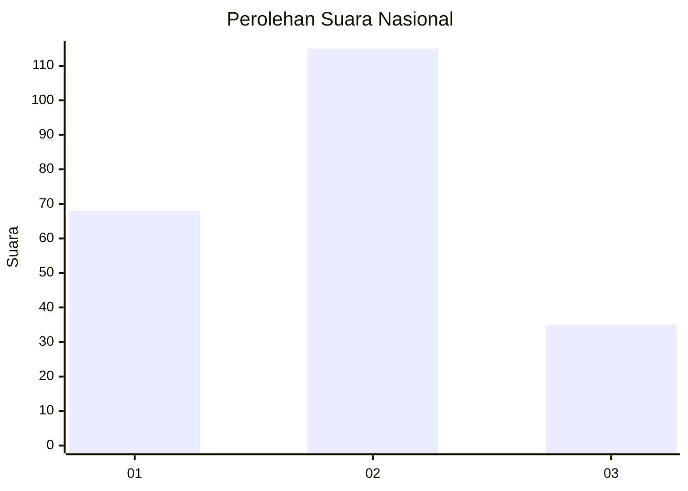
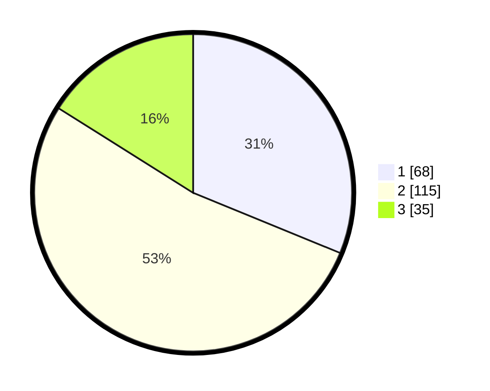

# Hasil

## Grafik

## Tabel

| No.    | Nama Paslon    | Suara | Suara (raw) | Persentase |
|:------ |:-------------- | -----:| -----------:| ----------:|
| 100025 | ANIES MUHAIMIN | 68    | [68][p-1]   | 31,19      |
| 100026 | PRABOWO GIBRAN | 115   | [115][p-2]  | 52,75      |
| 100027 | GANJAR MAHFUD  | 35    | [35][p-3]   | 16,06      |

[p-1]: https://github.com/gigit-pemilu/pemilu-2024/blob/main/pilpres/hitung-suara/sub/31-dki-jakarta/sub/73-jakarta-barat/sub/01-cengkareng/sub/1004-kedaung-kali-angke/sub/048-tps/sub/paslon-1.txt
[p-2]: https://github.com/gigit-pemilu/pemilu-2024/blob/main/pilpres/hitung-suara/sub/31-dki-jakarta/sub/73-jakarta-barat/sub/01-cengkareng/sub/1004-kedaung-kali-angke/sub/048-tps/sub/paslon-2.txt
[p-3]: https://github.com/gigit-pemilu/pemilu-2024/blob/main/pilpres/hitung-suara/sub/31-dki-jakarta/sub/73-jakarta-barat/sub/01-cengkareng/sub/1004-kedaung-kali-angke/sub/048-tps/sub/paslon-3.txt

## Foto C Plano

https://sirekap-obj-formc.kpu.go.id/1f8f/pemilu/ppwp/31/73/01/10/04/3173011004048-20240214-233124--a2179d6e-42d4-4b5a-95b6-0fd62ff1ff4e.jpg

https://sirekap-obj-formc.kpu.go.id/1f8f/pemilu/ppwp/31/73/01/10/04/3173011004048-20240214-233321--58a17352-8fa2-43a4-a30e-e82e5860b02c.jpg

https://sirekap-obj-formc.kpu.go.id/1f8f/pemilu/ppwp/31/73/01/10/04/3173011004048-20240214-233455--2f5f79bc-8ae2-44fe-9509-6b50f4000bfd.jpg

## Metadata

| Key        | Value               |
| ---------- | ------------------- |
| Time Stamp | 2024-02-17 19:30:00 |

