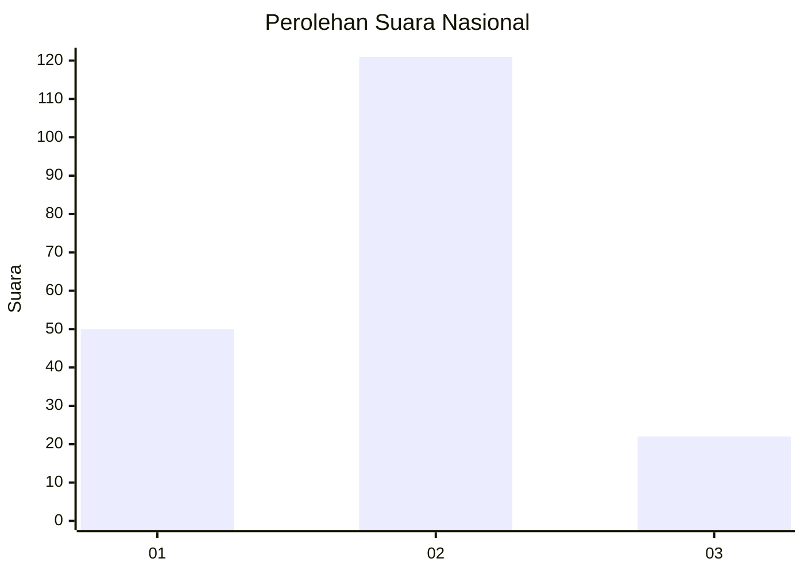
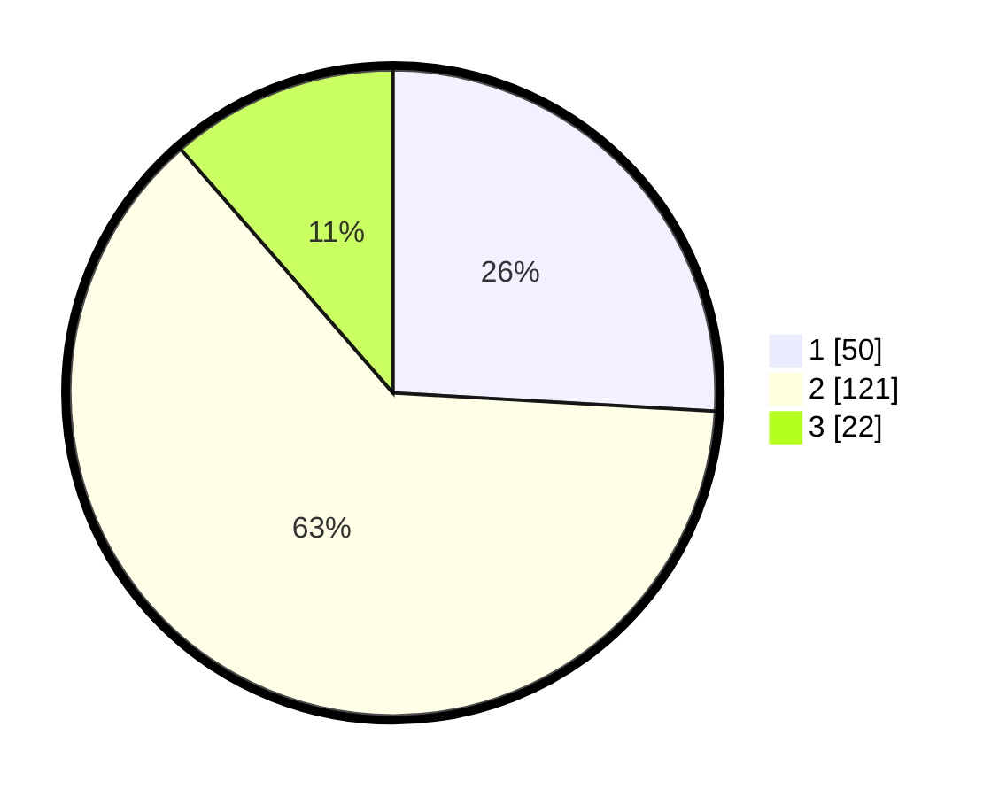

# Hasil

## Grafik

## Tabel

| No.    | Nama Paslon    | Suara | Suara (raw) | Persentase |
|:------ |:-------------- | -----:| -----------:| ----------:|
| 100025 | ANIES MUHAIMIN | 50    | [50][p-1]   | 25,91      |
| 100026 | PRABOWO GIBRAN | 121   | [121][p-2]  | 62,69      |
| 100027 | GANJAR MAHFUD  | 22    | [22][p-3]   | 11,40      |

[p-1]: https://github.com/gigit-pemilu/pemilu-2024/blob/main/pilpres/hitung-suara/sub/31-dki-jakarta/sub/73-jakarta-barat/sub/01-cengkareng/sub/1004-kedaung-kali-angke/sub/087-tps/sub/paslon-1.txt
[p-2]: https://github.com/gigit-pemilu/pemilu-2024/blob/main/pilpres/hitung-suara/sub/31-dki-jakarta/sub/73-jakarta-barat/sub/01-cengkareng/sub/1004-kedaung-kali-angke/sub/087-tps/sub/paslon-2.txt
[p-3]: https://github.com/gigit-pemilu/pemilu-2024/blob/main/pilpres/hitung-suara/sub/31-dki-jakarta/sub/73-jakarta-barat/sub/01-cengkareng/sub/1004-kedaung-kali-angke/sub/087-tps/sub/paslon-3.txt

## Foto C Plano

https://sirekap-obj-formc.kpu.go.id/c51b/pemilu/ppwp/31/73/01/10/04/3173011004087-20240215-232355--7313d97e-90e9-4947-969b-c0301550219d.jpg

https://sirekap-obj-formc.kpu.go.id/c51b/pemilu/ppwp/31/73/01/10/04/3173011004087-20240215-231631--33c3abb5-997c-4347-9e71-faf39b188a35.jpg

https://sirekap-obj-formc.kpu.go.id/c51b/pemilu/ppwp/31/73/01/10/04/3173011004087-20240215-232302--6171c0a7-0f64-4b96-9d8b-74f7b2b74c04.jpg

## Metadata

| Key        | Value               |
| ---------- | ------------------- |
| Time Stamp | 2024-02-19 14:00:00 |

