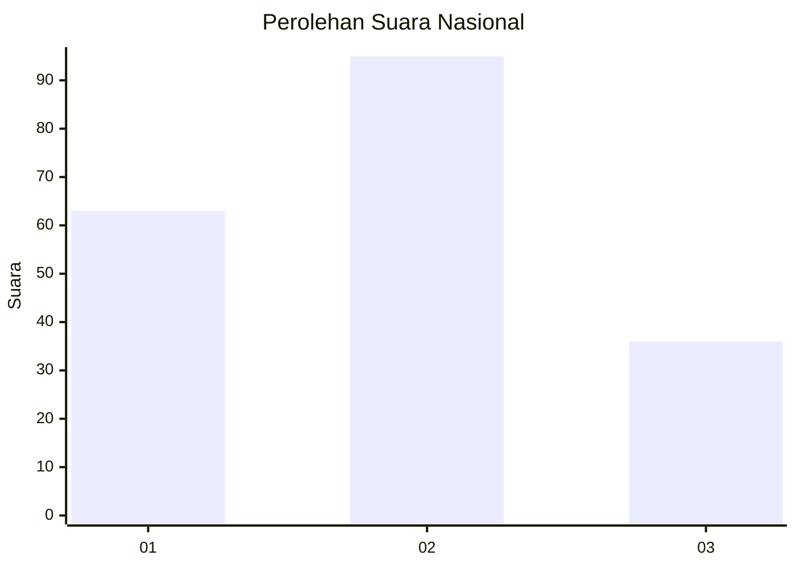
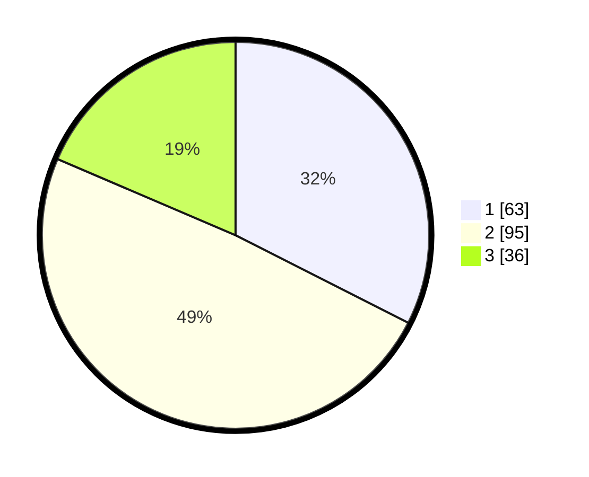

# Hasil

## Grafik

## Tabel

| No.    | Nama Paslon    | Suara | Suara (raw) | Persentase |
|:------ |:-------------- | -----:| -----------:| ----------:|
| 100025 | ANIES MUHAIMIN | 63    | [63][p-1]   | 32,47      |
| 100026 | PRABOWO GIBRAN | 95    | [95][p-2]   | 48,97      |
| 100027 | GANJAR MAHFUD  | 36    | [36][p-3]   | 18,56      |

[p-1]: https://github.com/gigit-pemilu/pemilu-2024/blob/main/pilpres/hitung-suara/sub/31-dki-jakarta/sub/73-jakarta-barat/sub/01-cengkareng/sub/1004-kedaung-kali-angke/sub/102-tps/sub/paslon-1.txt
[p-2]: https://github.com/gigit-pemilu/pemilu-2024/blob/main/pilpres/hitung-suara/sub/31-dki-jakarta/sub/73-jakarta-barat/sub/01-cengkareng/sub/1004-kedaung-kali-angke/sub/102-tps/sub/paslon-2.txt
[p-3]: https://github.com/gigit-pemilu/pemilu-2024/blob/main/pilpres/hitung-suara/sub/31-dki-jakarta/sub/73-jakarta-barat/sub/01-cengkareng/sub/1004-kedaung-kali-angke/sub/102-tps/sub/paslon-3.txt

## Foto C Plano

https://sirekap-obj-formc.kpu.go.id/4b46/pemilu/ppwp/31/73/01/10/04/3173011004102-20240215-014251--ba84bd75-9085-4adb-a7a6-9be82769b8b4.jpg

https://sirekap-obj-formc.kpu.go.id/4b46/pemilu/ppwp/31/73/01/10/04/3173011004102-20240215-014508--b6ddbd69-5549-4f8e-98ac-535ab5d9d582.jpg

https://sirekap-obj-formc.kpu.go.id/4b46/pemilu/ppwp/31/73/01/10/04/3173011004102-20240215-014656--19aca2af-b00c-4c85-b9ff-3c12e5cf8b55.jpg

## Metadata

| Key        | Value               |
| ---------- | ------------------- |
| Time Stamp | 2024-02-17 19:30:00 |

