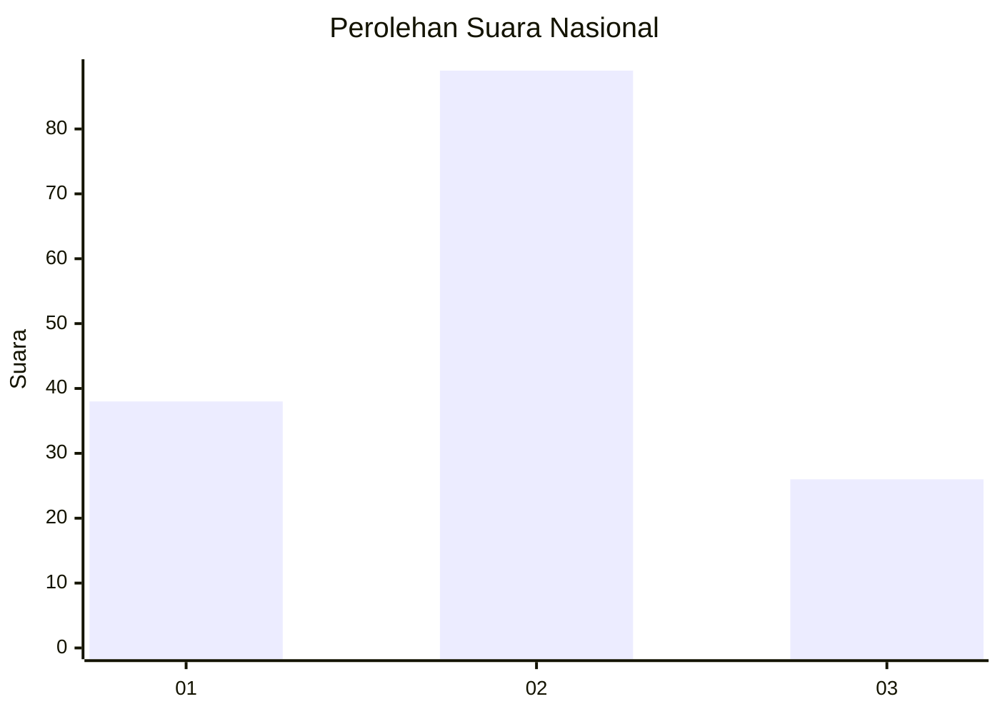

# Hasil

## Grafik

## Tabel

| No.    | Nama Paslon    | Suara | Suara (raw) | Persentase |
|:------ |:-------------- | -----:| -----------:| ----------:|
| 100025 | ANIES MUHAIMIN | 38    | [38][p-1]   | 24,84      |
| 100026 | PRABOWO GIBRAN | 89    | [89][p-2]   | 58,17      |
| 100027 | GANJAR MAHFUD  | 26    | [26][p-3]   | 16,99      |

[p-1]: https://github.com/gigit-pemilu/pemilu-2024/blob/main/pilpres/hitung-suara/sub/31-dki-jakarta/sub/73-jakarta-barat/sub/01-cengkareng/sub/1004-kedaung-kali-angke/sub/105-tps/sub/paslon-1.txt
[p-2]: https://github.com/gigit-pemilu/pemilu-2024/blob/main/pilpres/hitung-suara/sub/31-dki-jakarta/sub/73-jakarta-barat/sub/01-cengkareng/sub/1004-kedaung-kali-angke/sub/105-tps/sub/paslon-2.txt
[p-3]: https://github.com/gigit-pemilu/pemilu-2024/blob/main/pilpres/hitung-suara/sub/31-dki-jakarta/sub/73-jakarta-barat/sub/01-cengkareng/sub/1004-kedaung-kali-angke/sub/105-tps/sub/paslon-3.txt

## Foto C Plano

https://sirekap-obj-formc.kpu.go.id/5c2c/pemilu/ppwp/31/73/01/10/04/3173011004105-20240214-221001--4c877758-bd3a-4d3a-8012-649b18584c07.jpg

https://sirekap-obj-formc.kpu.go.id/5c2c/pemilu/ppwp/31/73/01/10/04/3173011004105-20240214-221133--8189170a-0557-4f98-a2fc-985e371e8ba5.jpg

https://sirekap-obj-formc.kpu.go.id/5c2c/pemilu/ppwp/31/73/01/10/04/3173011004105-20240214-221225--5e17ea2a-74ec-4038-88af-dc62e734b93a.jpg

## Metadata

| Key        | Value               |
| ---------- | ------------------- |
| Time Stamp | 2024-02-17 19:30:00 |

