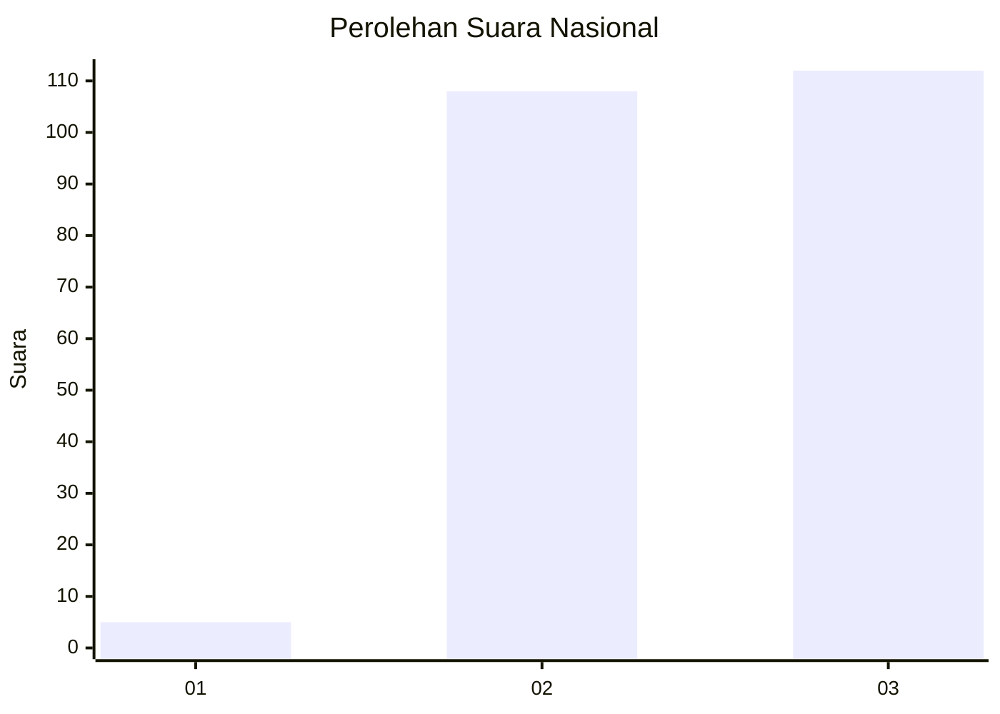
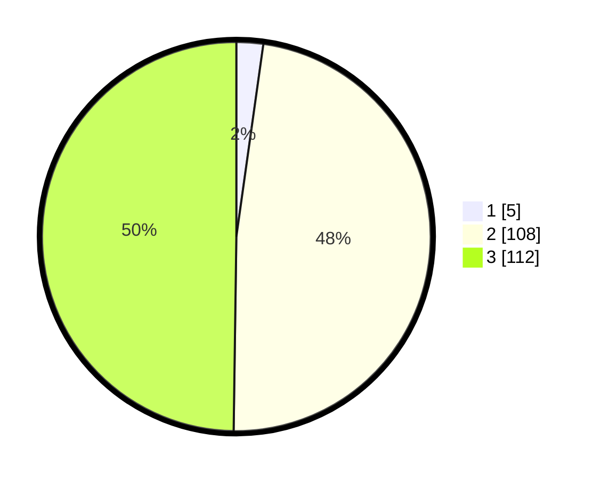

# Hasil

## Grafik

## Tabel

| No.    | Nama Paslon    | Suara | Suara (raw) | Persentase |
|:------ |:-------------- | -----:| -----------:| ----------:|
| 100025 | ANIES MUHAIMIN | 5     | [5][p-1]    | 2,22       |
| 100026 | PRABOWO GIBRAN | 108   | [108][p-2]  | 48,00      |
| 100027 | GANJAR MAHFUD  | 112   | [112][p-3]  | 49,78      |

[p-1]: https://github.com/gigit-pemilu/pemilu-2024/blob/main/pilpres/hitung-suara/sub/31-dki-jakarta/sub/73-jakarta-barat/sub/01-cengkareng/sub/1004-kedaung-kali-angke/sub/108-tps/sub/paslon-1.txt
[p-2]: https://github.com/gigit-pemilu/pemilu-2024/blob/main/pilpres/hitung-suara/sub/31-dki-jakarta/sub/73-jakarta-barat/sub/01-cengkareng/sub/1004-kedaung-kali-angke/sub/108-tps/sub/paslon-2.txt
[p-3]: https://github.com/gigit-pemilu/pemilu-2024/blob/main/pilpres/hitung-suara/sub/31-dki-jakarta/sub/73-jakarta-barat/sub/01-cengkareng/sub/1004-kedaung-kali-angke/sub/108-tps/sub/paslon-3.txt

## Foto C Plano

https://sirekap-obj-formc.kpu.go.id/5c71/pemilu/ppwp/31/73/01/10/04/3173011004108-20240214-230658--4e66570a-4dd9-42a2-8dd3-8118f21c024d.jpg

https://sirekap-obj-formc.kpu.go.id/5c71/pemilu/ppwp/31/73/01/10/04/3173011004108-20240214-230607--d6589781-367d-4736-9174-254d7d1ffaa7.jpg

https://sirekap-obj-formc.kpu.go.id/5c71/pemilu/ppwp/31/73/01/10/04/3173011004108-20240214-230753--91c7f595-976c-4ad6-979f-cb7e614a0d33.jpg

## Metadata

| Key        | Value               |
| ---------- | ------------------- |
| Time Stamp | 2024-02-17 19:30:00 |

