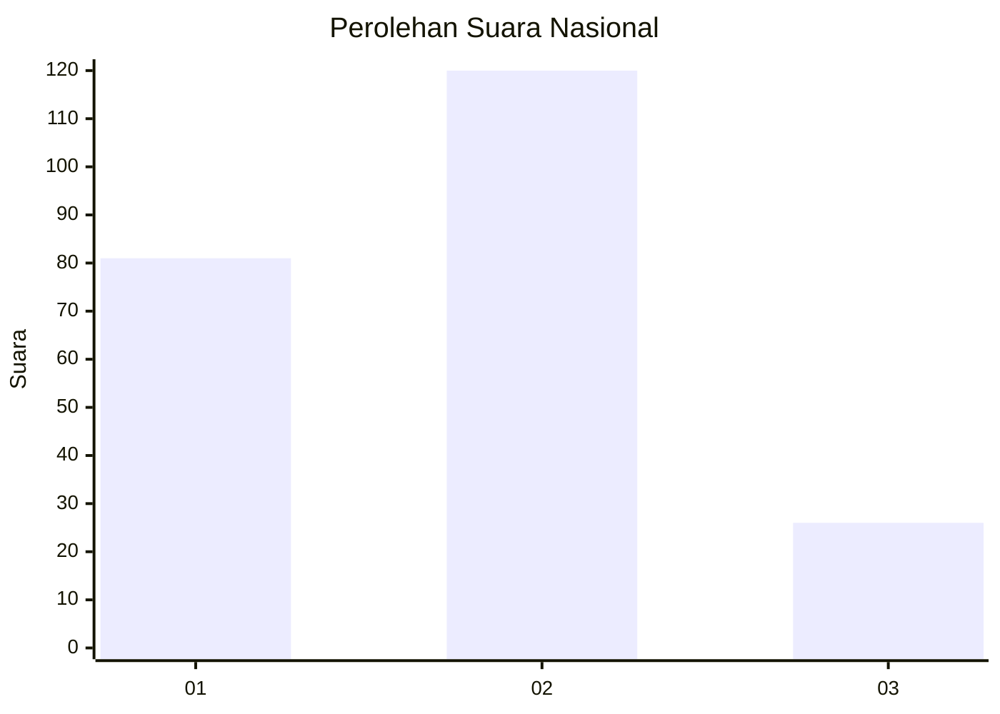
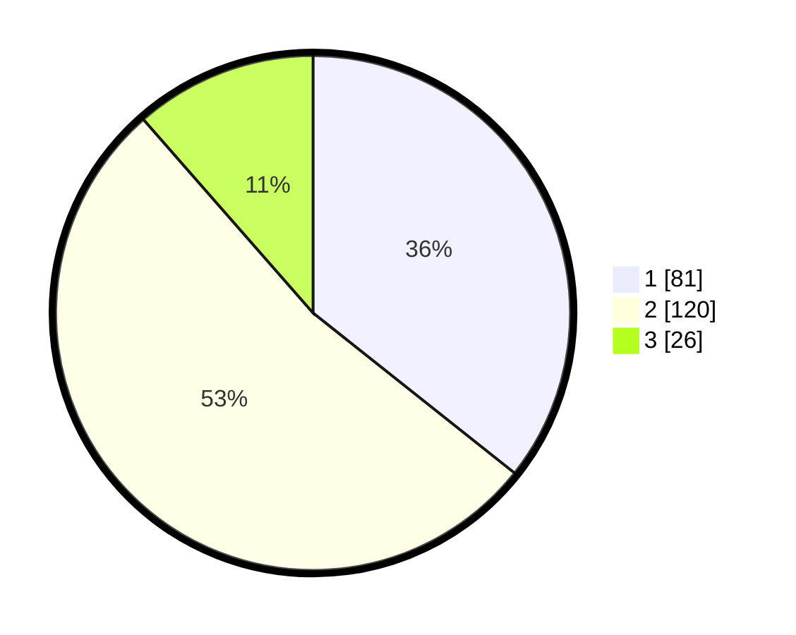

# Hasil

## Grafik

## Tabel

| No.    | Nama Paslon    | Suara | Suara (raw) | Persentase |
|:------ |:-------------- | -----:| -----------:| ----------:|
| 100025 | ANIES MUHAIMIN | 81    | [81][p-1]   | 35,68      |
| 100026 | PRABOWO GIBRAN | 120   | [120][p-2]  | 52,86      |
| 100027 | GANJAR MAHFUD  | 26    | [26][p-3]   | 11,45      |

[p-1]: https://github.com/gigit-pemilu/pemilu-2024/blob/main/pilpres/hitung-suara/sub/31-dki-jakarta/sub/73-jakarta-barat/sub/01-cengkareng/sub/1005-kapuk/sub/012-tps/sub/paslon-1.txt
[p-2]: https://github.com/gigit-pemilu/pemilu-2024/blob/main/pilpres/hitung-suara/sub/31-dki-jakarta/sub/73-jakarta-barat/sub/01-cengkareng/sub/1005-kapuk/sub/012-tps/sub/paslon-2.txt
[p-3]: https://github.com/gigit-pemilu/pemilu-2024/blob/main/pilpres/hitung-suara/sub/31-dki-jakarta/sub/73-jakarta-barat/sub/01-cengkareng/sub/1005-kapuk/sub/012-tps/sub/paslon-3.txt

## Foto C Plano

https://sirekap-obj-formc.kpu.go.id/441d/pemilu/ppwp/31/73/01/10/05/3173011005012-20240214-223702--aa9ee973-e178-4019-8b43-1485843b8704.jpg

https://sirekap-obj-formc.kpu.go.id/441d/pemilu/ppwp/31/73/01/10/05/3173011005012-20240214-223918--47efa69d-bf02-4ad0-8738-f2c74aa7ebf0.jpg

https://sirekap-obj-formc.kpu.go.id/441d/pemilu/ppwp/31/73/01/10/05/3173011005012-20240214-224157--41577cc3-2add-45f3-8374-eaf38e74f1f4.jpg

## Metadata

| Key        | Value               |
| ---------- | ------------------- |
| Time Stamp | 2024-02-19 14:00:00 |

