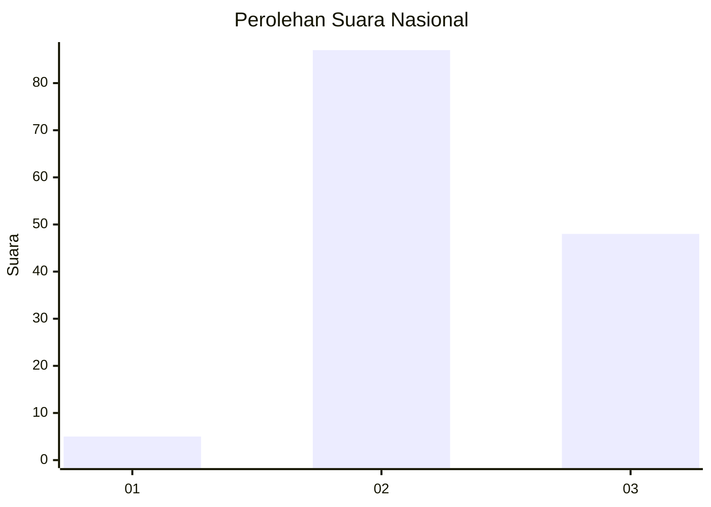
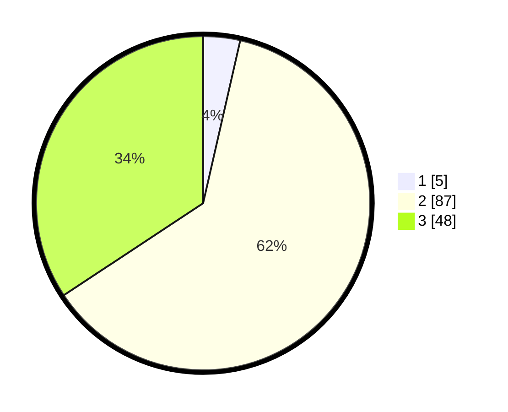

# Hasil

## Grafik

## Tabel

| No.    | Nama Paslon    | Suara | Suara (raw) | Persentase |
|:------ |:-------------- | -----:| -----------:| ----------:|
| 100025 | ANIES MUHAIMIN | 5     | [5][p-1]    | 3,57       |
| 100026 | PRABOWO GIBRAN | 87    | [87][p-2]   | 62,14      |
| 100027 | GANJAR MAHFUD  | 48    | [48][p-3]   | 34,29      |

[p-1]: https://github.com/gigit-pemilu/pemilu-2024/blob/main/pilpres/hitung-suara/sub/31-dki-jakarta/sub/73-jakarta-barat/sub/01-cengkareng/sub/1005-kapuk/sub/025-tps/sub/paslon-1.txt
[p-2]: https://github.com/gigit-pemilu/pemilu-2024/blob/main/pilpres/hitung-suara/sub/31-dki-jakarta/sub/73-jakarta-barat/sub/01-cengkareng/sub/1005-kapuk/sub/025-tps/sub/paslon-2.txt
[p-3]: https://github.com/gigit-pemilu/pemilu-2024/blob/main/pilpres/hitung-suara/sub/31-dki-jakarta/sub/73-jakarta-barat/sub/01-cengkareng/sub/1005-kapuk/sub/025-tps/sub/paslon-3.txt

## Foto C Plano

https://sirekap-obj-formc.kpu.go.id/cd78/pemilu/ppwp/31/73/01/10/05/3173011005025-20240214-230231--9ee2b868-b0e3-404d-97fd-75bde218c6e7.jpg

https://sirekap-obj-formc.kpu.go.id/cd78/pemilu/ppwp/31/73/01/10/05/3173011005025-20240214-230317--7f269272-64d3-480c-8976-fa650a2c9f52.jpg

https://sirekap-obj-formc.kpu.go.id/cd78/pemilu/ppwp/31/73/01/10/05/3173011005025-20240214-230347--57c5a88f-4316-4f20-ab9e-0c4140770f1c.jpg

## Metadata

| Key        | Value               |
| ---------- | ------------------- |
| Time Stamp | 2024-02-19 06:16:00 |

