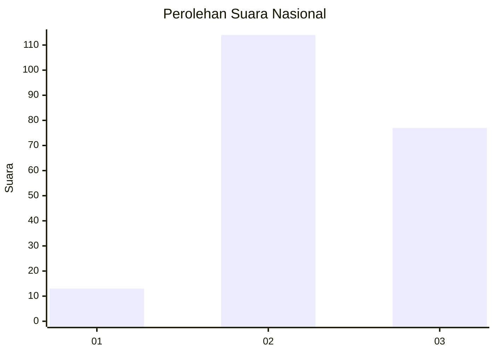
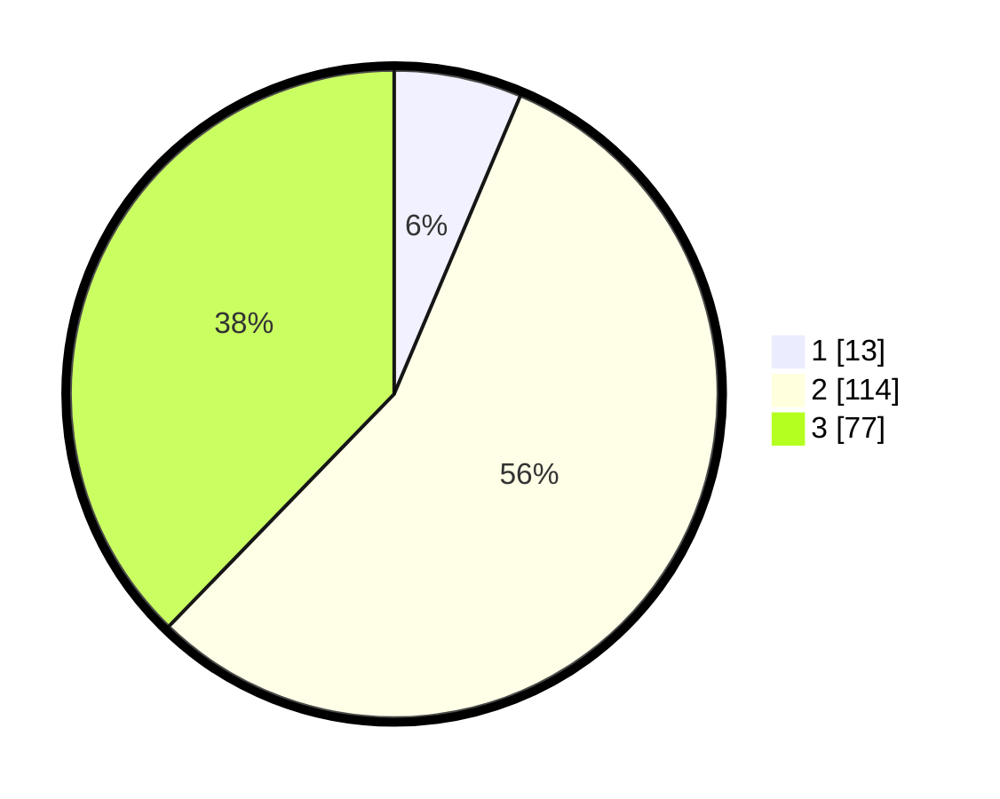

# Hasil

## Grafik

## Tabel

| No.    | Nama Paslon    | Suara | Suara (raw) | Persentase |
|:------ |:-------------- | -----:| -----------:| ----------:|
| 100025 | ANIES MUHAIMIN | 13    | [13][p-1]   | 6,37       |
| 100026 | PRABOWO GIBRAN | 114   | [114][p-2]  | 55,88      |
| 100027 | GANJAR MAHFUD  | 77    | [77][p-3]   | 37,75      |

[p-1]: https://github.com/gigit-pemilu/pemilu-2024/blob/main/pilpres/hitung-suara/sub/31-dki-jakarta/sub/73-jakarta-barat/sub/01-cengkareng/sub/1005-kapuk/sub/027-tps/sub/paslon-1.txt
[p-2]: https://github.com/gigit-pemilu/pemilu-2024/blob/main/pilpres/hitung-suara/sub/31-dki-jakarta/sub/73-jakarta-barat/sub/01-cengkareng/sub/1005-kapuk/sub/027-tps/sub/paslon-2.txt
[p-3]: https://github.com/gigit-pemilu/pemilu-2024/blob/main/pilpres/hitung-suara/sub/31-dki-jakarta/sub/73-jakarta-barat/sub/01-cengkareng/sub/1005-kapuk/sub/027-tps/sub/paslon-3.txt

## Foto C Plano

https://sirekap-obj-formc.kpu.go.id/839e/pemilu/ppwp/31/73/01/10/05/3173011005027-20240215-033754--c79fb4b4-f3e4-4b6d-9d56-2e1bf7dc9ae9.jpg

https://sirekap-obj-formc.kpu.go.id/839e/pemilu/ppwp/31/73/01/10/05/3173011005027-20240214-205406--480207c9-bc77-472e-a9c1-f86b7943c832.jpg

https://sirekap-obj-formc.kpu.go.id/839e/pemilu/ppwp/31/73/01/10/05/3173011005027-20240214-205454--5d0b3af7-a48c-4b05-b00b-c729e183931f.jpg

## Metadata

| Key        | Value               |
| ---------- | ------------------- |
| Time Stamp | 2024-02-15 12:00:28 |

