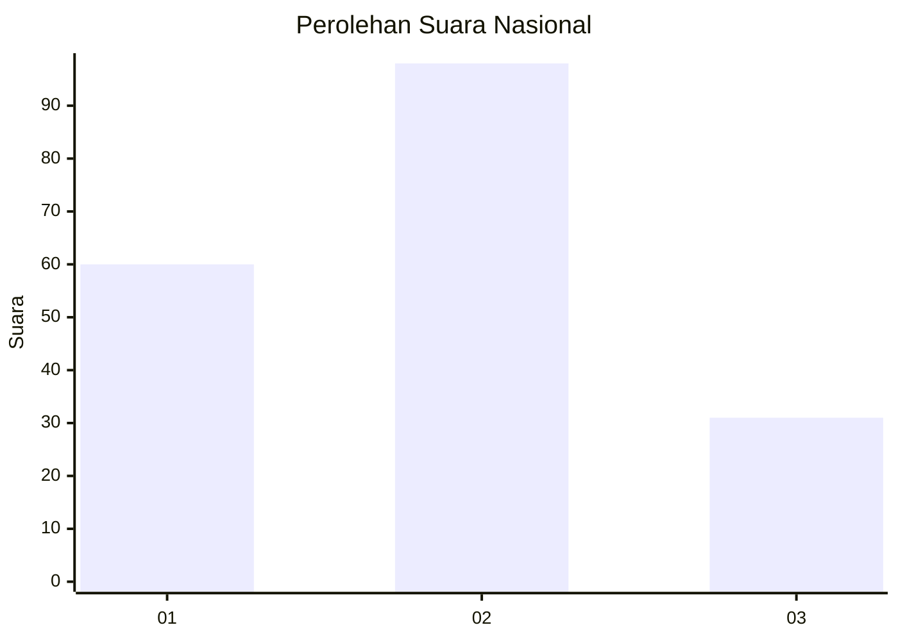
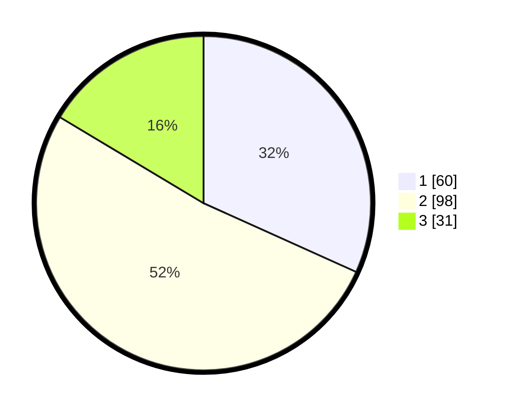

# Hasil

## Grafik

## Tabel

| No.    | Nama Paslon    | Suara | Suara (raw) | Persentase |
|:------ |:-------------- | -----:| -----------:| ----------:|
| 100025 | ANIES MUHAIMIN | 60    | [60][p-1]   | 31,75      |
| 100026 | PRABOWO GIBRAN | 98    | [98][p-2]   | 51,85      |
| 100027 | GANJAR MAHFUD  | 31    | [31][p-3]   | 16,40      |

[p-1]: https://github.com/gigit-pemilu/pemilu-2024/blob/main/pilpres/hitung-suara/sub/31-dki-jakarta/sub/73-jakarta-barat/sub/01-cengkareng/sub/1005-kapuk/sub/030-tps/sub/paslon-1.txt
[p-2]: https://github.com/gigit-pemilu/pemilu-2024/blob/main/pilpres/hitung-suara/sub/31-dki-jakarta/sub/73-jakarta-barat/sub/01-cengkareng/sub/1005-kapuk/sub/030-tps/sub/paslon-2.txt
[p-3]: https://github.com/gigit-pemilu/pemilu-2024/blob/main/pilpres/hitung-suara/sub/31-dki-jakarta/sub/73-jakarta-barat/sub/01-cengkareng/sub/1005-kapuk/sub/030-tps/sub/paslon-3.txt

## Foto C Plano

https://sirekap-obj-formc.kpu.go.id/1ac6/pemilu/ppwp/31/73/01/10/05/3173011005030-20240214-220516--67581980-ee15-45d0-95f5-a57f7f31d317.jpg

https://sirekap-obj-formc.kpu.go.id/1ac6/pemilu/ppwp/31/73/01/10/05/3173011005030-20240214-214153--03dce129-5bf1-4a1c-b5a2-27de2b5a5be4.jpg

https://sirekap-obj-formc.kpu.go.id/1ac6/pemilu/ppwp/31/73/01/10/05/3173011005030-20240214-220652--679e3dad-d7f2-4372-bb89-d33b17b172fb.jpg

## Metadata

| Key        | Value               |
| ---------- | ------------------- |
| Time Stamp | 2024-02-19 06:16:00 |

