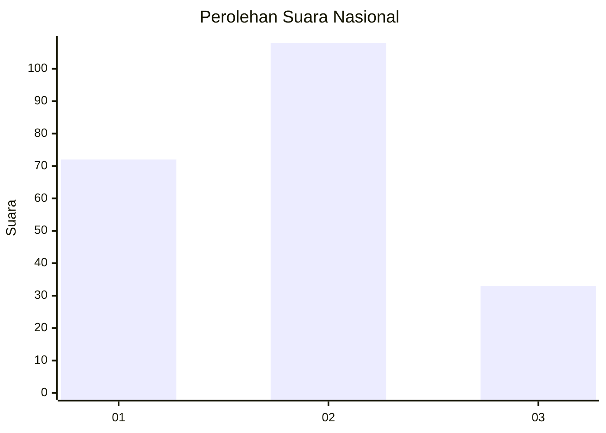
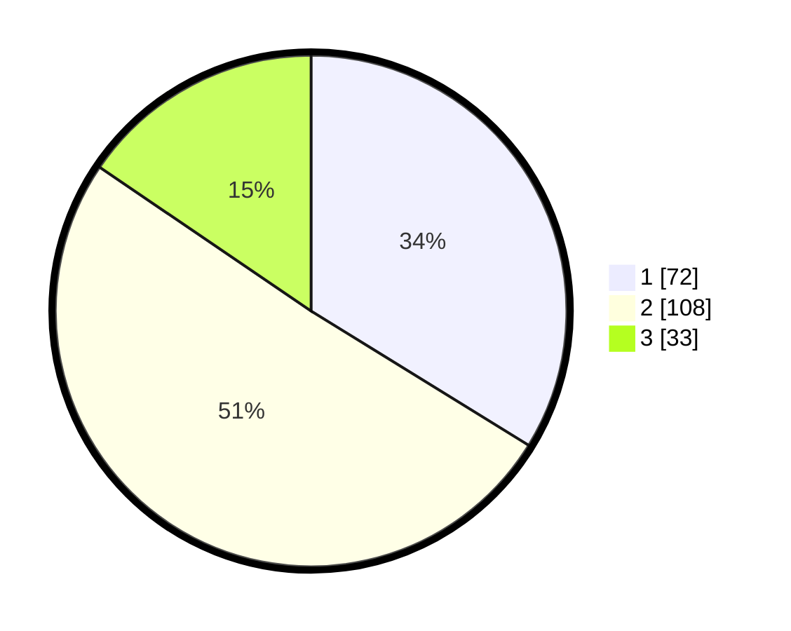

# Hasil

## Grafik

## Tabel

| No.    | Nama Paslon    | Suara | Suara (raw) | Persentase |
|:------ |:-------------- | -----:| -----------:| ----------:|
| 100025 | ANIES MUHAIMIN | 72    | [72][p-1]   | 33,80      |
| 100026 | PRABOWO GIBRAN | 108   | [108][p-2]  | 50,70      |
| 100027 | GANJAR MAHFUD  | 33    | [33][p-3]   | 15,49      |

[p-1]: https://github.com/gigit-pemilu/pemilu-2024/blob/main/pilpres/hitung-suara/sub/31-dki-jakarta/sub/73-jakarta-barat/sub/01-cengkareng/sub/1005-kapuk/sub/057-tps/sub/paslon-1.txt
[p-2]: https://github.com/gigit-pemilu/pemilu-2024/blob/main/pilpres/hitung-suara/sub/31-dki-jakarta/sub/73-jakarta-barat/sub/01-cengkareng/sub/1005-kapuk/sub/057-tps/sub/paslon-2.txt
[p-3]: https://github.com/gigit-pemilu/pemilu-2024/blob/main/pilpres/hitung-suara/sub/31-dki-jakarta/sub/73-jakarta-barat/sub/01-cengkareng/sub/1005-kapuk/sub/057-tps/sub/paslon-3.txt

## Foto C Plano

https://sirekap-obj-formc.kpu.go.id/1897/pemilu/ppwp/31/73/01/10/05/3173011005057-20240214-212357--2ba88c0d-7050-422a-a2a9-ce8cacc31b6f.jpg

https://sirekap-obj-formc.kpu.go.id/1897/pemilu/ppwp/31/73/01/10/05/3173011005057-20240214-212558--f178d0dc-9856-4bf9-ac3d-eea9bc7b7229.jpg

https://sirekap-obj-formc.kpu.go.id/1897/pemilu/ppwp/31/73/01/10/05/3173011005057-20240214-212747--23acc18f-9b00-4890-9a1d-715758bf331a.jpg

## Metadata

| Key        | Value               |
| ---------- | ------------------- |
| Time Stamp | 2024-02-19 06:16:00 |

