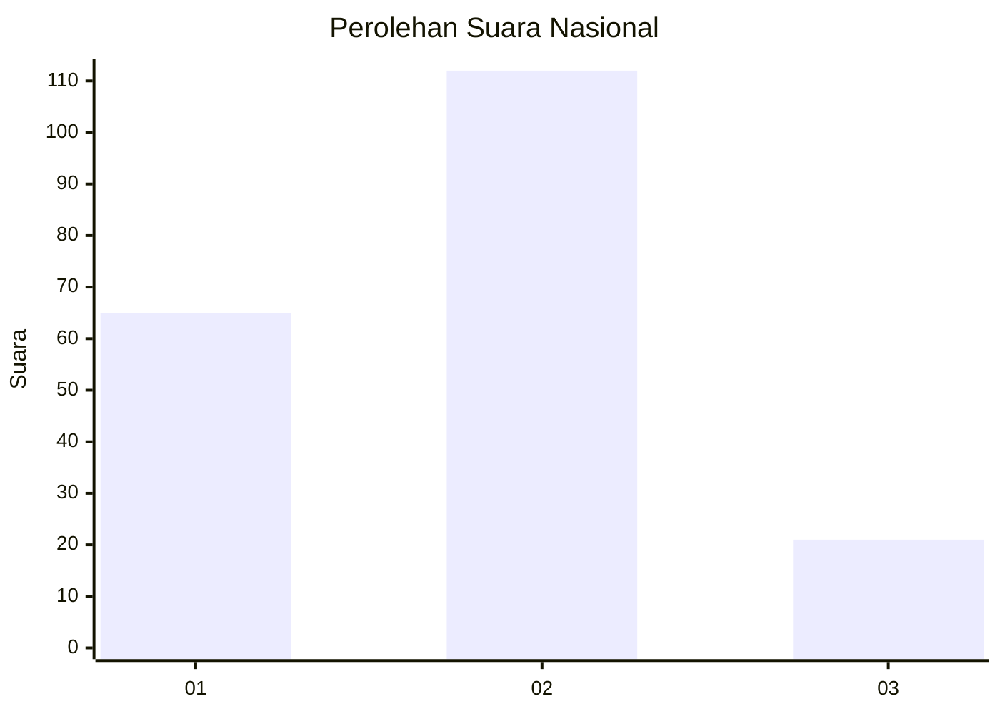
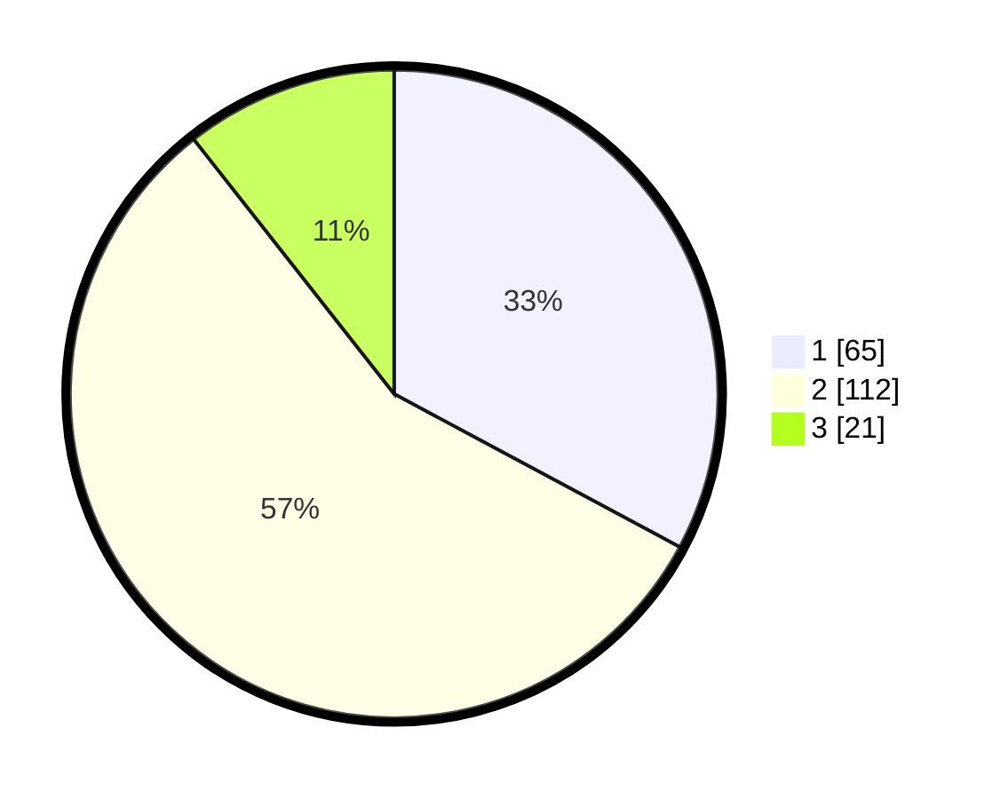

# Hasil

## Grafik

## Tabel

| No.    | Nama Paslon    | Suara | Suara (raw) | Persentase |
|:------ |:-------------- | -----:| -----------:| ----------:|
| 100025 | ANIES MUHAIMIN | 65    | [65][p-1]   | 32,83      |
| 100026 | PRABOWO GIBRAN | 112   | [112][p-2]  | 56,57      |
| 100027 | GANJAR MAHFUD  | 21    | [21][p-3]   | 10,61      |

[p-1]: https://github.com/gigit-pemilu/pemilu-2024/blob/main/pilpres/hitung-suara/sub/31-dki-jakarta/sub/73-jakarta-barat/sub/01-cengkareng/sub/1005-kapuk/sub/066-tps/sub/paslon-1.txt
[p-2]: https://github.com/gigit-pemilu/pemilu-2024/blob/main/pilpres/hitung-suara/sub/31-dki-jakarta/sub/73-jakarta-barat/sub/01-cengkareng/sub/1005-kapuk/sub/066-tps/sub/paslon-2.txt
[p-3]: https://github.com/gigit-pemilu/pemilu-2024/blob/main/pilpres/hitung-suara/sub/31-dki-jakarta/sub/73-jakarta-barat/sub/01-cengkareng/sub/1005-kapuk/sub/066-tps/sub/paslon-3.txt

## Foto C Plano

https://sirekap-obj-formc.kpu.go.id/03ef/pemilu/ppwp/31/73/01/10/05/3173011005066-20240215-002744--84ca4e28-037c-45d3-b3de-d3f793ba8ed6.jpg

https://sirekap-obj-formc.kpu.go.id/03ef/pemilu/ppwp/31/73/01/10/05/3173011005066-20240215-003014--a8ee9272-e254-4108-bc82-778f6565a028.jpg

https://sirekap-obj-formc.kpu.go.id/03ef/pemilu/ppwp/31/73/01/10/05/3173011005066-20240215-003206--82a395c1-d3a5-490e-b093-8ad62f5f4038.jpg

## Metadata

| Key        | Value               |
| ---------- | ------------------- |
| Time Stamp | 2024-02-19 16:00:00 |

