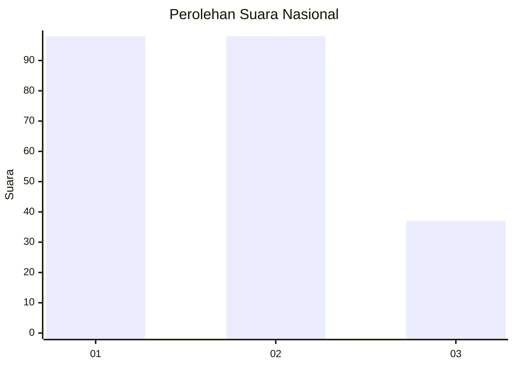
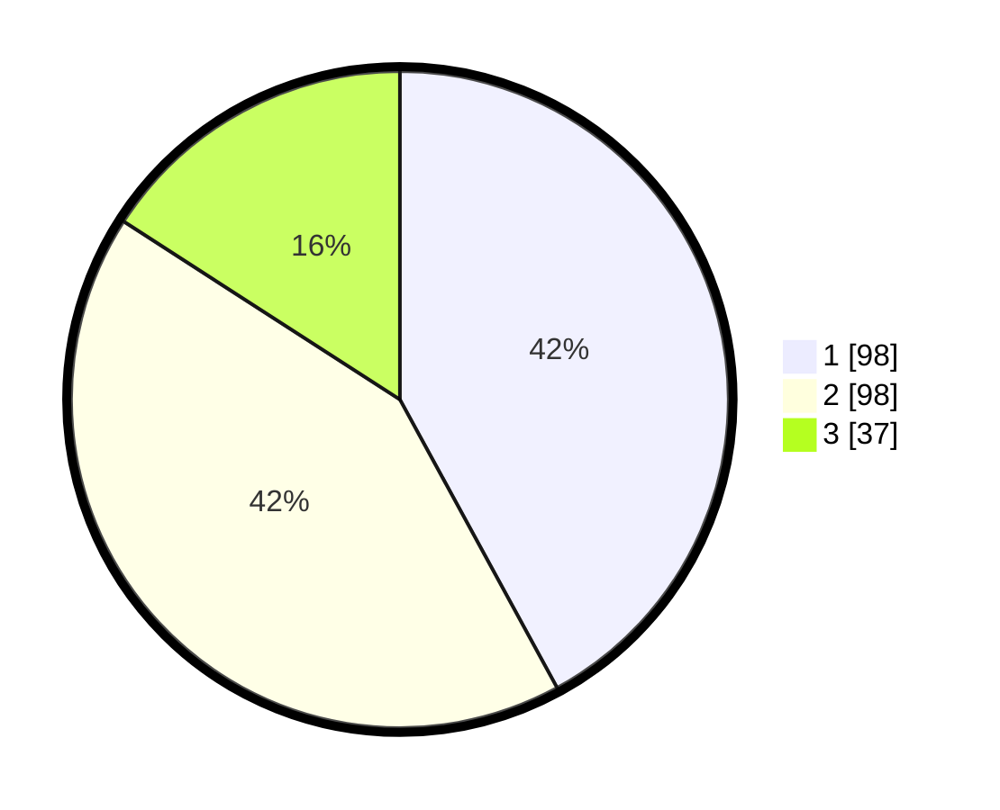

# Hasil

## Grafik

## Tabel

| No.    | Nama Paslon    | Suara | Suara (raw) | Persentase |
|:------ |:-------------- | -----:| -----------:| ----------:|
| 100025 | ANIES MUHAIMIN | 98    | [98][p-1]   | 42,06      |
| 100026 | PRABOWO GIBRAN | 98    | [98][p-2]   | 42,06      |
| 100027 | GANJAR MAHFUD  | 37    | [37][p-3]   | 15,88      |

[p-1]: https://github.com/gigit-pemilu/pemilu-2024/blob/main/pilpres/hitung-suara/sub/31-dki-jakarta/sub/73-jakarta-barat/sub/01-cengkareng/sub/1005-kapuk/sub/077-tps/sub/paslon-1.txt
[p-2]: https://github.com/gigit-pemilu/pemilu-2024/blob/main/pilpres/hitung-suara/sub/31-dki-jakarta/sub/73-jakarta-barat/sub/01-cengkareng/sub/1005-kapuk/sub/077-tps/sub/paslon-2.txt
[p-3]: https://github.com/gigit-pemilu/pemilu-2024/blob/main/pilpres/hitung-suara/sub/31-dki-jakarta/sub/73-jakarta-barat/sub/01-cengkareng/sub/1005-kapuk/sub/077-tps/sub/paslon-3.txt

## Foto C Plano

https://sirekap-obj-formc.kpu.go.id/22be/pemilu/ppwp/31/73/01/10/05/3173011005077-20240215-031940--5b5e39ce-08fc-4969-b107-bcafd47f6de0.jpg

https://sirekap-obj-formc.kpu.go.id/22be/pemilu/ppwp/31/73/01/10/05/3173011005077-20240215-032030--5976da8e-c797-496e-a538-926a43fc1016.jpg

https://sirekap-obj-formc.kpu.go.id/22be/pemilu/ppwp/31/73/01/10/05/3173011005077-20240215-032231--c6ac6dd9-3bf6-47cb-9976-adb416af520e.jpg

## Metadata

| Key        | Value               |
| ---------- | ------------------- |
| Time Stamp | 2024-02-19 06:16:00 |

