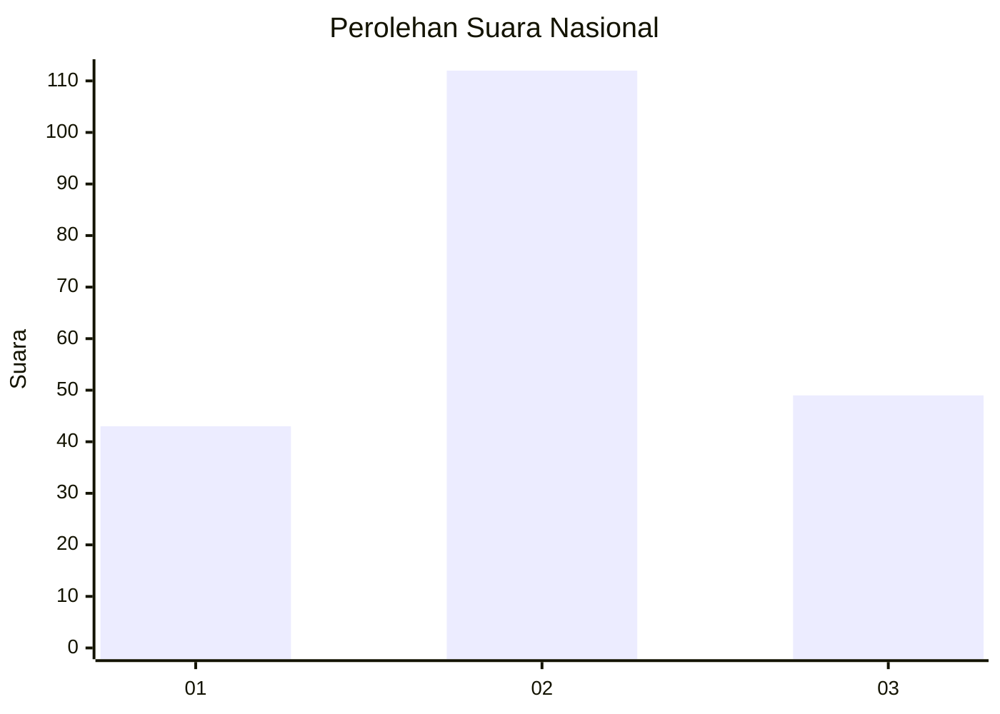
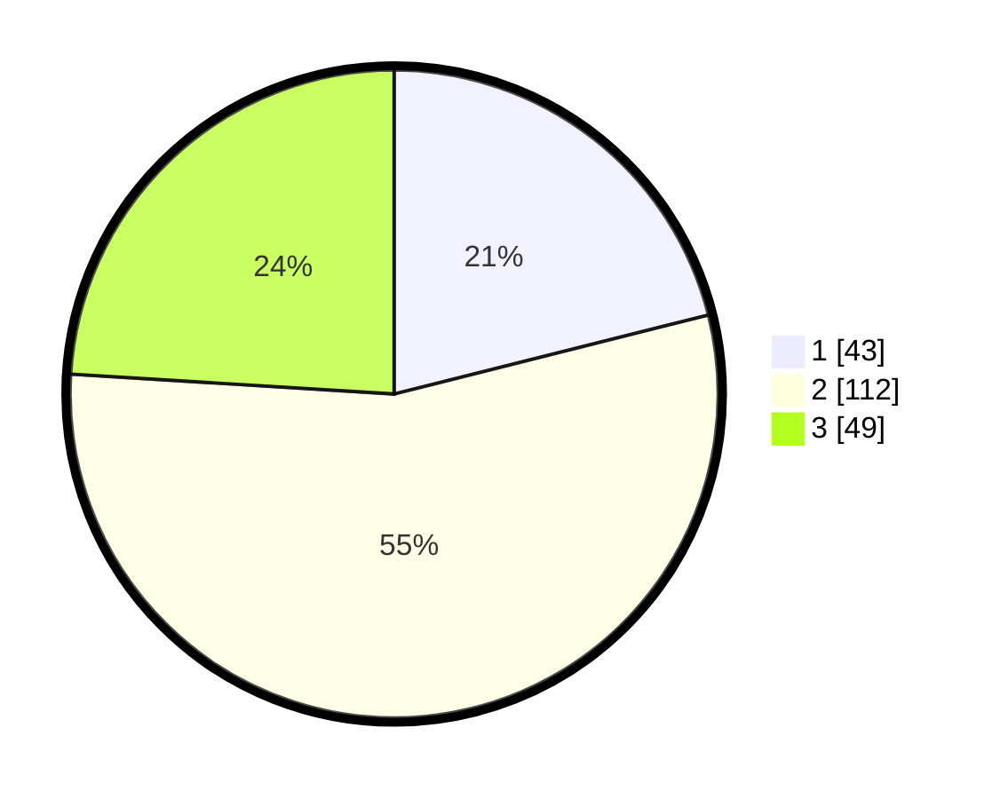

# Hasil

## Grafik

## Tabel

| No.    | Nama Paslon    | Suara | Suara (raw) | Persentase |
|:------ |:-------------- | -----:| -----------:| ----------:|
| 100025 | ANIES MUHAIMIN | 43    | [43][p-1]   | 21,08      |
| 100026 | PRABOWO GIBRAN | 112   | [112][p-2]  | 54,90      |
| 100027 | GANJAR MAHFUD  | 49    | [49][p-3]   | 24,02      |

[p-1]: https://github.com/gigit-pemilu/pemilu-2024/blob/main/pilpres/hitung-suara/sub/31-dki-jakarta/sub/73-jakarta-barat/sub/01-cengkareng/sub/1005-kapuk/sub/082-tps/sub/paslon-1.txt
[p-2]: https://github.com/gigit-pemilu/pemilu-2024/blob/main/pilpres/hitung-suara/sub/31-dki-jakarta/sub/73-jakarta-barat/sub/01-cengkareng/sub/1005-kapuk/sub/082-tps/sub/paslon-2.txt
[p-3]: https://github.com/gigit-pemilu/pemilu-2024/blob/main/pilpres/hitung-suara/sub/31-dki-jakarta/sub/73-jakarta-barat/sub/01-cengkareng/sub/1005-kapuk/sub/082-tps/sub/paslon-3.txt

## Foto C Plano

https://sirekap-obj-formc.kpu.go.id/47a7/pemilu/ppwp/31/73/01/10/05/3173011005082-20240214-190908--bfd6538a-0a09-4144-8794-74db5b546057.jpg

https://sirekap-obj-formc.kpu.go.id/47a7/pemilu/ppwp/31/73/01/10/05/3173011005082-20240214-185504--b592d6c1-3ca8-486f-ab27-30079da4004a.jpg

https://sirekap-obj-formc.kpu.go.id/47a7/pemilu/ppwp/31/73/01/10/05/3173011005082-20240215-004305--b71c10c6-a87b-4a91-90ba-8dde88e1aede.jpg

## Metadata

| Key        | Value               |
| ---------- | ------------------- |
| Time Stamp | 2024-02-15 00:46:45 |

