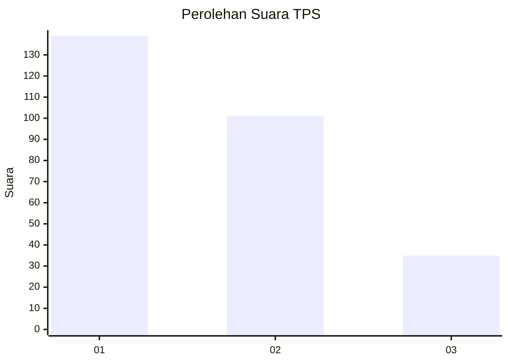
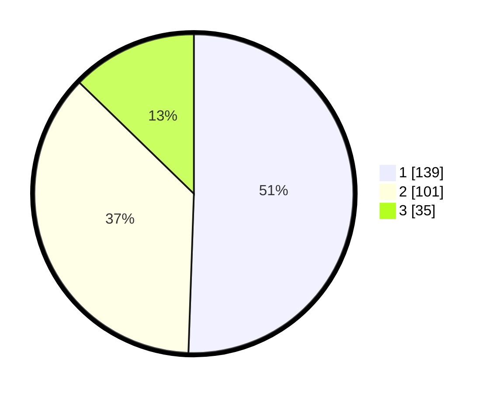

# Hasil

## Grafik

## Tabel

| No. | Nama Paslon    | Suara | Suara (raw) | Persentase |
|:--- |:-------------- | -----:| -----------:| ----------:|
| 1   | ANIES MUHAIMIN | 139   | [139][p-1]  | 50,55      |
| 2   | PRABOWO GIBRAN | 101   | [101][p-2]  | 36,73      |
| 3   | GANJAR MAHFUD  | 35    | [35][p-3]   | 12,73      |

[p-1]: https://github.com/gigit-pemilu/pemilu-2024-31-dki-jakarta/blob/main/pilpres/hitung-suara/sub/31-dki-jakarta/sub/73-jakarta-barat/sub/01-cengkareng/sub/1005-kapuk/sub/084-tps/sub/paslon-1.txt
[p-2]: https://github.com/gigit-pemilu/pemilu-2024-31-dki-jakarta/blob/main/pilpres/hitung-suara/sub/31-dki-jakarta/sub/73-jakarta-barat/sub/01-cengkareng/sub/1005-kapuk/sub/084-tps/sub/paslon-2.txt
[p-3]: https://github.com/gigit-pemilu/pemilu-2024-31-dki-jakarta/blob/main/pilpres/hitung-suara/sub/31-dki-jakarta/sub/73-jakarta-barat/sub/01-cengkareng/sub/1005-kapuk/sub/084-tps/sub/paslon-3.txt

## Foto C Plano

https://sirekap-obj-formc.kpu.go.id/6099/pemilu/ppwp/31/73/01/10/05/3173011005084-20240214-215749--9fce069f-635d-4de0-a988-a56a7c680f7a.jpg

https://sirekap-obj-formc.kpu.go.id/6099/pemilu/ppwp/31/73/01/10/05/3173011005084-20240214-210248--46daf9ce-218f-4b09-b7d4-106d0b14ba9f.jpg

https://sirekap-obj-formc.kpu.go.id/6099/pemilu/ppwp/31/73/01/10/05/3173011005084-20240214-220534--a33e90ab-0063-4395-992a-82ace217bce4.jpg

## Metadata

| Key        | Value               |
| ---------- | ------------------- |
| Time Stamp | 2024-02-19 06:16:00 |

