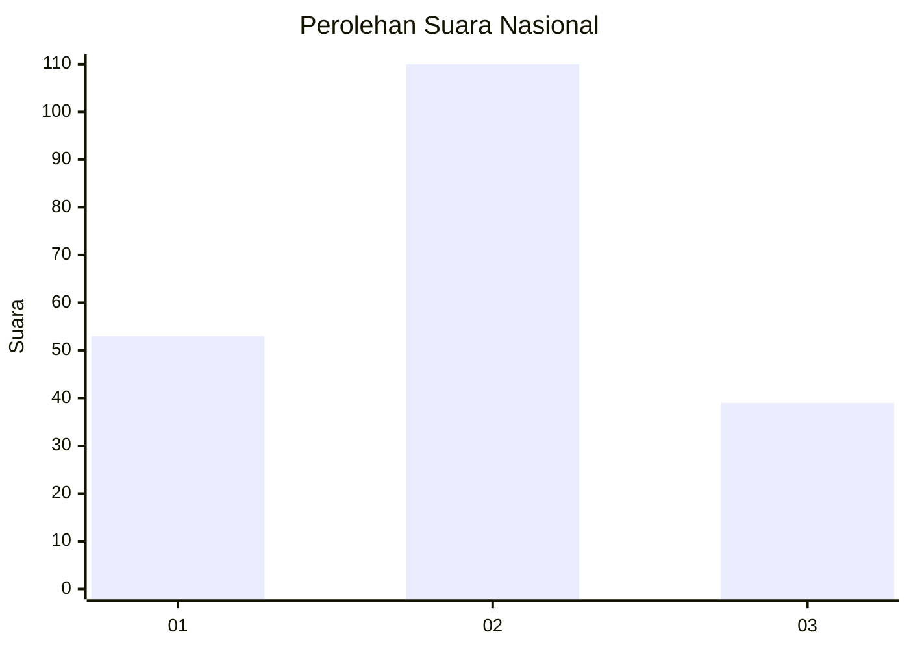
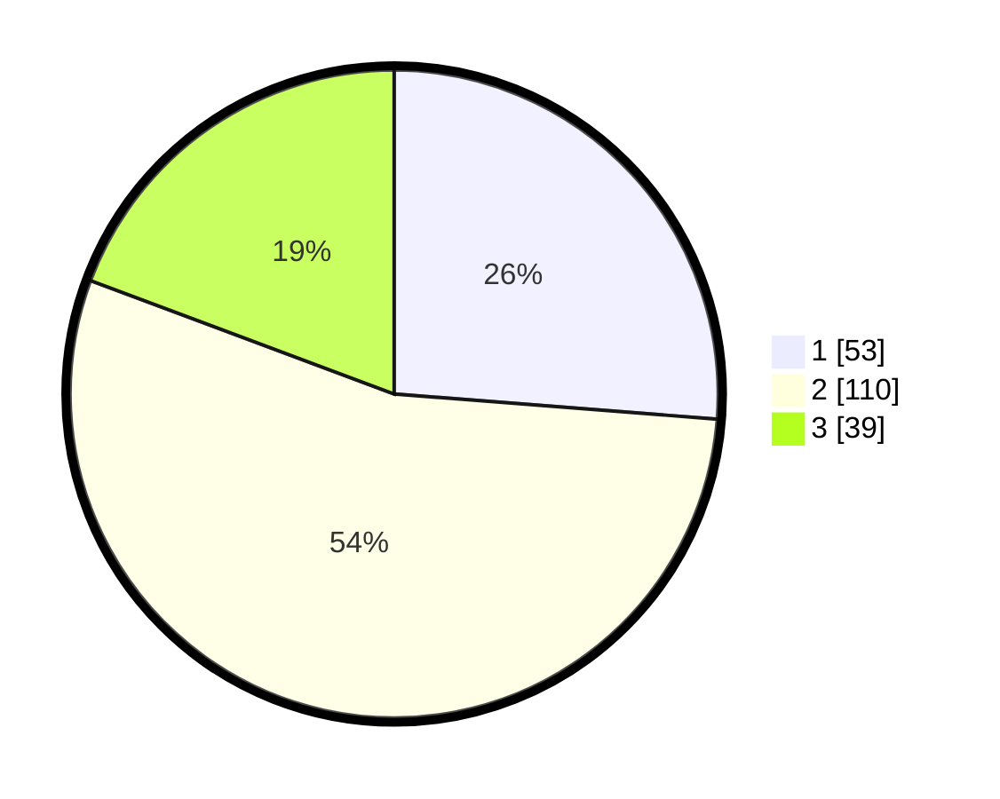

# Hasil

## Grafik

## Tabel

| No.    | Nama Paslon    | Suara | Suara (raw) | Persentase |
|:------ |:-------------- | -----:| -----------:| ----------:|
| 100025 | ANIES MUHAIMIN | 53    | [53][p-1]   | 26,24      |
| 100026 | PRABOWO GIBRAN | 110   | [110][p-2]  | 54,46      |
| 100027 | GANJAR MAHFUD  | 39    | [39][p-3]   | 19,31      |

[p-1]: https://github.com/gigit-pemilu/pemilu-2024/blob/main/pilpres/hitung-suara/sub/31-dki-jakarta/sub/73-jakarta-barat/sub/01-cengkareng/sub/1005-kapuk/sub/087-tps/sub/paslon-1.txt
[p-2]: https://github.com/gigit-pemilu/pemilu-2024/blob/main/pilpres/hitung-suara/sub/31-dki-jakarta/sub/73-jakarta-barat/sub/01-cengkareng/sub/1005-kapuk/sub/087-tps/sub/paslon-2.txt
[p-3]: https://github.com/gigit-pemilu/pemilu-2024/blob/main/pilpres/hitung-suara/sub/31-dki-jakarta/sub/73-jakarta-barat/sub/01-cengkareng/sub/1005-kapuk/sub/087-tps/sub/paslon-3.txt

## Foto C Plano

https://sirekap-obj-formc.kpu.go.id/a47f/pemilu/ppwp/31/73/01/10/05/3173011005087-20240214-195015--e0b3bff2-0459-4cb6-91db-295b6d209c7f.jpg

https://sirekap-obj-formc.kpu.go.id/a47f/pemilu/ppwp/31/73/01/10/05/3173011005087-20240214-195315--0eb0f5b1-f200-4d38-a185-b8678f430ce8.jpg

https://sirekap-obj-formc.kpu.go.id/a47f/pemilu/ppwp/31/73/01/10/05/3173011005087-20240214-195519--995abed4-71a7-437e-b75c-d635b222329c.jpg

## Metadata

| Key        | Value               |
| ---------- | ------------------- |
| Time Stamp | 2024-02-19 18:00:00 |

