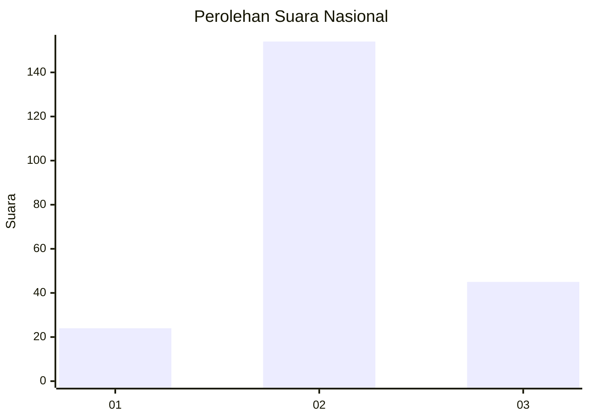
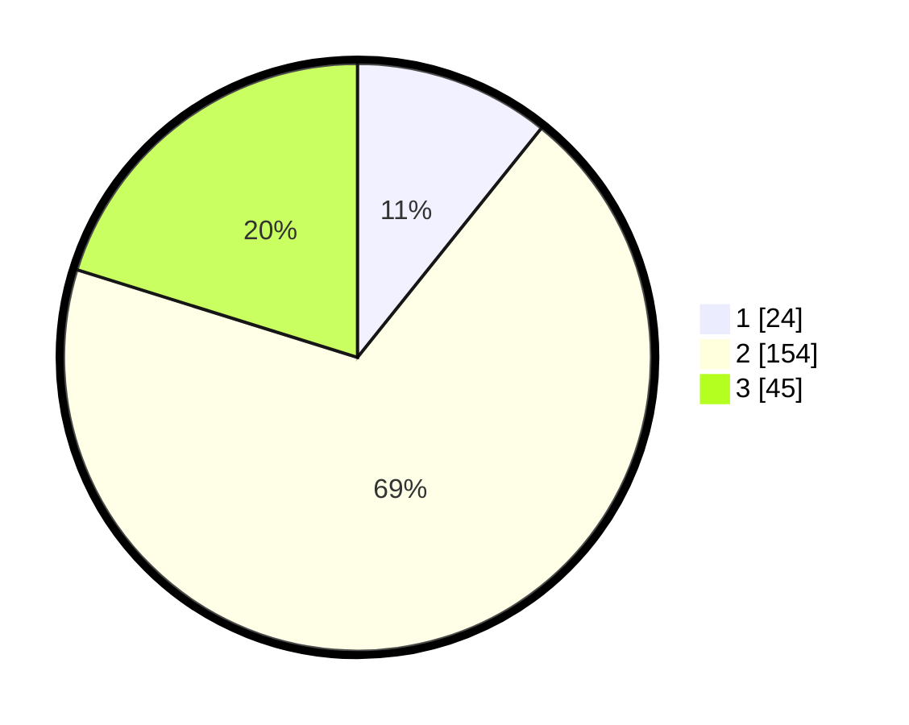

# Hasil

## Grafik

## Tabel

| No.    | Nama Paslon    | Suara | Suara (raw) | Persentase |
|:------ |:-------------- | -----:| -----------:| ----------:|
| 100025 | ANIES MUHAIMIN | 24    | [24][p-1]   | 10,76      |
| 100026 | PRABOWO GIBRAN | 154   | [154][p-2]  | 69,06      |
| 100027 | GANJAR MAHFUD  | 45    | [45][p-3]   | 20,18      |

[p-1]: https://github.com/gigit-pemilu/pemilu-2024/blob/main/pilpres/hitung-suara/sub/31-dki-jakarta/sub/73-jakarta-barat/sub/01-cengkareng/sub/1005-kapuk/sub/100-tps/sub/paslon-1.txt
[p-2]: https://github.com/gigit-pemilu/pemilu-2024/blob/main/pilpres/hitung-suara/sub/31-dki-jakarta/sub/73-jakarta-barat/sub/01-cengkareng/sub/1005-kapuk/sub/100-tps/sub/paslon-2.txt
[p-3]: https://github.com/gigit-pemilu/pemilu-2024/blob/main/pilpres/hitung-suara/sub/31-dki-jakarta/sub/73-jakarta-barat/sub/01-cengkareng/sub/1005-kapuk/sub/100-tps/sub/paslon-3.txt

## Foto C Plano

https://sirekap-obj-formc.kpu.go.id/3d47/pemilu/ppwp/31/73/01/10/05/3173011005100-20240215-000658--ca4c074c-a907-47cb-bfbb-c08ada3f6643.jpg

https://sirekap-obj-formc.kpu.go.id/3d47/pemilu/ppwp/31/73/01/10/05/3173011005100-20240215-000707--60a955e3-b56a-46ee-b85c-dd7ed53cfdac.jpg

https://sirekap-obj-formc.kpu.go.id/3d47/pemilu/ppwp/31/73/01/10/05/3173011005100-20240215-000728--02d93aa4-0095-477c-8786-e3b30a806def.jpg

## Metadata

| Key        | Value               |
| ---------- | ------------------- |
| Time Stamp | 2024-02-19 19:00:00 |

