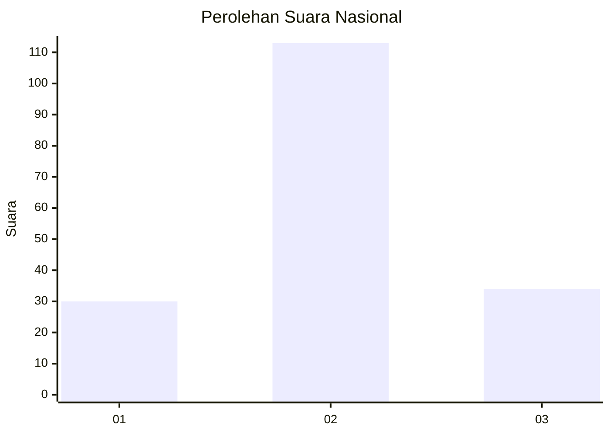
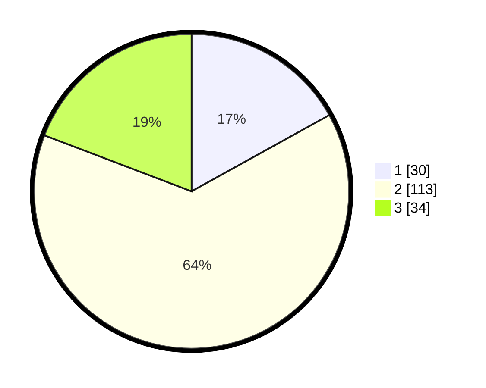

# Hasil

## Grafik

## Tabel

| No.    | Nama Paslon    | Suara | Suara (raw) | Persentase |
|:------ |:-------------- | -----:| -----------:| ----------:|
| 100025 | ANIES MUHAIMIN | 30    | [30][p-1]   | 16,95      |
| 100026 | PRABOWO GIBRAN | 113   | [113][p-2]  | 63,84      |
| 100027 | GANJAR MAHFUD  | 34    | [34][p-3]   | 19,21      |

[p-1]: https://github.com/gigit-pemilu/pemilu-2024/blob/main/pilpres/hitung-suara/sub/31-dki-jakarta/sub/73-jakarta-barat/sub/01-cengkareng/sub/1005-kapuk/sub/107-tps/sub/paslon-1.txt
[p-2]: https://github.com/gigit-pemilu/pemilu-2024/blob/main/pilpres/hitung-suara/sub/31-dki-jakarta/sub/73-jakarta-barat/sub/01-cengkareng/sub/1005-kapuk/sub/107-tps/sub/paslon-2.txt
[p-3]: https://github.com/gigit-pemilu/pemilu-2024/blob/main/pilpres/hitung-suara/sub/31-dki-jakarta/sub/73-jakarta-barat/sub/01-cengkareng/sub/1005-kapuk/sub/107-tps/sub/paslon-3.txt

## Foto C Plano

https://sirekap-obj-formc.kpu.go.id/b00c/pemilu/ppwp/31/73/01/10/05/3173011005107-20240214-232516--69e64c7f-0b84-45ea-994a-010bb3be8547.jpg

https://sirekap-obj-formc.kpu.go.id/b00c/pemilu/ppwp/31/73/01/10/05/3173011005107-20240214-232545--53092a19-a941-47c2-95cf-5783c4a2d40d.jpg

https://sirekap-obj-formc.kpu.go.id/b00c/pemilu/ppwp/31/73/01/10/05/3173011005107-20240214-232613--1d19193a-1ab1-4b01-9fc9-d160e099c742.jpg

## Metadata

| Key        | Value               |
| ---------- | ------------------- |
| Time Stamp | 2024-02-19 06:16:00 |

