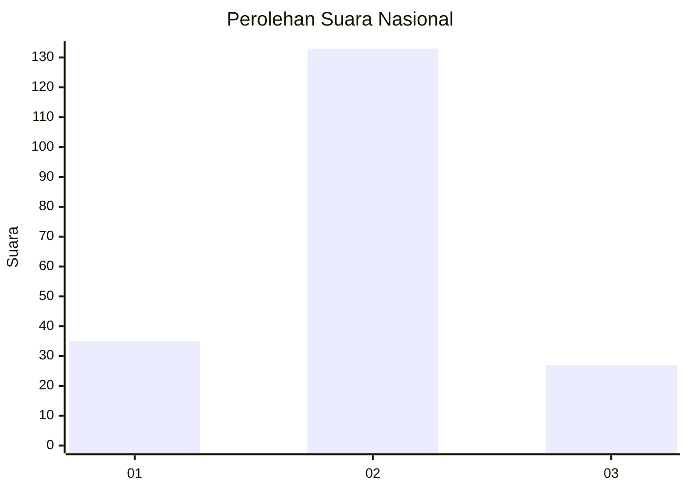
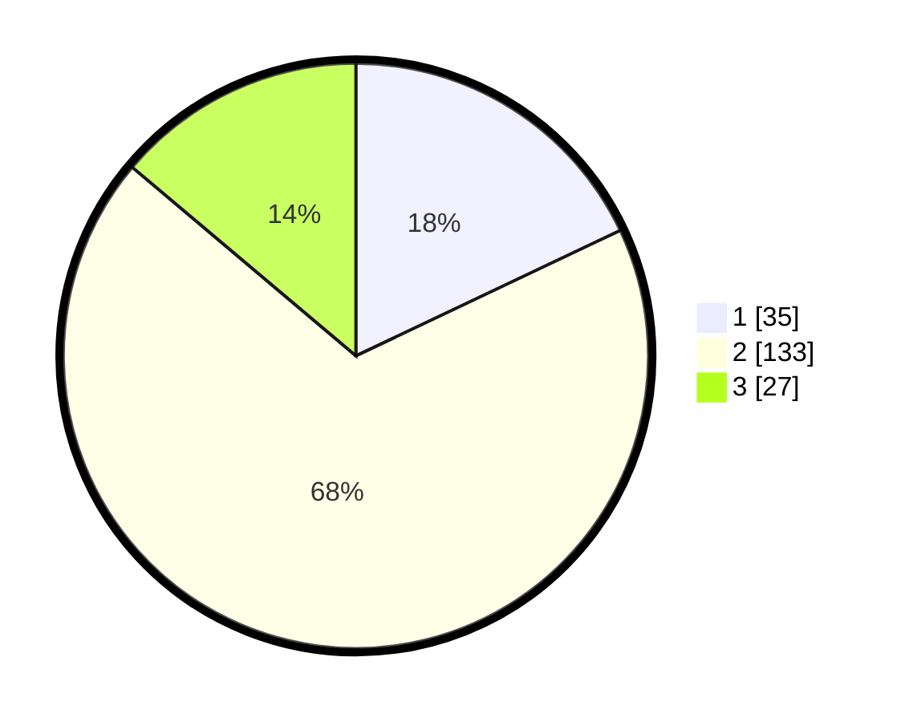

# Hasil

## Grafik

## Tabel

| No.    | Nama Paslon    | Suara | Suara (raw) | Persentase |
|:------ |:-------------- | -----:| -----------:| ----------:|
| 100025 | ANIES MUHAIMIN | 35    | [35][p-1]   | 17,95      |
| 100026 | PRABOWO GIBRAN | 133   | [133][p-2]  | 68,21      |
| 100027 | GANJAR MAHFUD  | 27    | [27][p-3]   | 13,85      |

[p-1]: https://github.com/gigit-pemilu/pemilu-2024/blob/main/pilpres/hitung-suara/sub/31-dki-jakarta/sub/73-jakarta-barat/sub/01-cengkareng/sub/1005-kapuk/sub/112-tps/sub/paslon-1.txt
[p-2]: https://github.com/gigit-pemilu/pemilu-2024/blob/main/pilpres/hitung-suara/sub/31-dki-jakarta/sub/73-jakarta-barat/sub/01-cengkareng/sub/1005-kapuk/sub/112-tps/sub/paslon-2.txt
[p-3]: https://github.com/gigit-pemilu/pemilu-2024/blob/main/pilpres/hitung-suara/sub/31-dki-jakarta/sub/73-jakarta-barat/sub/01-cengkareng/sub/1005-kapuk/sub/112-tps/sub/paslon-3.txt

## Foto C Plano

https://sirekap-obj-formc.kpu.go.id/b1bb/pemilu/ppwp/31/73/01/10/05/3173011005112-20240214-201632--35d1d301-c8af-416a-b5ea-f7da4a6af95c.jpg

https://sirekap-obj-formc.kpu.go.id/b1bb/pemilu/ppwp/31/73/01/10/05/3173011005112-20240214-202052--3e1f57ee-4948-4d1e-8862-b7558810080f.jpg

https://sirekap-obj-formc.kpu.go.id/b1bb/pemilu/ppwp/31/73/01/10/05/3173011005112-20240214-202205--84499441-a12f-4e7a-aab0-bbf17cb8eb27.jpg

## Metadata

| Key        | Value               |
| ---------- | ------------------- |
| Time Stamp | 2024-02-19 06:16:00 |

