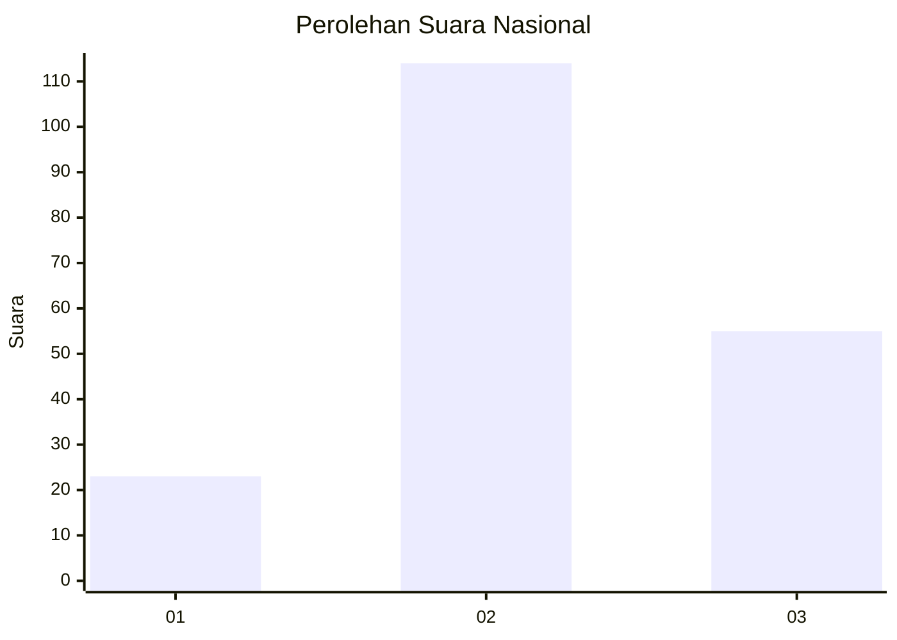
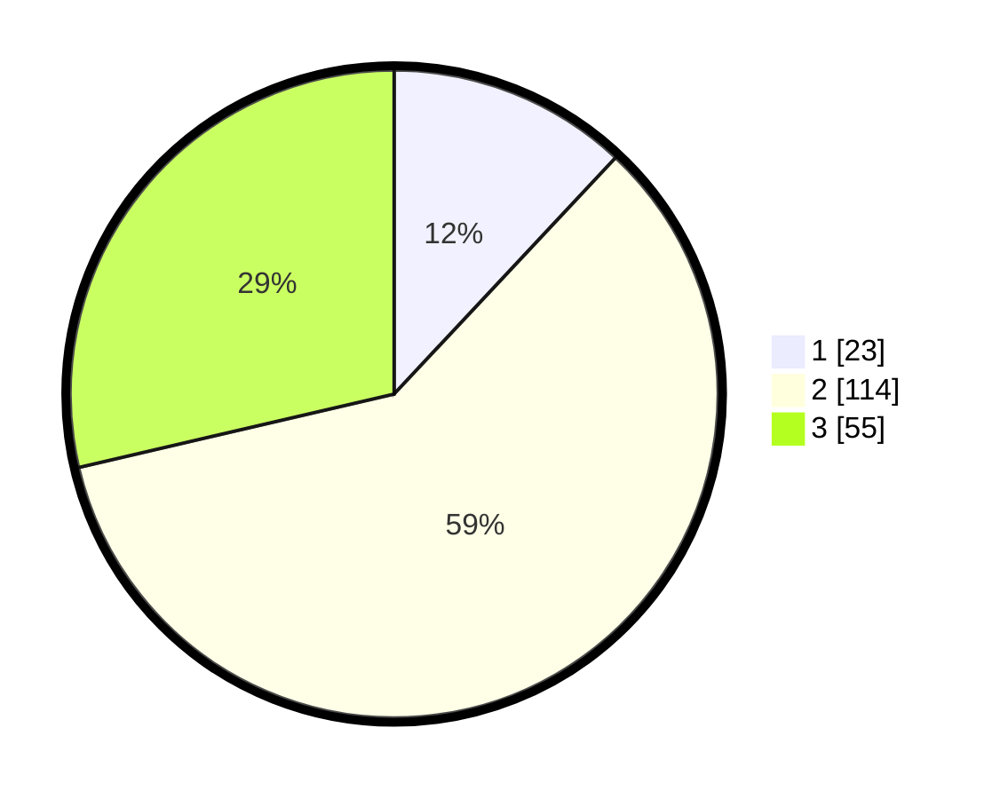

# Hasil

## Grafik

## Tabel

| No.    | Nama Paslon    | Suara | Suara (raw) | Persentase |
|:------ |:-------------- | -----:| -----------:| ----------:|
| 100025 | ANIES MUHAIMIN | 23    | [23][p-1]   | 11,98      |
| 100026 | PRABOWO GIBRAN | 114   | [114][p-2]  | 59,38      |
| 100027 | GANJAR MAHFUD  | 55    | [55][p-3]   | 28,65      |

[p-1]: https://github.com/gigit-pemilu/pemilu-2024/blob/main/pilpres/hitung-suara/sub/31-dki-jakarta/sub/73-jakarta-barat/sub/01-cengkareng/sub/1005-kapuk/sub/139-tps/sub/paslon-1.txt
[p-2]: https://github.com/gigit-pemilu/pemilu-2024/blob/main/pilpres/hitung-suara/sub/31-dki-jakarta/sub/73-jakarta-barat/sub/01-cengkareng/sub/1005-kapuk/sub/139-tps/sub/paslon-2.txt
[p-3]: https://github.com/gigit-pemilu/pemilu-2024/blob/main/pilpres/hitung-suara/sub/31-dki-jakarta/sub/73-jakarta-barat/sub/01-cengkareng/sub/1005-kapuk/sub/139-tps/sub/paslon-3.txt

## Foto C Plano

https://sirekap-obj-formc.kpu.go.id/da54/pemilu/ppwp/31/73/01/10/05/3173011005139-20240214-221748--abcbab9a-f8fa-4301-8f20-8155fbcba525.jpg

https://sirekap-obj-formc.kpu.go.id/da54/pemilu/ppwp/31/73/01/10/05/3173011005139-20240214-224517--a07cce75-1ab9-47a5-b283-6a55879b8f54.jpg

https://sirekap-obj-formc.kpu.go.id/da54/pemilu/ppwp/31/73/01/10/05/3173011005139-20240214-224635--01df9a02-1098-4044-80b5-aa6febde2d5d.jpg

## Metadata

| Key        | Value               |
| ---------- | ------------------- |
| Time Stamp | 2024-02-19 20:00:00 |

