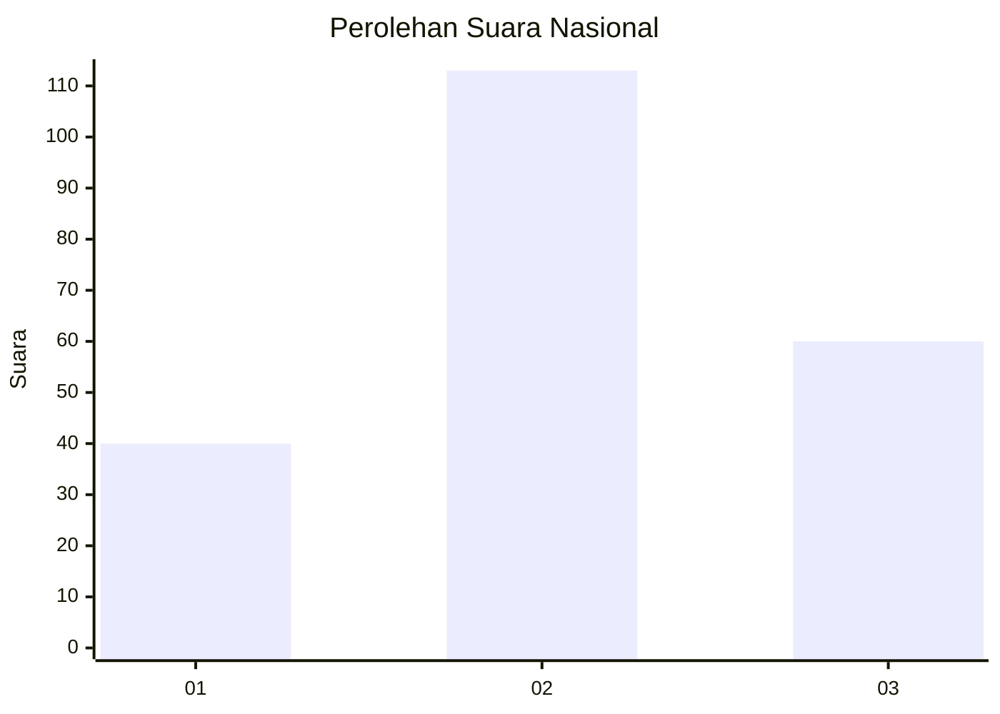
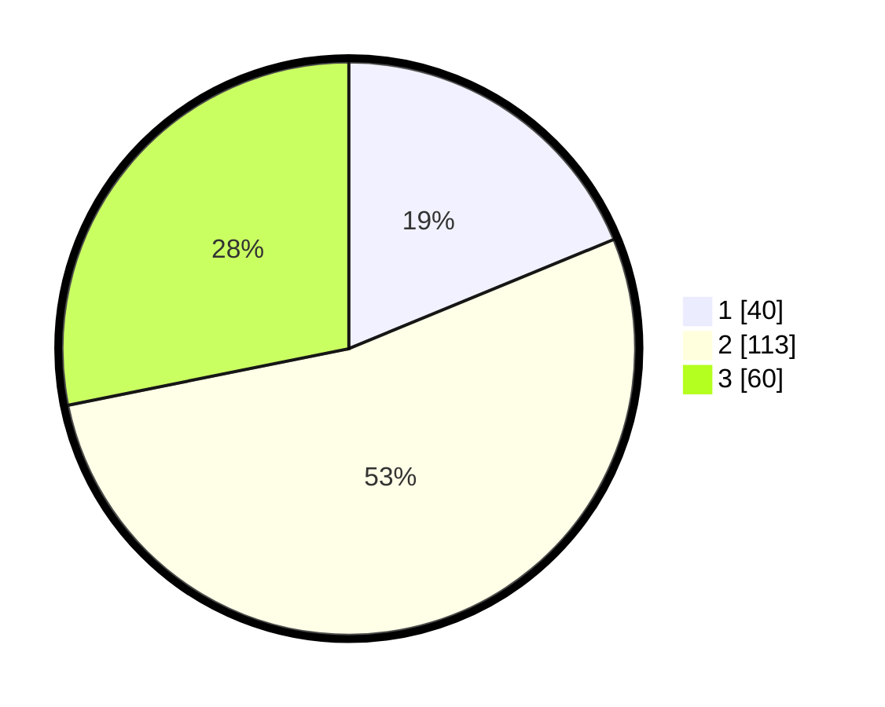

# Hasil

## Grafik

## Tabel

| No.    | Nama Paslon    | Suara | Suara (raw) | Persentase |
|:------ |:-------------- | -----:| -----------:| ----------:|
| 100025 | ANIES MUHAIMIN | 40    | [40][p-1]   | 18,78      |
| 100026 | PRABOWO GIBRAN | 113   | [113][p-2]  | 53,05      |
| 100027 | GANJAR MAHFUD  | 60    | [60][p-3]   | 28,17      |

[p-1]: https://github.com/gigit-pemilu/pemilu-2024/blob/main/pilpres/hitung-suara/sub/31-dki-jakarta/sub/73-jakarta-barat/sub/01-cengkareng/sub/1005-kapuk/sub/164-tps/sub/paslon-1.txt
[p-2]: https://github.com/gigit-pemilu/pemilu-2024/blob/main/pilpres/hitung-suara/sub/31-dki-jakarta/sub/73-jakarta-barat/sub/01-cengkareng/sub/1005-kapuk/sub/164-tps/sub/paslon-2.txt
[p-3]: https://github.com/gigit-pemilu/pemilu-2024/blob/main/pilpres/hitung-suara/sub/31-dki-jakarta/sub/73-jakarta-barat/sub/01-cengkareng/sub/1005-kapuk/sub/164-tps/sub/paslon-3.txt

## Foto C Plano

https://sirekap-obj-formc.kpu.go.id/04a9/pemilu/ppwp/31/73/01/10/05/3173011005164-20240215-004500--a20dd740-b0ac-40a9-95e0-8705b576fc5a.jpg

https://sirekap-obj-formc.kpu.go.id/04a9/pemilu/ppwp/31/73/01/10/05/3173011005164-20240214-214932--72a7ddd6-fb8f-4c85-9ef6-86bdd7e4c084.jpg

https://sirekap-obj-formc.kpu.go.id/04a9/pemilu/ppwp/31/73/01/10/05/3173011005164-20240214-214953--60fcd546-9e1c-4331-8032-8d4acca2a8e7.jpg

## Metadata

| Key        | Value               |
| ---------- | ------------------- |
| Time Stamp | 2024-02-19 16:00:00 |

