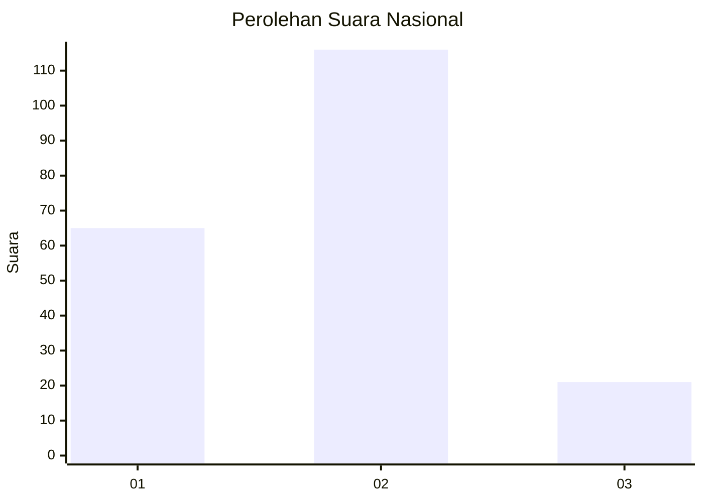
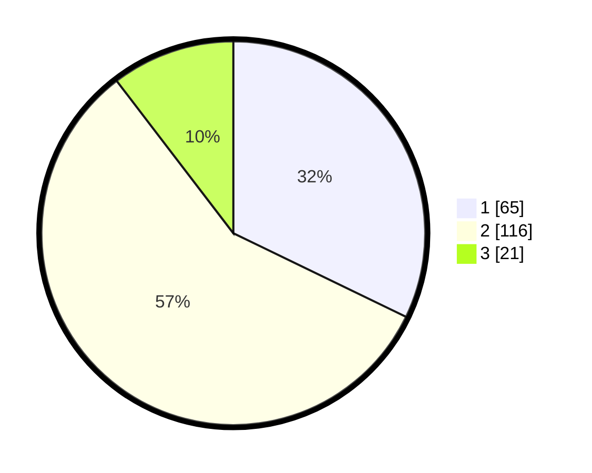

# Hasil

## Grafik

## Tabel

| No.    | Nama Paslon    | Suara | Suara (raw) | Persentase |
|:------ |:-------------- | -----:| -----------:| ----------:|
| 100025 | ANIES MUHAIMIN | 65    | [65][p-1]   | 32,18      |
| 100026 | PRABOWO GIBRAN | 116   | [116][p-2]  | 57,43      |
| 100027 | GANJAR MAHFUD  | 21    | [21][p-3]   | 10,40      |

[p-1]: https://github.com/gigit-pemilu/pemilu-2024/blob/main/pilpres/hitung-suara/sub/31-dki-jakarta/sub/73-jakarta-barat/sub/01-cengkareng/sub/1005-kapuk/sub/171-tps/sub/paslon-1.txt
[p-2]: https://github.com/gigit-pemilu/pemilu-2024/blob/main/pilpres/hitung-suara/sub/31-dki-jakarta/sub/73-jakarta-barat/sub/01-cengkareng/sub/1005-kapuk/sub/171-tps/sub/paslon-2.txt
[p-3]: https://github.com/gigit-pemilu/pemilu-2024/blob/main/pilpres/hitung-suara/sub/31-dki-jakarta/sub/73-jakarta-barat/sub/01-cengkareng/sub/1005-kapuk/sub/171-tps/sub/paslon-3.txt

## Foto C Plano

https://sirekap-obj-formc.kpu.go.id/c957/pemilu/ppwp/31/73/01/10/05/3173011005171-20240214-232957--ba12173f-591c-450d-b876-bcfd1d453311.jpg

https://sirekap-obj-formc.kpu.go.id/c957/pemilu/ppwp/31/73/01/10/05/3173011005171-20240214-233013--96af1b53-49c5-47c1-8ad3-de1ea9a1c965.jpg

https://sirekap-obj-formc.kpu.go.id/c957/pemilu/ppwp/31/73/01/10/05/3173011005171-20240214-233022--06a96b21-6ccc-484d-a4ba-b021ac0cbb49.jpg

## Metadata

| Key        | Value               |
| ---------- | ------------------- |
| Time Stamp | 2024-02-19 06:16:00 |

