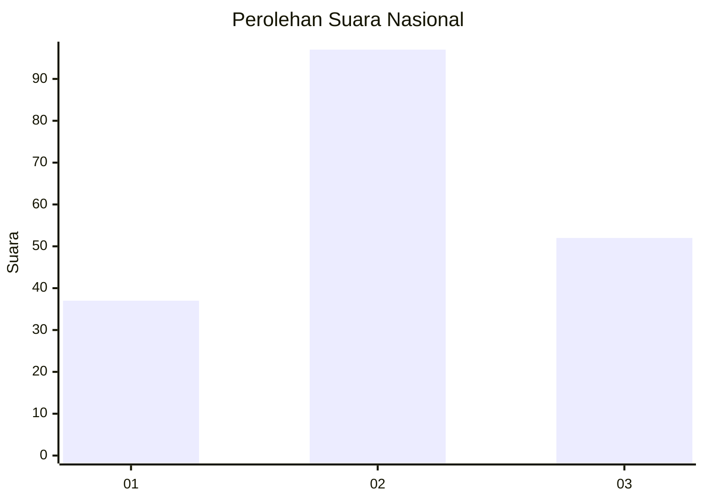
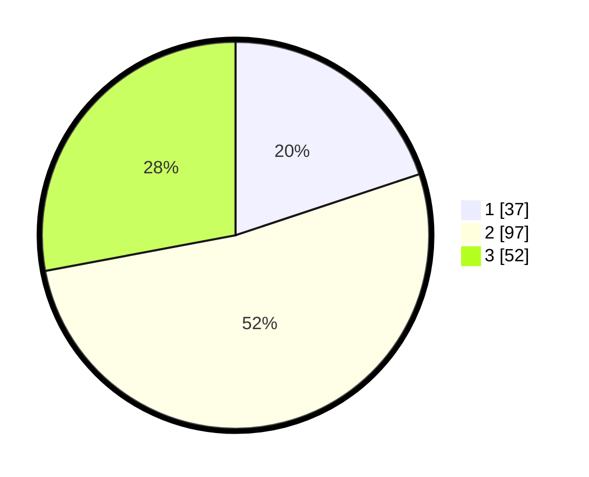

# Hasil

## Grafik

## Tabel

| No.    | Nama Paslon    | Suara | Suara (raw) | Persentase |
|:------ |:-------------- | -----:| -----------:| ----------:|
| 100025 | ANIES MUHAIMIN | 37    | [37][p-1]   | 19,89      |
| 100026 | PRABOWO GIBRAN | 97    | [97][p-2]   | 52,15      |
| 100027 | GANJAR MAHFUD  | 52    | [52][p-3]   | 27,96      |

[p-1]: https://github.com/gigit-pemilu/pemilu-2024/blob/main/pilpres/hitung-suara/sub/31-dki-jakarta/sub/73-jakarta-barat/sub/01-cengkareng/sub/1005-kapuk/sub/175-tps/sub/paslon-1.txt
[p-2]: https://github.com/gigit-pemilu/pemilu-2024/blob/main/pilpres/hitung-suara/sub/31-dki-jakarta/sub/73-jakarta-barat/sub/01-cengkareng/sub/1005-kapuk/sub/175-tps/sub/paslon-2.txt
[p-3]: https://github.com/gigit-pemilu/pemilu-2024/blob/main/pilpres/hitung-suara/sub/31-dki-jakarta/sub/73-jakarta-barat/sub/01-cengkareng/sub/1005-kapuk/sub/175-tps/sub/paslon-3.txt

## Foto C Plano

https://sirekap-obj-formc.kpu.go.id/df62/pemilu/ppwp/31/73/01/10/05/3173011005175-20240215-012236--2c82bc60-e654-4b08-8553-b4dedd3182de.jpg

https://sirekap-obj-formc.kpu.go.id/df62/pemilu/ppwp/31/73/01/10/05/3173011005175-20240215-022037--59b5420c-9b8a-441d-bbde-dbe422291dc6.jpg

https://sirekap-obj-formc.kpu.go.id/df62/pemilu/ppwp/31/73/01/10/05/3173011005175-20240215-013637--8b42203e-4403-418e-8a29-336e64d9dbee.jpg

## Metadata

| Key        | Value               |
| ---------- | ------------------- |
| Time Stamp | 2024-02-21 16:00:00 |

