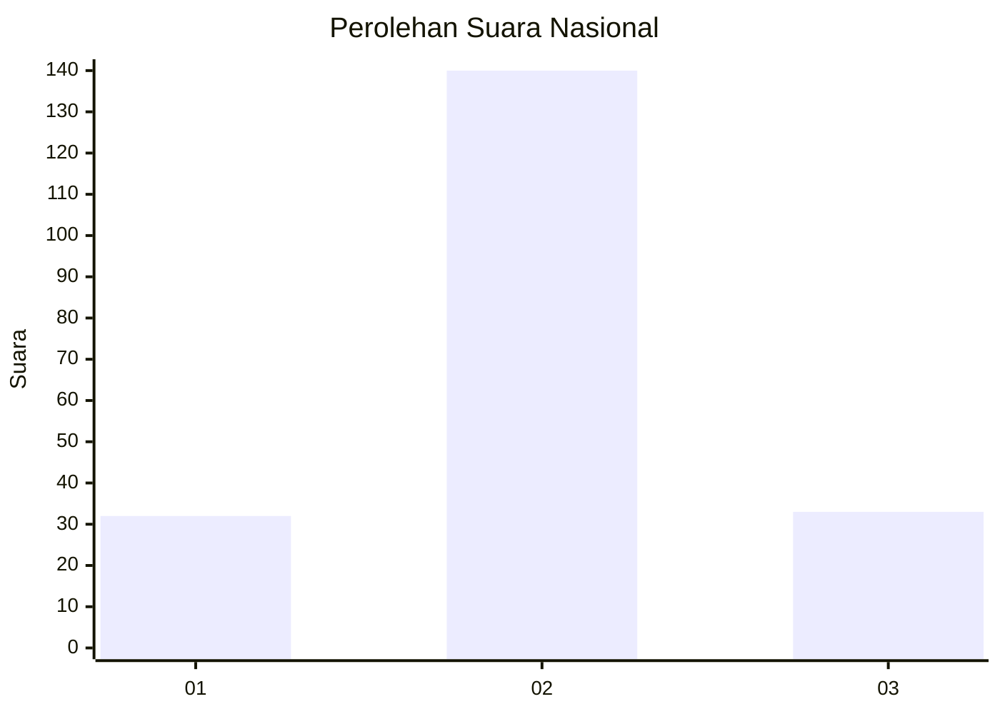
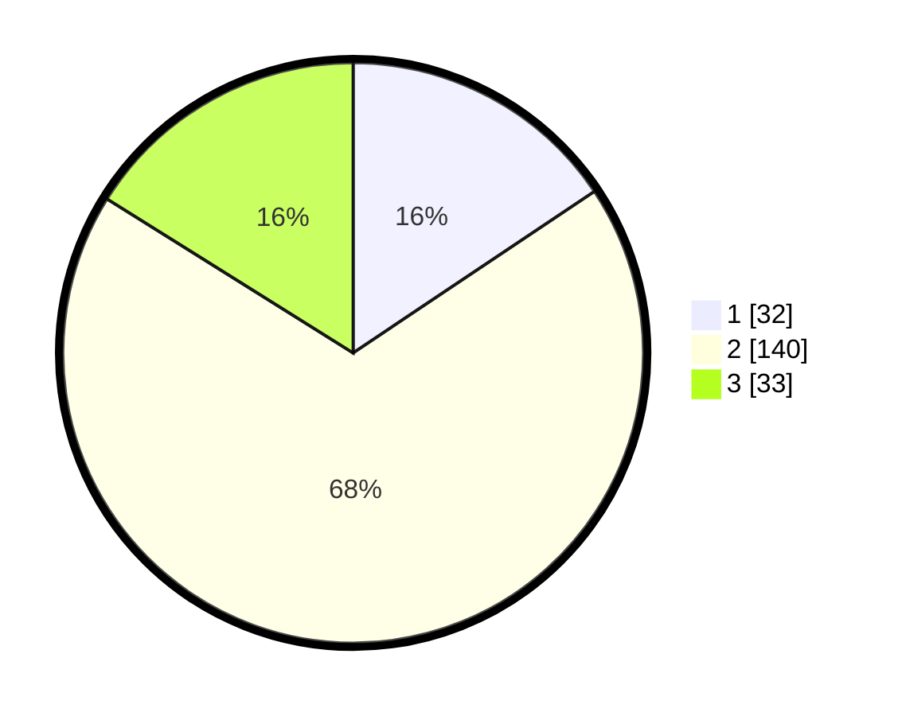

# Hasil

## Grafik

## Tabel

| No.    | Nama Paslon    | Suara | Suara (raw) | Persentase |
|:------ |:-------------- | -----:| -----------:| ----------:|
| 100025 | ANIES MUHAIMIN | 32    | [32][p-1]   | 15,61      |
| 100026 | PRABOWO GIBRAN | 140   | [140][p-2]  | 68,29      |
| 100027 | GANJAR MAHFUD  | 33    | [33][p-3]   | 16,10      |

[p-1]: https://github.com/gigit-pemilu/pemilu-2024/blob/main/pilpres/hitung-suara/sub/31-dki-jakarta/sub/73-jakarta-barat/sub/01-cengkareng/sub/1005-kapuk/sub/181-tps/sub/paslon-1.txt
[p-2]: https://github.com/gigit-pemilu/pemilu-2024/blob/main/pilpres/hitung-suara/sub/31-dki-jakarta/sub/73-jakarta-barat/sub/01-cengkareng/sub/1005-kapuk/sub/181-tps/sub/paslon-2.txt
[p-3]: https://github.com/gigit-pemilu/pemilu-2024/blob/main/pilpres/hitung-suara/sub/31-dki-jakarta/sub/73-jakarta-barat/sub/01-cengkareng/sub/1005-kapuk/sub/181-tps/sub/paslon-3.txt

## Foto C Plano

https://sirekap-obj-formc.kpu.go.id/ff4f/pemilu/ppwp/31/73/01/10/05/3173011005181-20240215-015825--10e27057-6a17-48b4-9284-57040a6ad006.jpg

https://sirekap-obj-formc.kpu.go.id/ff4f/pemilu/ppwp/31/73/01/10/05/3173011005181-20240214-213644--6b999488-30be-4aae-9814-3cef8281fa87.jpg

https://sirekap-obj-formc.kpu.go.id/ff4f/pemilu/ppwp/31/73/01/10/05/3173011005181-20240214-223728--dec0fd03-530f-4a7d-abfd-fd5154d69656.jpg

## Metadata

| Key        | Value               |
| ---------- | ------------------- |
| Time Stamp | 2024-02-19 06:16:00 |

