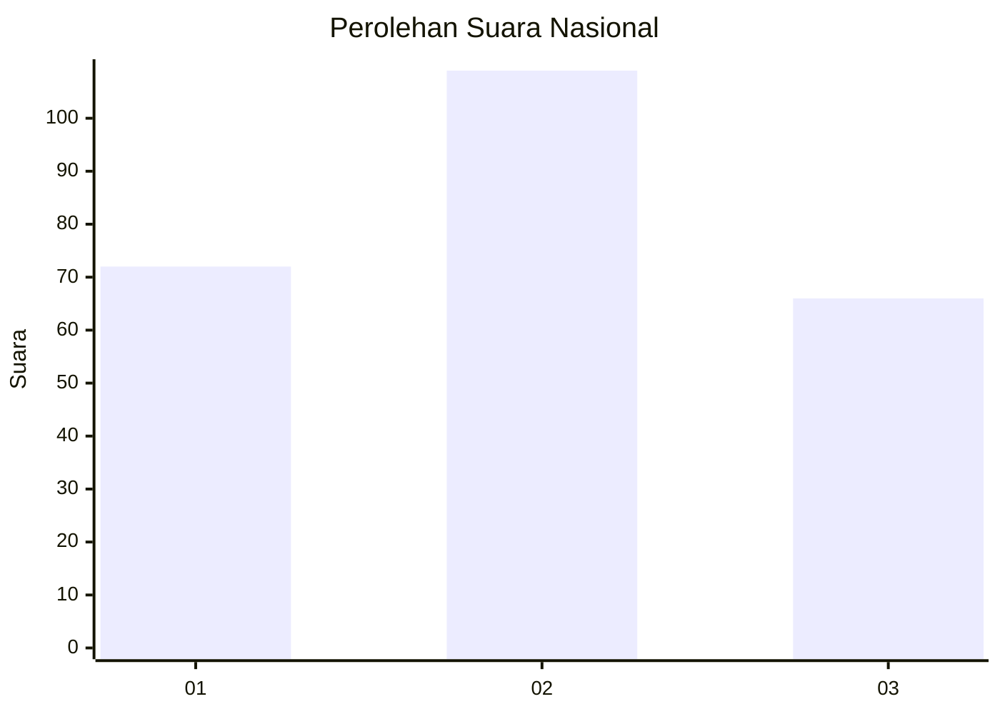
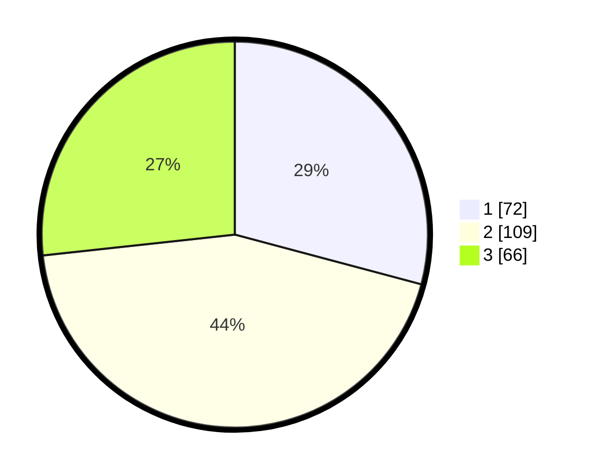

# Hasil

## Grafik

## Tabel

| No.    | Nama Paslon    | Suara | Suara (raw) | Persentase |
|:------ |:-------------- | -----:| -----------:| ----------:|
| 100025 | ANIES MUHAIMIN | 72    | [72][p-1]   | 29,15      |
| 100026 | PRABOWO GIBRAN | 109   | [109][p-2]  | 44,13      |
| 100027 | GANJAR MAHFUD  | 66    | [66][p-3]   | 26,72      |

[p-1]: https://github.com/gigit-pemilu/pemilu-2024/blob/main/pilpres/hitung-suara/sub/31-dki-jakarta/sub/73-jakarta-barat/sub/01-cengkareng/sub/1005-kapuk/sub/195-tps/sub/paslon-1.txt
[p-2]: https://github.com/gigit-pemilu/pemilu-2024/blob/main/pilpres/hitung-suara/sub/31-dki-jakarta/sub/73-jakarta-barat/sub/01-cengkareng/sub/1005-kapuk/sub/195-tps/sub/paslon-2.txt
[p-3]: https://github.com/gigit-pemilu/pemilu-2024/blob/main/pilpres/hitung-suara/sub/31-dki-jakarta/sub/73-jakarta-barat/sub/01-cengkareng/sub/1005-kapuk/sub/195-tps/sub/paslon-3.txt

## Foto C Plano

https://sirekap-obj-formc.kpu.go.id/e785/pemilu/ppwp/31/73/01/10/05/3173011005195-20240214-211448--1a29879d-fb62-4899-9030-824b0117ffde.jpg

https://sirekap-obj-formc.kpu.go.id/e785/pemilu/ppwp/31/73/01/10/05/3173011005195-20240214-211730--c9a36202-796e-468d-b469-dae153d31931.jpg

https://sirekap-obj-formc.kpu.go.id/e785/pemilu/ppwp/31/73/01/10/05/3173011005195-20240215-030720--c5d59d90-6326-4684-bb3b-97d22af79dcd.jpg

## Metadata

| Key        | Value               |
| ---------- | ------------------- |
| Time Stamp | 2024-02-15 04:00:24 |

