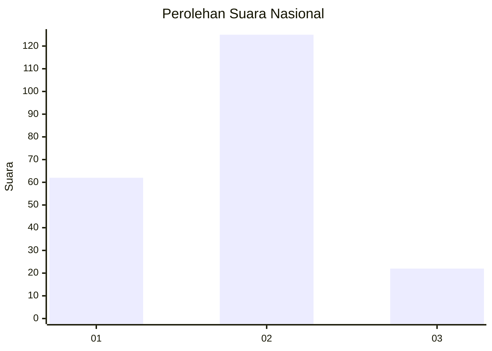
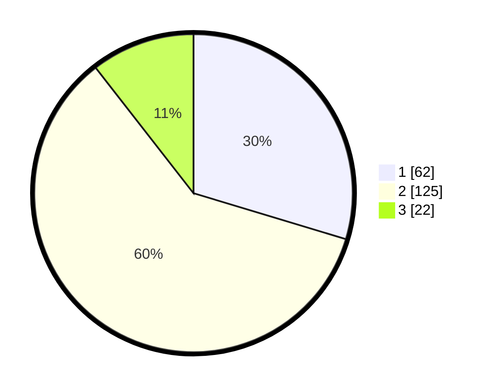

# Hasil

## Grafik

## Tabel

| No.    | Nama Paslon    | Suara | Suara (raw) | Persentase |
|:------ |:-------------- | -----:| -----------:| ----------:|
| 100025 | ANIES MUHAIMIN | 62    | [62][p-1]   | 29,67      |
| 100026 | PRABOWO GIBRAN | 125   | [125][p-2]  | 59,81      |
| 100027 | GANJAR MAHFUD  | 22    | [22][p-3]   | 10,53      |

[p-1]: https://github.com/gigit-pemilu/pemilu-2024/blob/main/pilpres/hitung-suara/sub/31-dki-jakarta/sub/73-jakarta-barat/sub/01-cengkareng/sub/1005-kapuk/sub/222-tps/sub/paslon-1.txt
[p-2]: https://github.com/gigit-pemilu/pemilu-2024/blob/main/pilpres/hitung-suara/sub/31-dki-jakarta/sub/73-jakarta-barat/sub/01-cengkareng/sub/1005-kapuk/sub/222-tps/sub/paslon-2.txt
[p-3]: https://github.com/gigit-pemilu/pemilu-2024/blob/main/pilpres/hitung-suara/sub/31-dki-jakarta/sub/73-jakarta-barat/sub/01-cengkareng/sub/1005-kapuk/sub/222-tps/sub/paslon-3.txt

## Foto C Plano

https://sirekap-obj-formc.kpu.go.id/cce1/pemilu/ppwp/31/73/01/10/05/3173011005222-20240214-222550--f5093eb6-050f-4034-8d55-5a4131cb6fdc.jpg

https://sirekap-obj-formc.kpu.go.id/cce1/pemilu/ppwp/31/73/01/10/05/3173011005222-20240214-220903--fedcf480-1d7e-4b51-8091-b2936753e931.jpg

https://sirekap-obj-formc.kpu.go.id/cce1/pemilu/ppwp/31/73/01/10/05/3173011005222-20240214-221042--9bc04718-ac5a-4251-ad8b-0a5340e5e4db.jpg

## Metadata

| Key        | Value               |
| ---------- | ------------------- |
| Time Stamp | 2024-02-19 06:16:00 |

