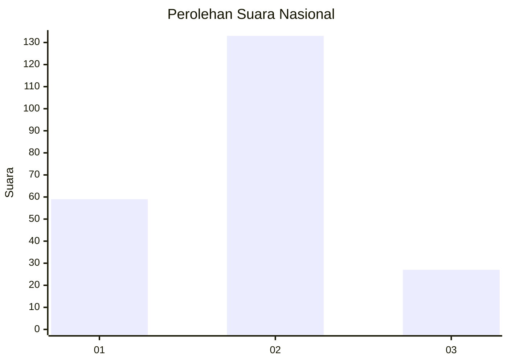
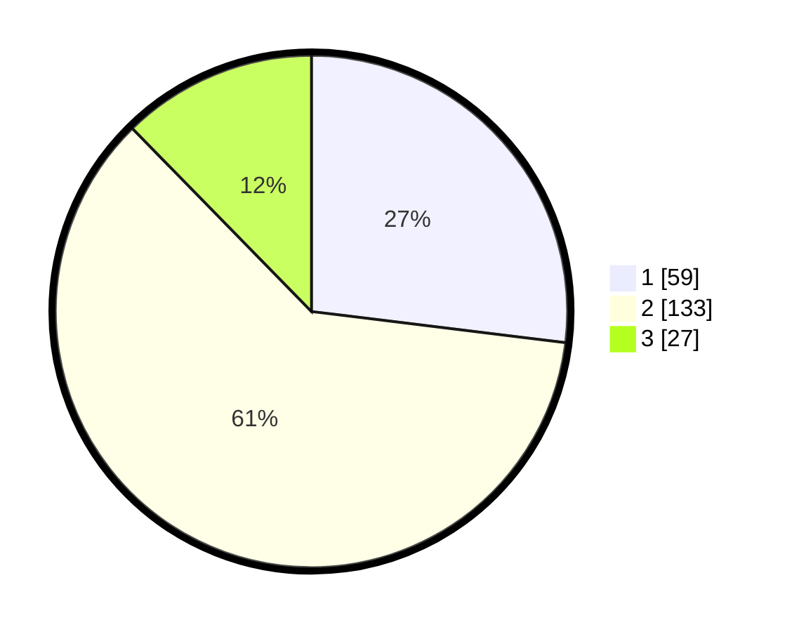

# Hasil

## Grafik

## Tabel

| No.    | Nama Paslon    | Suara | Suara (raw) | Persentase |
|:------ |:-------------- | -----:| -----------:| ----------:|
| 100025 | ANIES MUHAIMIN | 59    | [59][p-1]   | 26,94      |
| 100026 | PRABOWO GIBRAN | 133   | [133][p-2]  | 60,73      |
| 100027 | GANJAR MAHFUD  | 27    | [27][p-3]   | 12,33      |

[p-1]: https://github.com/gigit-pemilu/pemilu-2024/blob/main/pilpres/hitung-suara/sub/31-dki-jakarta/sub/73-jakarta-barat/sub/01-cengkareng/sub/1005-kapuk/sub/224-tps/sub/paslon-1.txt
[p-2]: https://github.com/gigit-pemilu/pemilu-2024/blob/main/pilpres/hitung-suara/sub/31-dki-jakarta/sub/73-jakarta-barat/sub/01-cengkareng/sub/1005-kapuk/sub/224-tps/sub/paslon-2.txt
[p-3]: https://github.com/gigit-pemilu/pemilu-2024/blob/main/pilpres/hitung-suara/sub/31-dki-jakarta/sub/73-jakarta-barat/sub/01-cengkareng/sub/1005-kapuk/sub/224-tps/sub/paslon-3.txt

## Foto C Plano

https://sirekap-obj-formc.kpu.go.id/fd81/pemilu/ppwp/31/73/01/10/05/3173011005224-20240214-204940--9eac9430-9f83-4489-84fe-135b4280394a.jpg

https://sirekap-obj-formc.kpu.go.id/fd81/pemilu/ppwp/31/73/01/10/05/3173011005224-20240214-204553--1d6b4fcb-5a21-4922-b325-62b97694bd75.jpg

https://sirekap-obj-formc.kpu.go.id/fd81/pemilu/ppwp/31/73/01/10/05/3173011005224-20240214-225856--8fd5e3b0-8c0e-40bc-9274-57a625ca1a2a.jpg

## Metadata

| Key        | Value               |
| ---------- | ------------------- |
| Time Stamp | 2024-02-15 04:00:24 |

