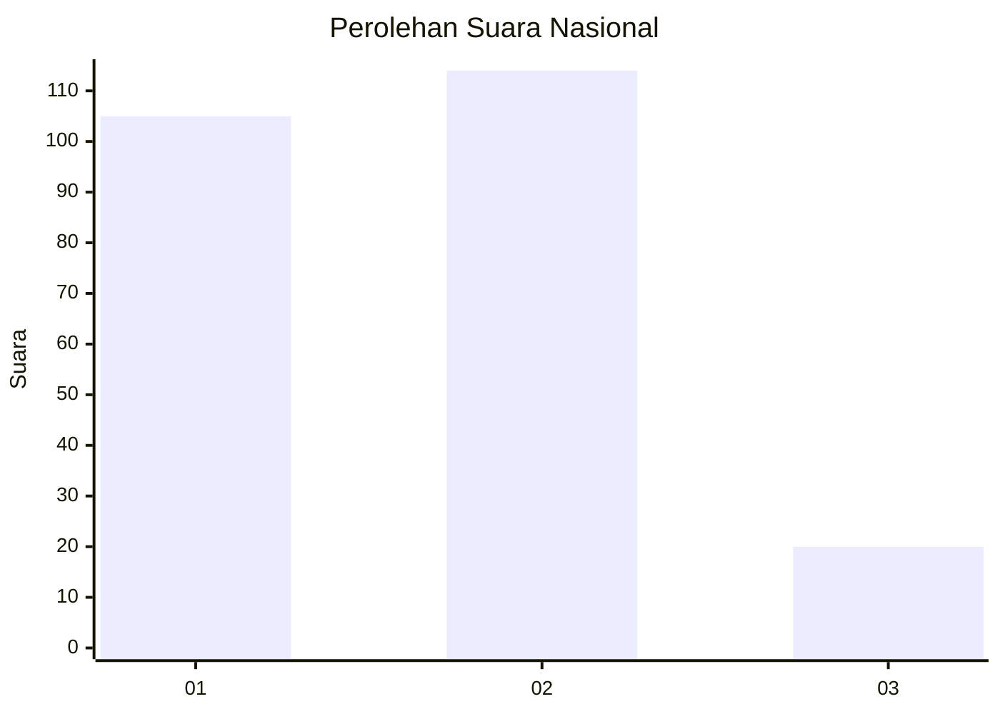
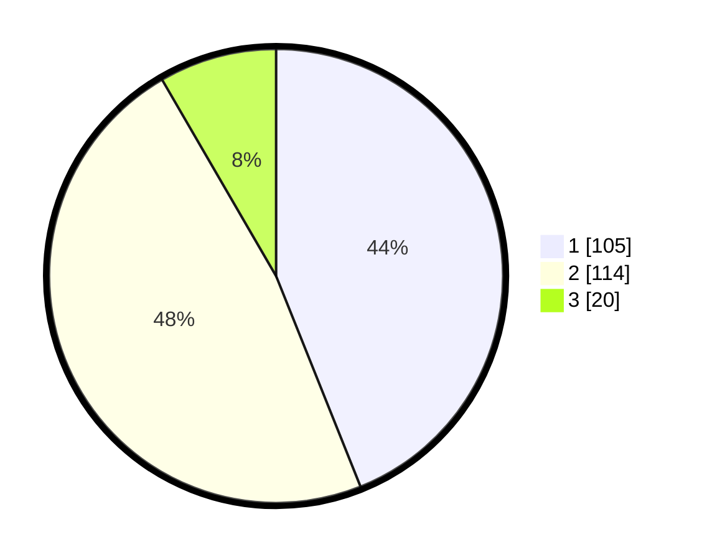

# Hasil

## Grafik

## Tabel

| No.    | Nama Paslon    | Suara | Suara (raw) | Persentase |
|:------ |:-------------- | -----:| -----------:| ----------:|
| 100025 | ANIES MUHAIMIN | 105   | [105][p-1]  | 43,93      |
| 100026 | PRABOWO GIBRAN | 114   | [114][p-2]  | 47,70      |
| 100027 | GANJAR MAHFUD  | 20    | [20][p-3]   | 8,37       |

[p-1]: https://github.com/gigit-pemilu/pemilu-2024/blob/main/pilpres/hitung-suara/sub/31-dki-jakarta/sub/73-jakarta-barat/sub/01-cengkareng/sub/1005-kapuk/sub/238-tps/sub/paslon-1.txt
[p-2]: https://github.com/gigit-pemilu/pemilu-2024/blob/main/pilpres/hitung-suara/sub/31-dki-jakarta/sub/73-jakarta-barat/sub/01-cengkareng/sub/1005-kapuk/sub/238-tps/sub/paslon-2.txt
[p-3]: https://github.com/gigit-pemilu/pemilu-2024/blob/main/pilpres/hitung-suara/sub/31-dki-jakarta/sub/73-jakarta-barat/sub/01-cengkareng/sub/1005-kapuk/sub/238-tps/sub/paslon-3.txt

## Foto C Plano

https://sirekap-obj-formc.kpu.go.id/64a0/pemilu/ppwp/31/73/01/10/05/3173011005238-20240214-223706--61959fdb-22d8-4200-892b-48941f3f5b84.jpg

https://sirekap-obj-formc.kpu.go.id/64a0/pemilu/ppwp/31/73/01/10/05/3173011005238-20240214-223849--f3f08eab-9704-41d8-894d-a27801b82b76.jpg

https://sirekap-obj-formc.kpu.go.id/64a0/pemilu/ppwp/31/73/01/10/05/3173011005238-20240214-224020--4a8543a5-726d-4477-a864-fd9a1919973c.jpg

## Metadata

| Key        | Value               |
| ---------- | ------------------- |
| Time Stamp | 2024-02-19 20:00:00 |

