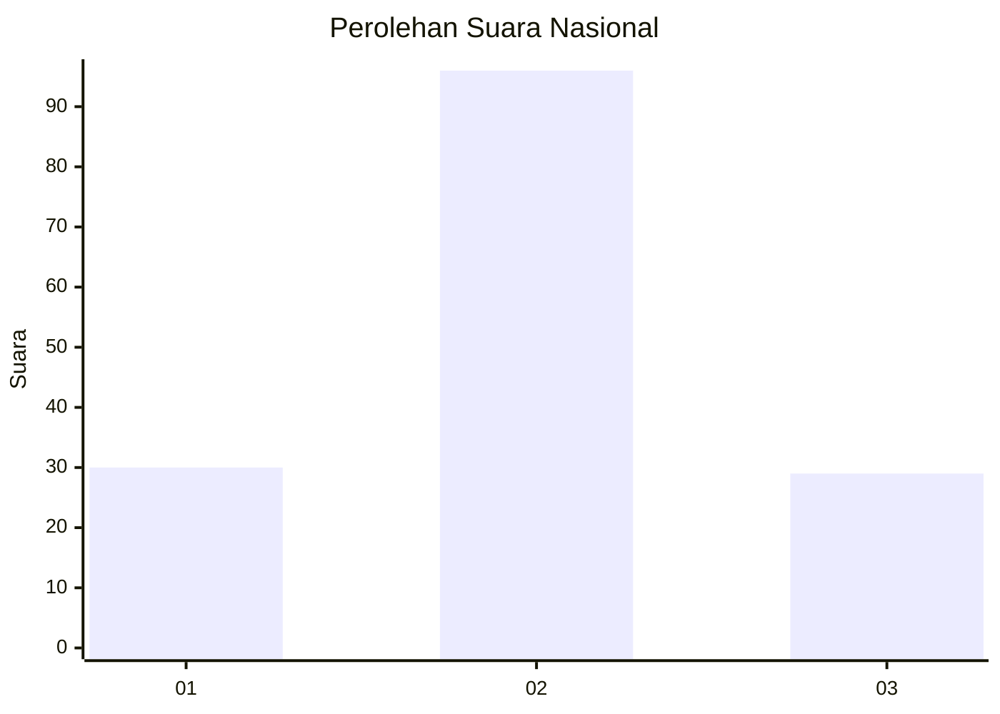
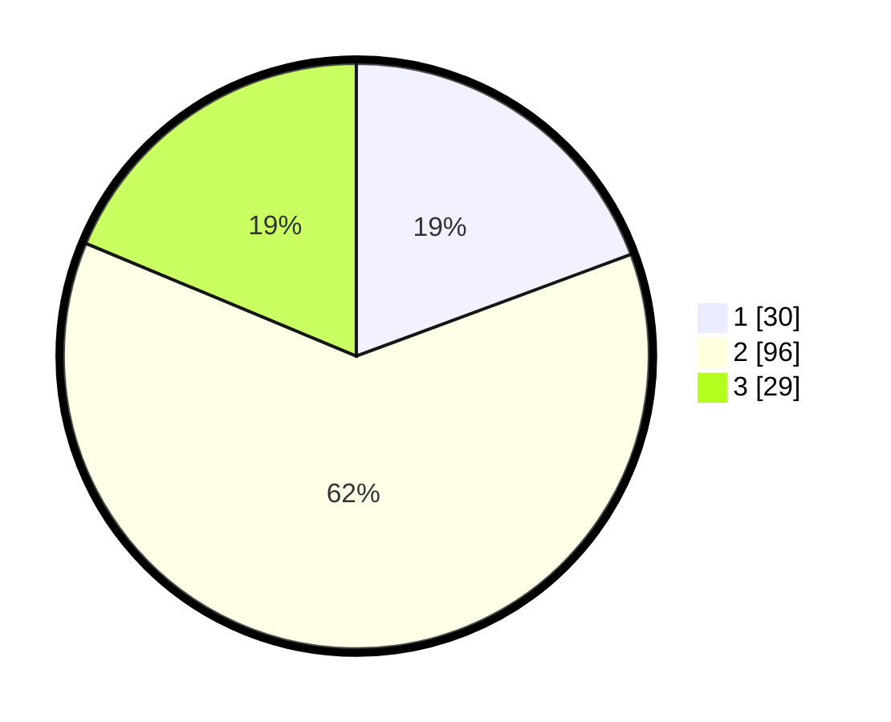

# Hasil

## Grafik

## Tabel

| No.    | Nama Paslon    | Suara | Suara (raw) | Persentase |
|:------ |:-------------- | -----:| -----------:| ----------:|
| 100025 | ANIES MUHAIMIN | 30    | [30][p-1]   | 19,35      |
| 100026 | PRABOWO GIBRAN | 96    | [96][p-2]   | 61,94      |
| 100027 | GANJAR MAHFUD  | 29    | [29][p-3]   | 18,71      |

[p-1]: https://github.com/gigit-pemilu/pemilu-2024/blob/main/pilpres/hitung-suara/sub/31-dki-jakarta/sub/73-jakarta-barat/sub/01-cengkareng/sub/1005-kapuk/sub/245-tps/sub/paslon-1.txt
[p-2]: https://github.com/gigit-pemilu/pemilu-2024/blob/main/pilpres/hitung-suara/sub/31-dki-jakarta/sub/73-jakarta-barat/sub/01-cengkareng/sub/1005-kapuk/sub/245-tps/sub/paslon-2.txt
[p-3]: https://github.com/gigit-pemilu/pemilu-2024/blob/main/pilpres/hitung-suara/sub/31-dki-jakarta/sub/73-jakarta-barat/sub/01-cengkareng/sub/1005-kapuk/sub/245-tps/sub/paslon-3.txt

## Foto C Plano

https://sirekap-obj-formc.kpu.go.id/518c/pemilu/ppwp/31/73/01/10/05/3173011005245-20240215-053848--5de1ea24-e5a7-4339-84c2-5166bc65d365.jpg

https://sirekap-obj-formc.kpu.go.id/518c/pemilu/ppwp/31/73/01/10/05/3173011005245-20240215-054024--3e15144f-c737-43c2-add3-d53c6f4733f9.jpg

https://sirekap-obj-formc.kpu.go.id/518c/pemilu/ppwp/31/73/01/10/05/3173011005245-20240215-054131--9e52ecd6-869b-42cb-8457-041fae44a14b.jpg

## Metadata

| Key        | Value               |
| ---------- | ------------------- |
| Time Stamp | 2024-02-19 21:00:00 |

