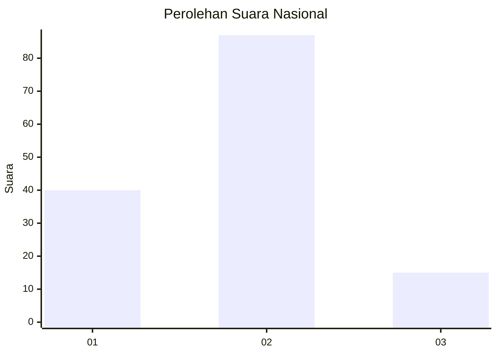
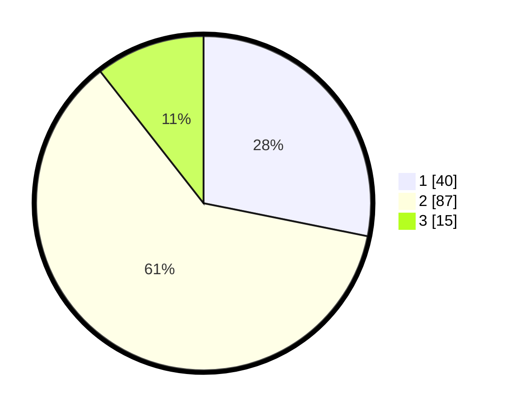

# Hasil

## Grafik

## Tabel

| No.    | Nama Paslon    | Suara | Suara (raw) | Persentase |
|:------ |:-------------- | -----:| -----------:| ----------:|
| 100025 | ANIES MUHAIMIN | 40    | [40][p-1]   | 28,17      |
| 100026 | PRABOWO GIBRAN | 87    | [87][p-2]   | 61,27      |
| 100027 | GANJAR MAHFUD  | 15    | [15][p-3]   | 10,56      |

[p-1]: https://github.com/gigit-pemilu/pemilu-2024/blob/main/pilpres/hitung-suara/sub/31-dki-jakarta/sub/73-jakarta-barat/sub/01-cengkareng/sub/1005-kapuk/sub/246-tps/sub/paslon-1.txt
[p-2]: https://github.com/gigit-pemilu/pemilu-2024/blob/main/pilpres/hitung-suara/sub/31-dki-jakarta/sub/73-jakarta-barat/sub/01-cengkareng/sub/1005-kapuk/sub/246-tps/sub/paslon-2.txt
[p-3]: https://github.com/gigit-pemilu/pemilu-2024/blob/main/pilpres/hitung-suara/sub/31-dki-jakarta/sub/73-jakarta-barat/sub/01-cengkareng/sub/1005-kapuk/sub/246-tps/sub/paslon-3.txt

## Foto C Plano

https://sirekap-obj-formc.kpu.go.id/7f23/pemilu/ppwp/31/73/01/10/05/3173011005246-20240215-112851--bc808f6f-665d-405e-af40-190a7439fded.jpg

https://sirekap-obj-formc.kpu.go.id/7f23/pemilu/ppwp/31/73/01/10/05/3173011005246-20240215-112939--deabd056-6cb5-4bff-9f3b-917e8543ab15.jpg

https://sirekap-obj-formc.kpu.go.id/7f23/pemilu/ppwp/31/73/01/10/05/3173011005246-20240215-113342--fee2b142-4c99-43f6-92e4-af7afbcf9af5.jpg

## Metadata

| Key        | Value               |
| ---------- | ------------------- |
| Time Stamp | 2024-02-19 06:16:00 |

