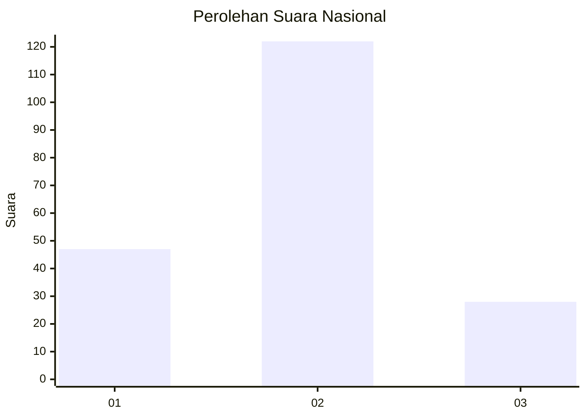
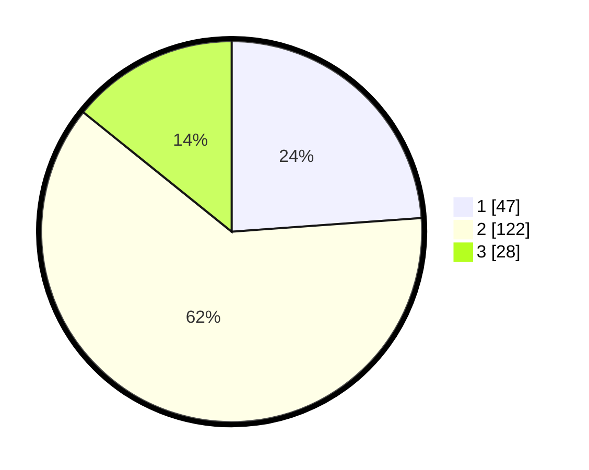

# Hasil

## Grafik

## Tabel

| No.    | Nama Paslon    | Suara | Suara (raw) | Persentase |
|:------ |:-------------- | -----:| -----------:| ----------:|
| 100025 | ANIES MUHAIMIN | 47    | [47][p-1]   | 23,86      |
| 100026 | PRABOWO GIBRAN | 122   | [122][p-2]  | 61,93      |
| 100027 | GANJAR MAHFUD  | 28    | [28][p-3]   | 14,21      |

[p-1]: https://github.com/gigit-pemilu/pemilu-2024/blob/main/pilpres/hitung-suara/sub/31-dki-jakarta/sub/73-jakarta-barat/sub/01-cengkareng/sub/1005-kapuk/sub/247-tps/sub/paslon-1.txt
[p-2]: https://github.com/gigit-pemilu/pemilu-2024/blob/main/pilpres/hitung-suara/sub/31-dki-jakarta/sub/73-jakarta-barat/sub/01-cengkareng/sub/1005-kapuk/sub/247-tps/sub/paslon-2.txt
[p-3]: https://github.com/gigit-pemilu/pemilu-2024/blob/main/pilpres/hitung-suara/sub/31-dki-jakarta/sub/73-jakarta-barat/sub/01-cengkareng/sub/1005-kapuk/sub/247-tps/sub/paslon-3.txt

## Foto C Plano

https://sirekap-obj-formc.kpu.go.id/9762/pemilu/ppwp/31/73/01/10/05/3173011005247-20240214-223841--01a1226f-ad4c-4063-8031-9d0148339ddb.jpg

https://sirekap-obj-formc.kpu.go.id/9762/pemilu/ppwp/31/73/01/10/05/3173011005247-20240214-223942--11ab7a8c-45cd-4671-b511-69100f90d4a0.jpg

https://sirekap-obj-formc.kpu.go.id/9762/pemilu/ppwp/31/73/01/10/05/3173011005247-20240214-224052--3d079627-b8c2-42e6-9fe7-782c964b00ed.jpg

## Metadata

| Key        | Value               |
| ---------- | ------------------- |
| Time Stamp | 2024-02-19 06:16:00 |

