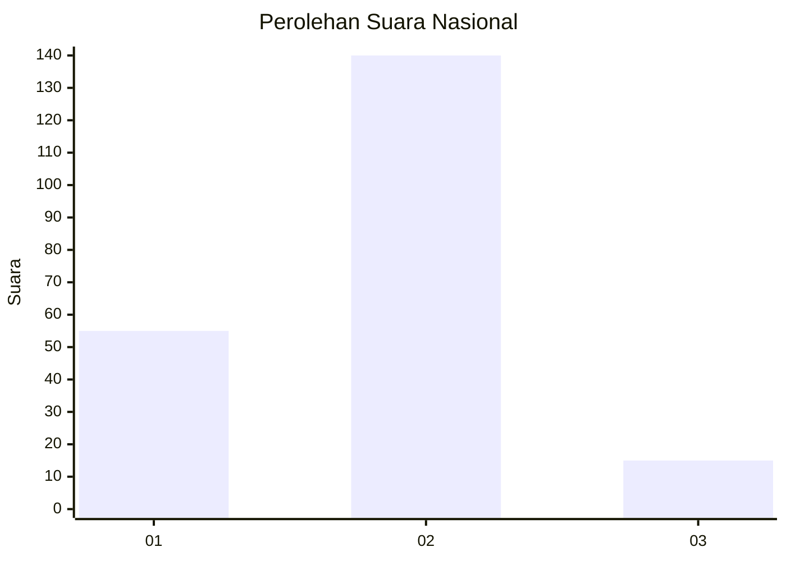
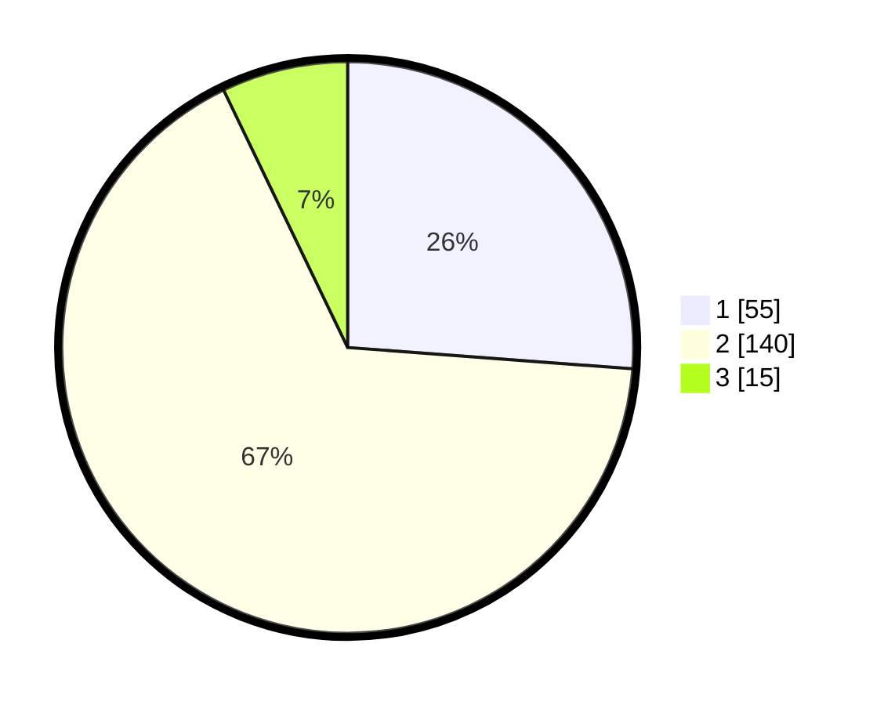

# Hasil

## Grafik

## Tabel

| No.    | Nama Paslon    | Suara | Suara (raw) | Persentase |
|:------ |:-------------- | -----:| -----------:| ----------:|
| 100025 | ANIES MUHAIMIN | 55    | [55][p-1]   | 26,19      |
| 100026 | PRABOWO GIBRAN | 140   | [140][p-2]  | 66,67      |
| 100027 | GANJAR MAHFUD  | 15    | [15][p-3]   | 7,14       |

[p-1]: https://github.com/gigit-pemilu/pemilu-2024/blob/main/pilpres/hitung-suara/sub/31-dki-jakarta/sub/73-jakarta-barat/sub/01-cengkareng/sub/1005-kapuk/sub/254-tps/sub/paslon-1.txt
[p-2]: https://github.com/gigit-pemilu/pemilu-2024/blob/main/pilpres/hitung-suara/sub/31-dki-jakarta/sub/73-jakarta-barat/sub/01-cengkareng/sub/1005-kapuk/sub/254-tps/sub/paslon-2.txt
[p-3]: https://github.com/gigit-pemilu/pemilu-2024/blob/main/pilpres/hitung-suara/sub/31-dki-jakarta/sub/73-jakarta-barat/sub/01-cengkareng/sub/1005-kapuk/sub/254-tps/sub/paslon-3.txt

## Foto C Plano

https://sirekap-obj-formc.kpu.go.id/f17b/pemilu/ppwp/31/73/01/10/05/3173011005254-20240214-234932--9d0811d8-2928-4fc5-863d-364ec9ca61dc.jpg

https://sirekap-obj-formc.kpu.go.id/f17b/pemilu/ppwp/31/73/01/10/05/3173011005254-20240214-235110--de8dbb16-4d9d-4618-ad1e-fb9a39727287.jpg

https://sirekap-obj-formc.kpu.go.id/f17b/pemilu/ppwp/31/73/01/10/05/3173011005254-20240214-235210--88efc50a-eee1-47d1-b6a0-2c96f9f455c4.jpg

## Metadata

| Key        | Value               |
| ---------- | ------------------- |
| Time Stamp | 2024-02-19 06:16:00 |

