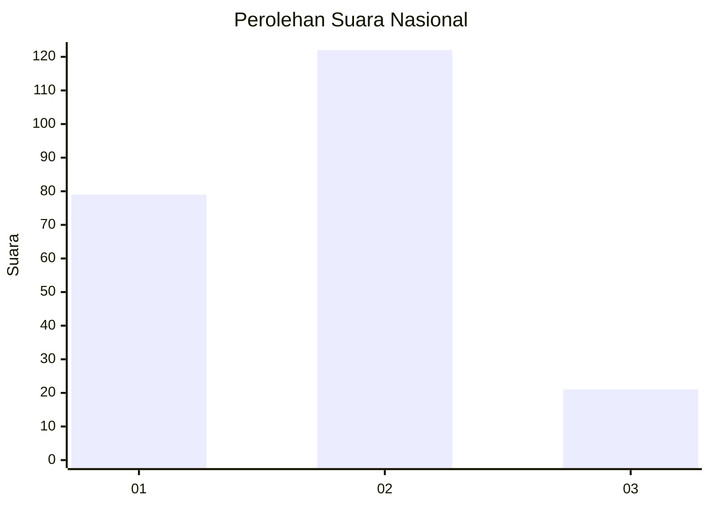

# Hasil

## Grafik

## Tabel

| No.    | Nama Paslon    | Suara | Suara (raw) | Persentase |
|:------ |:-------------- | -----:| -----------:| ----------:|
| 100025 | ANIES MUHAIMIN | 79    | [79][p-1]   | 35,59      |
| 100026 | PRABOWO GIBRAN | 122   | [122][p-2]  | 54,95      |
| 100027 | GANJAR MAHFUD  | 21    | [21][p-3]   | 9,46       |

[p-1]: https://github.com/gigit-pemilu/pemilu-2024/blob/main/pilpres/hitung-suara/sub/31-dki-jakarta/sub/73-jakarta-barat/sub/01-cengkareng/sub/1005-kapuk/sub/261-tps/sub/paslon-1.txt
[p-2]: https://github.com/gigit-pemilu/pemilu-2024/blob/main/pilpres/hitung-suara/sub/31-dki-jakarta/sub/73-jakarta-barat/sub/01-cengkareng/sub/1005-kapuk/sub/261-tps/sub/paslon-2.txt
[p-3]: https://github.com/gigit-pemilu/pemilu-2024/blob/main/pilpres/hitung-suara/sub/31-dki-jakarta/sub/73-jakarta-barat/sub/01-cengkareng/sub/1005-kapuk/sub/261-tps/sub/paslon-3.txt

## Foto C Plano

https://sirekap-obj-formc.kpu.go.id/1756/pemilu/ppwp/31/73/01/10/05/3173011005261-20240214-234305--f8676f1c-b75f-4200-8727-cd0e6189ddcc.jpg

https://sirekap-obj-formc.kpu.go.id/1756/pemilu/ppwp/31/73/01/10/05/3173011005261-20240214-234223--38c574a1-e405-4728-a84d-3d9f164308bb.jpg

https://sirekap-obj-formc.kpu.go.id/1756/pemilu/ppwp/31/73/01/10/05/3173011005261-20240214-234123--9fb9e61d-8643-44c6-8473-07045f2e9d46.jpg

## Metadata

| Key        | Value               |
| ---------- | ------------------- |
| Time Stamp | 2024-02-19 06:16:00 |

