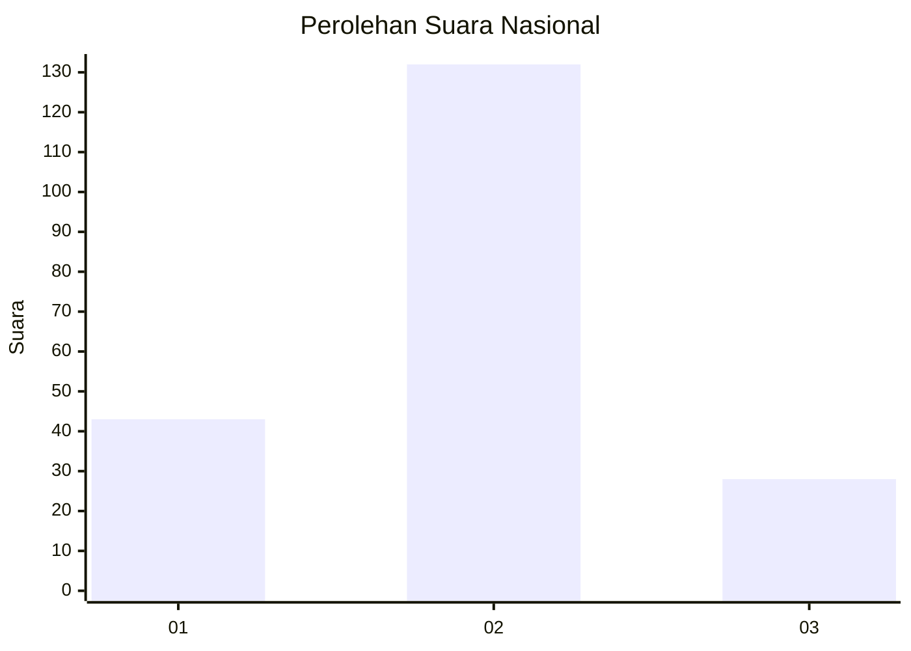
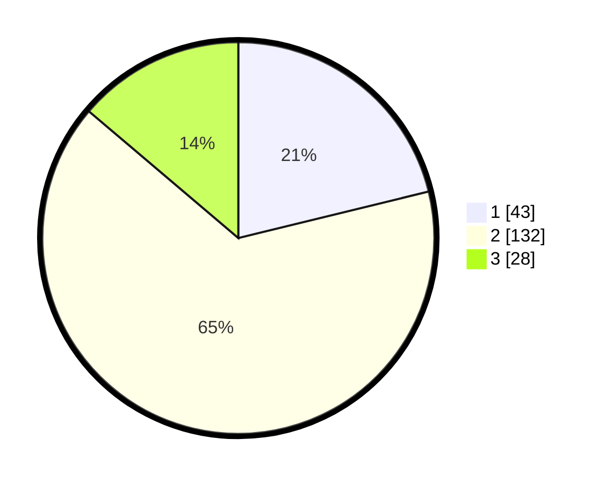

# Hasil

## Grafik

## Tabel

| No.    | Nama Paslon    | Suara | Suara (raw) | Persentase |
|:------ |:-------------- | -----:| -----------:| ----------:|
| 100025 | ANIES MUHAIMIN | 43    | [43][p-1]   | 21,18      |
| 100026 | PRABOWO GIBRAN | 132   | [132][p-2]  | 65,02      |
| 100027 | GANJAR MAHFUD  | 28    | [28][p-3]   | 13,79      |

[p-1]: https://github.com/gigit-pemilu/pemilu-2024/blob/main/pilpres/hitung-suara/sub/31-dki-jakarta/sub/73-jakarta-barat/sub/01-cengkareng/sub/1005-kapuk/sub/264-tps/sub/paslon-1.txt
[p-2]: https://github.com/gigit-pemilu/pemilu-2024/blob/main/pilpres/hitung-suara/sub/31-dki-jakarta/sub/73-jakarta-barat/sub/01-cengkareng/sub/1005-kapuk/sub/264-tps/sub/paslon-2.txt
[p-3]: https://github.com/gigit-pemilu/pemilu-2024/blob/main/pilpres/hitung-suara/sub/31-dki-jakarta/sub/73-jakarta-barat/sub/01-cengkareng/sub/1005-kapuk/sub/264-tps/sub/paslon-3.txt

## Foto C Plano

https://sirekap-obj-formc.kpu.go.id/d5ca/pemilu/ppwp/31/73/01/10/05/3173011005264-20240215-014739--baa2e230-b3df-4aaf-a8c2-4ee0b4de3bd4.jpg

https://sirekap-obj-formc.kpu.go.id/d5ca/pemilu/ppwp/31/73/01/10/05/3173011005264-20240215-014642--fbf3870a-bd5d-4605-b4a7-6ec334052a35.jpg

https://sirekap-obj-formc.kpu.go.id/d5ca/pemilu/ppwp/31/73/01/10/05/3173011005264-20240215-014934--dd565ebf-d7f6-4ddb-9f2d-25b9e7901b95.jpg

## Metadata

| Key        | Value               |
| ---------- | ------------------- |
| Time Stamp | 2024-02-19 06:16:00 |

