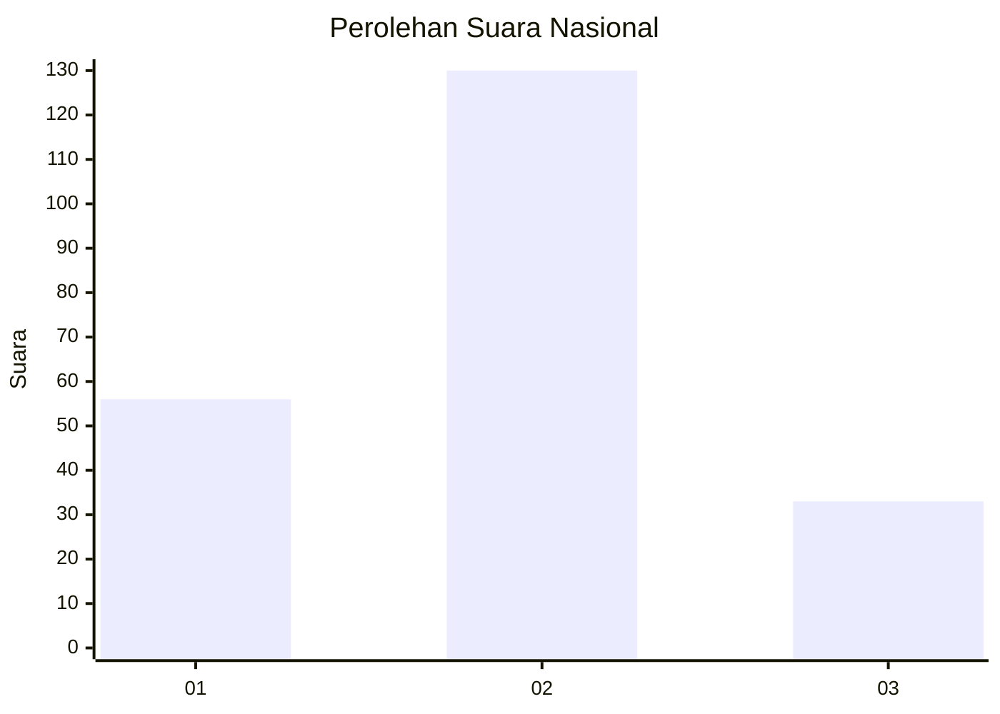

# Hasil

## Grafik

## Tabel

| No.    | Nama Paslon    | Suara | Suara (raw) | Persentase |
|:------ |:-------------- | -----:| -----------:| ----------:|
| 100025 | ANIES MUHAIMIN | 56    | [56][p-1]   | 25,57      |
| 100026 | PRABOWO GIBRAN | 130   | [130][p-2]  | 59,36      |
| 100027 | GANJAR MAHFUD  | 33    | [33][p-3]   | 15,07      |

[p-1]: https://github.com/gigit-pemilu/pemilu-2024/blob/main/pilpres/hitung-suara/sub/31-dki-jakarta/sub/73-jakarta-barat/sub/01-cengkareng/sub/1005-kapuk/sub/280-tps/sub/paslon-1.txt
[p-2]: https://github.com/gigit-pemilu/pemilu-2024/blob/main/pilpres/hitung-suara/sub/31-dki-jakarta/sub/73-jakarta-barat/sub/01-cengkareng/sub/1005-kapuk/sub/280-tps/sub/paslon-2.txt
[p-3]: https://github.com/gigit-pemilu/pemilu-2024/blob/main/pilpres/hitung-suara/sub/31-dki-jakarta/sub/73-jakarta-barat/sub/01-cengkareng/sub/1005-kapuk/sub/280-tps/sub/paslon-3.txt

## Foto C Plano

https://sirekap-obj-formc.kpu.go.id/2d66/pemilu/ppwp/31/73/01/10/05/3173011005280-20240214-230336--ac76eace-7ae0-4289-b34f-f6366685d27e.jpg

https://sirekap-obj-formc.kpu.go.id/2d66/pemilu/ppwp/31/73/01/10/05/3173011005280-20240214-230238--299cb700-b0e6-4092-817c-58766c200e7d.jpg

https://sirekap-obj-formc.kpu.go.id/2d66/pemilu/ppwp/31/73/01/10/05/3173011005280-20240214-230055--5c39d2ad-1921-4258-9777-17a677ccaefe.jpg

## Metadata

| Key        | Value               |
| ---------- | ------------------- |
| Time Stamp | 2024-02-19 06:16:00 |

