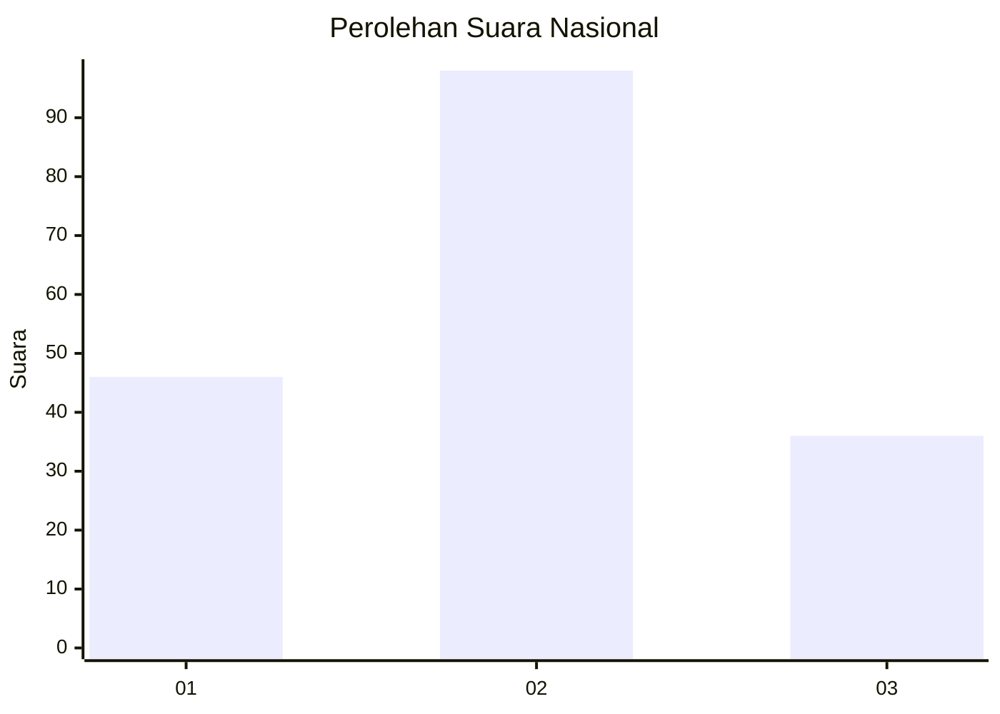
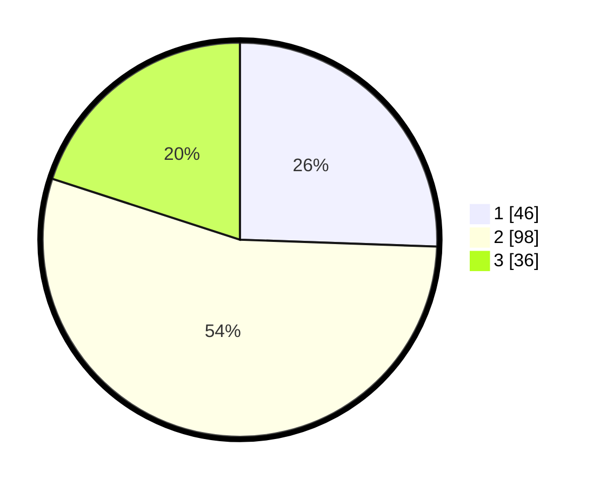

# Hasil

## Grafik

## Tabel

| No.    | Nama Paslon    | Suara | Suara (raw) | Persentase |
|:------ |:-------------- | -----:| -----------:| ----------:|
| 100025 | ANIES MUHAIMIN | 46    | [46][p-1]   | 25,56      |
| 100026 | PRABOWO GIBRAN | 98    | [98][p-2]   | 54,44      |
| 100027 | GANJAR MAHFUD  | 36    | [36][p-3]   | 20,00      |

[p-1]: https://github.com/gigit-pemilu/pemilu-2024/blob/main/pilpres/hitung-suara/sub/31-dki-jakarta/sub/73-jakarta-barat/sub/01-cengkareng/sub/1005-kapuk/sub/291-tps/sub/paslon-1.txt
[p-2]: https://github.com/gigit-pemilu/pemilu-2024/blob/main/pilpres/hitung-suara/sub/31-dki-jakarta/sub/73-jakarta-barat/sub/01-cengkareng/sub/1005-kapuk/sub/291-tps/sub/paslon-2.txt
[p-3]: https://github.com/gigit-pemilu/pemilu-2024/blob/main/pilpres/hitung-suara/sub/31-dki-jakarta/sub/73-jakarta-barat/sub/01-cengkareng/sub/1005-kapuk/sub/291-tps/sub/paslon-3.txt

## Foto C Plano

https://sirekap-obj-formc.kpu.go.id/c95e/pemilu/ppwp/31/73/01/10/05/3173011005291-20240215-024041--98e9275d-4190-4ed2-a354-a71000da0440.jpg

https://sirekap-obj-formc.kpu.go.id/c95e/pemilu/ppwp/31/73/01/10/05/3173011005291-20240214-225947--4304f21e-21e2-4de5-9c4b-f280b9a59b79.jpg

https://sirekap-obj-formc.kpu.go.id/c95e/pemilu/ppwp/31/73/01/10/05/3173011005291-20240214-230037--b2fdd587-f770-4898-a68b-fefb24afe124.jpg

## Metadata

| Key        | Value               |
| ---------- | ------------------- |
| Time Stamp | 2024-02-19 21:00:00 |

