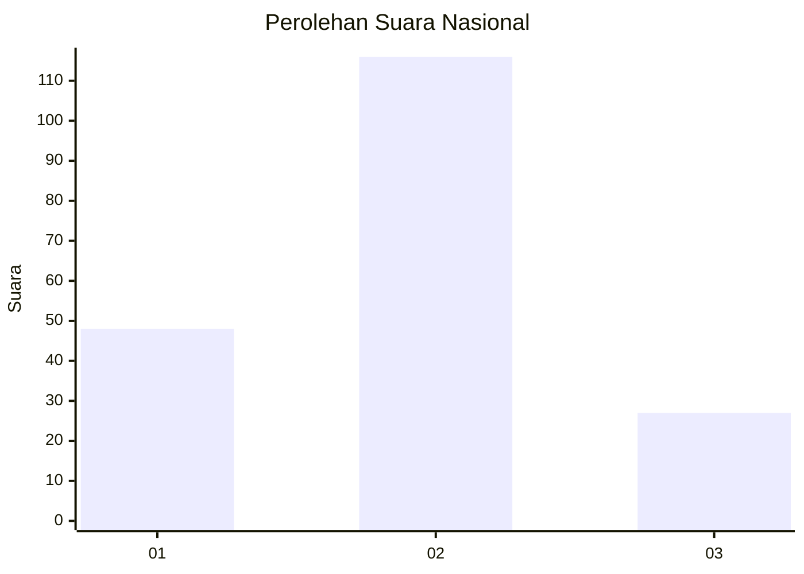
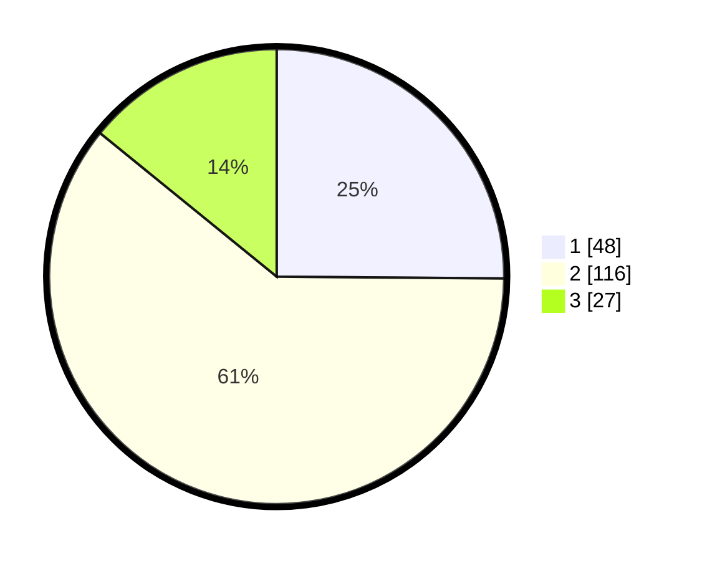

# Hasil

## Grafik

## Tabel

| No.    | Nama Paslon    | Suara | Suara (raw) | Persentase |
|:------ |:-------------- | -----:| -----------:| ----------:|
| 100025 | ANIES MUHAIMIN | 48    | [48][p-1]   | 25,13      |
| 100026 | PRABOWO GIBRAN | 116   | [116][p-2]  | 60,73      |
| 100027 | GANJAR MAHFUD  | 27    | [27][p-3]   | 14,14      |

[p-1]: https://github.com/gigit-pemilu/pemilu-2024/blob/main/pilpres/hitung-suara/sub/31-dki-jakarta/sub/73-jakarta-barat/sub/01-cengkareng/sub/1005-kapuk/sub/292-tps/sub/paslon-1.txt
[p-2]: https://github.com/gigit-pemilu/pemilu-2024/blob/main/pilpres/hitung-suara/sub/31-dki-jakarta/sub/73-jakarta-barat/sub/01-cengkareng/sub/1005-kapuk/sub/292-tps/sub/paslon-2.txt
[p-3]: https://github.com/gigit-pemilu/pemilu-2024/blob/main/pilpres/hitung-suara/sub/31-dki-jakarta/sub/73-jakarta-barat/sub/01-cengkareng/sub/1005-kapuk/sub/292-tps/sub/paslon-3.txt

## Foto C Plano

https://sirekap-obj-formc.kpu.go.id/03cd/pemilu/ppwp/31/73/01/10/05/3173011005292-20240215-023346--c079fe3a-3597-44c4-b288-e953e4d9ace3.jpg

https://sirekap-obj-formc.kpu.go.id/03cd/pemilu/ppwp/31/73/01/10/05/3173011005292-20240215-022903--37ce7c00-9a20-4a57-bd9a-e411fca0e25d.jpg

https://sirekap-obj-formc.kpu.go.id/03cd/pemilu/ppwp/31/73/01/10/05/3173011005292-20240215-022957--f5148841-ebd2-417e-bf3c-68ceda08b8a6.jpg

## Metadata

| Key        | Value               |
| ---------- | ------------------- |
| Time Stamp | 2024-02-19 06:16:00 |

