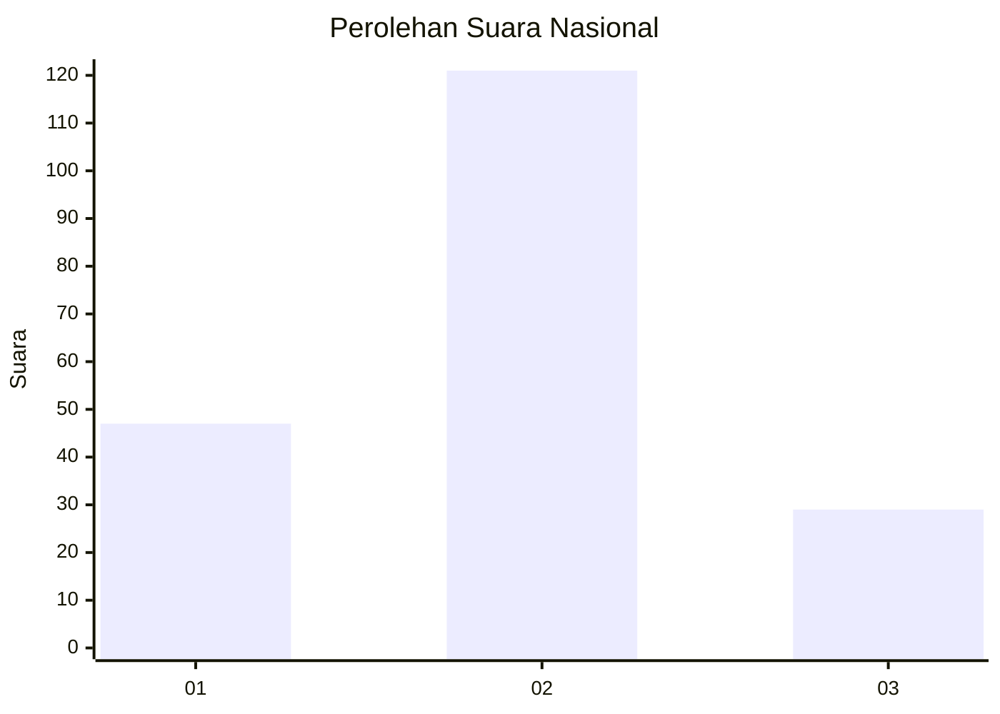
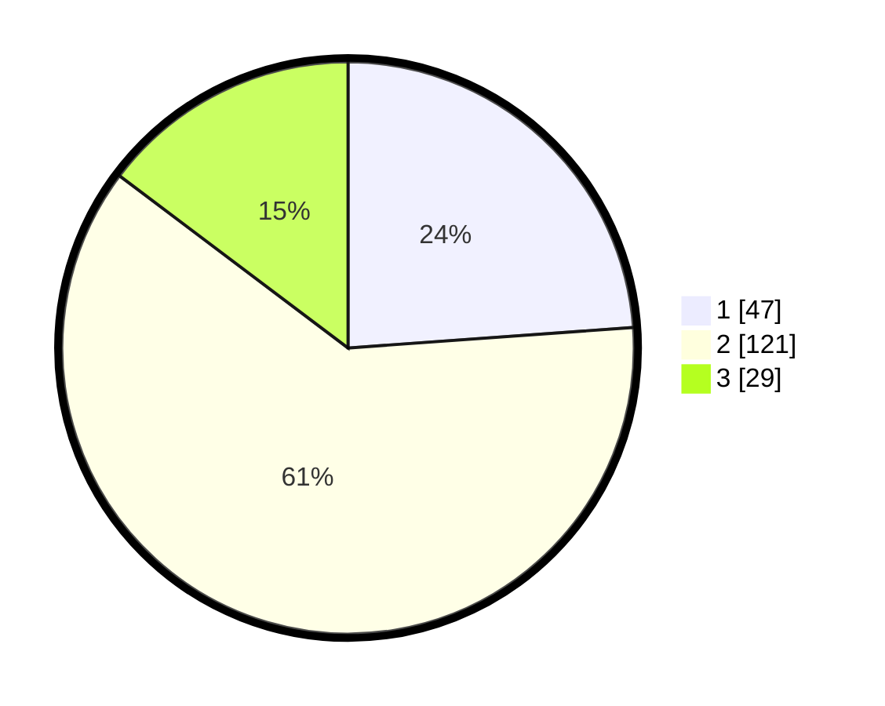

# Hasil

## Grafik

## Tabel

| No.    | Nama Paslon    | Suara | Suara (raw) | Persentase |
|:------ |:-------------- | -----:| -----------:| ----------:|
| 100025 | ANIES MUHAIMIN | 47    | [47][p-1]   | 23,86      |
| 100026 | PRABOWO GIBRAN | 121   | [121][p-2]  | 61,42      |
| 100027 | GANJAR MAHFUD  | 29    | [29][p-3]   | 14,72      |

[p-1]: https://github.com/gigit-pemilu/pemilu-2024/blob/main/pilpres/hitung-suara/sub/31-dki-jakarta/sub/73-jakarta-barat/sub/01-cengkareng/sub/1005-kapuk/sub/302-tps/sub/paslon-1.txt
[p-2]: https://github.com/gigit-pemilu/pemilu-2024/blob/main/pilpres/hitung-suara/sub/31-dki-jakarta/sub/73-jakarta-barat/sub/01-cengkareng/sub/1005-kapuk/sub/302-tps/sub/paslon-2.txt
[p-3]: https://github.com/gigit-pemilu/pemilu-2024/blob/main/pilpres/hitung-suara/sub/31-dki-jakarta/sub/73-jakarta-barat/sub/01-cengkareng/sub/1005-kapuk/sub/302-tps/sub/paslon-3.txt

## Foto C Plano

https://sirekap-obj-formc.kpu.go.id/5d1b/pemilu/ppwp/31/73/01/10/05/3173011005302-20240215-005616--ff44b071-15f0-40a3-a962-847d3960b5a1.jpg

https://sirekap-obj-formc.kpu.go.id/5d1b/pemilu/ppwp/31/73/01/10/05/3173011005302-20240215-005903--3f1a49e7-1c59-415b-a921-ed9656e043bf.jpg

https://sirekap-obj-formc.kpu.go.id/5d1b/pemilu/ppwp/31/73/01/10/05/3173011005302-20240215-010159--cab4c922-123b-4941-aac2-2bf3e693f8ec.jpg

## Metadata

| Key        | Value               |
| ---------- | ------------------- |
| Time Stamp | 2024-02-19 21:00:00 |

