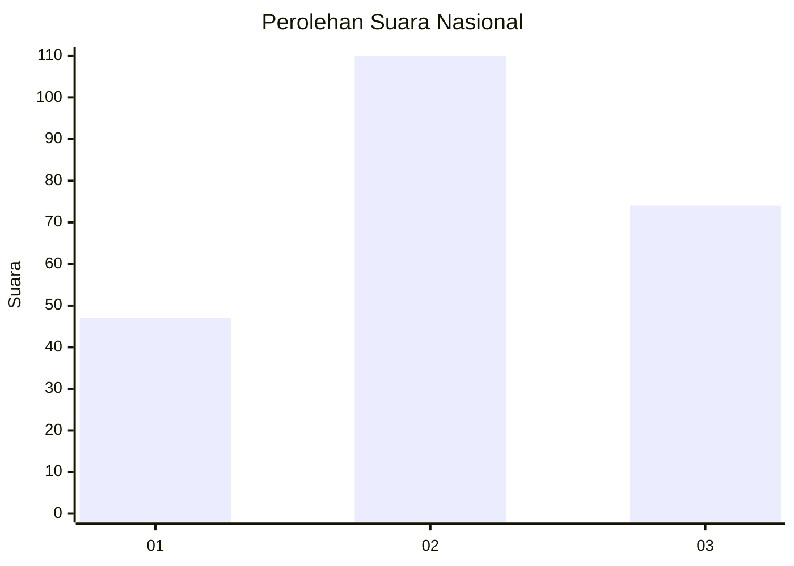
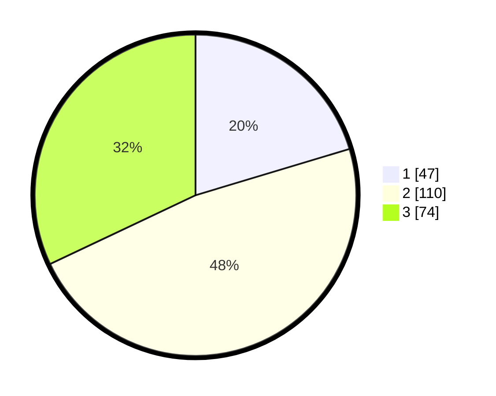

# Hasil

## Grafik

## Tabel

| No.    | Nama Paslon    | Suara | Suara (raw) | Persentase |
|:------ |:-------------- | -----:| -----------:| ----------:|
| 100025 | ANIES MUHAIMIN | 47    | [47][p-1]   | 20,35      |
| 100026 | PRABOWO GIBRAN | 110   | [110][p-2]  | 47,62      |
| 100027 | GANJAR MAHFUD  | 74    | [74][p-3]   | 32,03      |

[p-1]: https://github.com/gigit-pemilu/pemilu-2024/blob/main/pilpres/hitung-suara/sub/31-dki-jakarta/sub/73-jakarta-barat/sub/01-cengkareng/sub/1005-kapuk/sub/312-tps/sub/paslon-1.txt
[p-2]: https://github.com/gigit-pemilu/pemilu-2024/blob/main/pilpres/hitung-suara/sub/31-dki-jakarta/sub/73-jakarta-barat/sub/01-cengkareng/sub/1005-kapuk/sub/312-tps/sub/paslon-2.txt
[p-3]: https://github.com/gigit-pemilu/pemilu-2024/blob/main/pilpres/hitung-suara/sub/31-dki-jakarta/sub/73-jakarta-barat/sub/01-cengkareng/sub/1005-kapuk/sub/312-tps/sub/paslon-3.txt

## Foto C Plano

https://sirekap-obj-formc.kpu.go.id/f7f4/pemilu/ppwp/31/73/01/10/05/3173011005312-20240215-024340--6d8f3a83-5e69-4e8f-9c85-23e8642eef13.jpg

https://sirekap-obj-formc.kpu.go.id/f7f4/pemilu/ppwp/31/73/01/10/05/3173011005312-20240215-024533--c6c2757c-944f-4182-ab49-4552ecb59318.jpg

https://sirekap-obj-formc.kpu.go.id/f7f4/pemilu/ppwp/31/73/01/10/05/3173011005312-20240215-025042--8afeee0d-2e3f-493b-8584-5060fa75a5b6.jpg

## Metadata

| Key        | Value               |
| ---------- | ------------------- |
| Time Stamp | 2024-02-15 15:00:29 |

