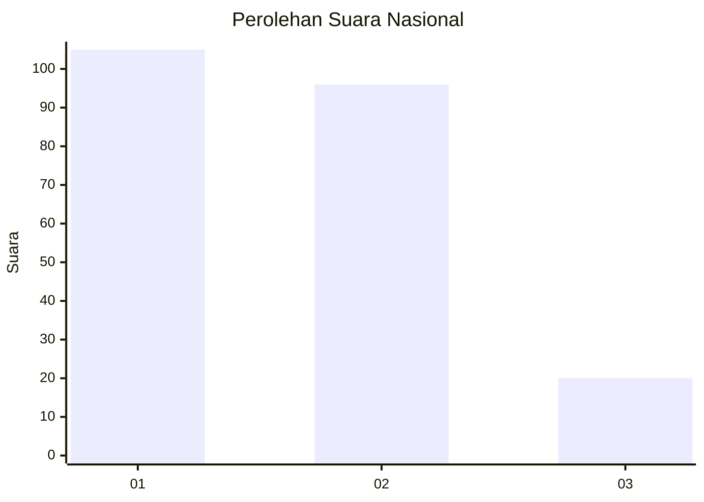
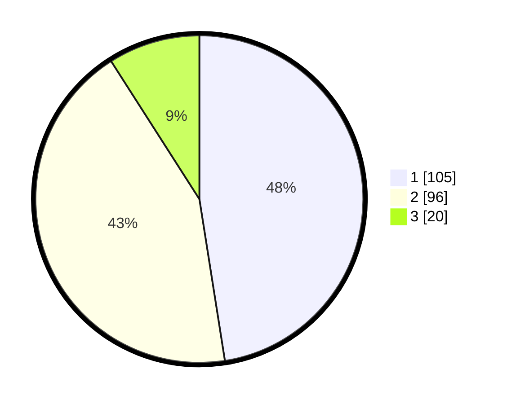

# Hasil

## Grafik

## Tabel

| No.    | Nama Paslon    | Suara | Suara (raw) | Persentase |
|:------ |:-------------- | -----:| -----------:| ----------:|
| 100025 | ANIES MUHAIMIN | 105   | [105][p-1]  | 47,51      |
| 100026 | PRABOWO GIBRAN | 96    | [96][p-2]   | 43,44      |
| 100027 | GANJAR MAHFUD  | 20    | [20][p-3]   | 9,05       |

[p-1]: https://github.com/gigit-pemilu/pemilu-2024/blob/main/pilpres/hitung-suara/sub/31-dki-jakarta/sub/73-jakarta-barat/sub/01-cengkareng/sub/1005-kapuk/sub/321-tps/sub/paslon-1.txt
[p-2]: https://github.com/gigit-pemilu/pemilu-2024/blob/main/pilpres/hitung-suara/sub/31-dki-jakarta/sub/73-jakarta-barat/sub/01-cengkareng/sub/1005-kapuk/sub/321-tps/sub/paslon-2.txt
[p-3]: https://github.com/gigit-pemilu/pemilu-2024/blob/main/pilpres/hitung-suara/sub/31-dki-jakarta/sub/73-jakarta-barat/sub/01-cengkareng/sub/1005-kapuk/sub/321-tps/sub/paslon-3.txt

## Foto C Plano

https://sirekap-obj-formc.kpu.go.id/e03c/pemilu/ppwp/31/73/01/10/05/3173011005321-20240215-011912--731a9758-f06c-4959-bf17-711d104d6a5e.jpg

https://sirekap-obj-formc.kpu.go.id/e03c/pemilu/ppwp/31/73/01/10/05/3173011005321-20240215-012033--3c8fd95f-a29a-4098-9f42-a7695c07a403.jpg

https://sirekap-obj-formc.kpu.go.id/e03c/pemilu/ppwp/31/73/01/10/05/3173011005321-20240215-012404--c8b1f368-5e5b-4732-bf14-e3f1f6ab5b66.jpg

## Metadata

| Key        | Value               |
| ---------- | ------------------- |
| Time Stamp | 2024-02-15 17:00:25 |

