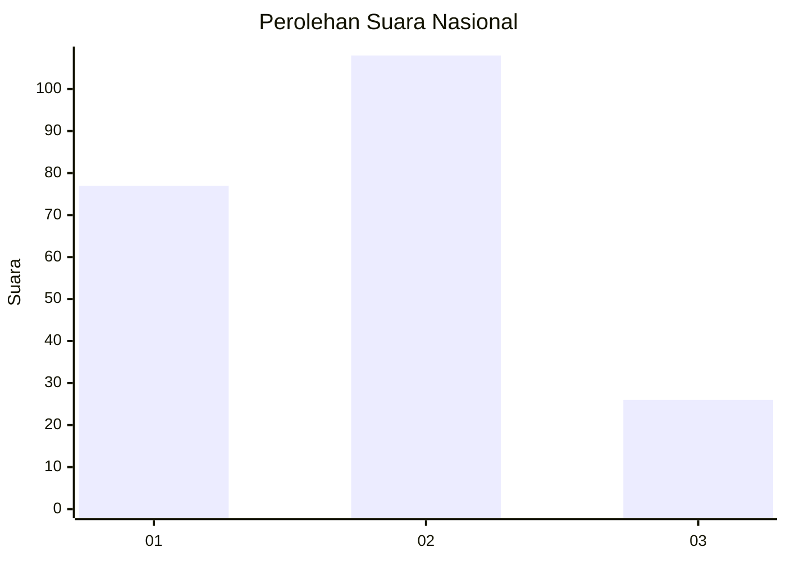
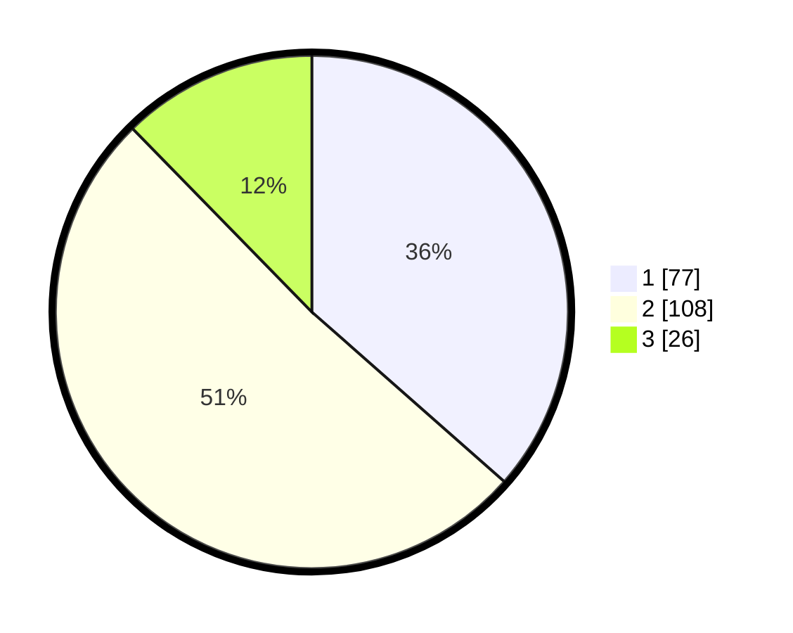

# Hasil

## Grafik

## Tabel

| No.    | Nama Paslon    | Suara | Suara (raw) | Persentase |
|:------ |:-------------- | -----:| -----------:| ----------:|
| 100025 | ANIES MUHAIMIN | 77    | [77][p-1]   | 36,49      |
| 100026 | PRABOWO GIBRAN | 108   | [108][p-2]  | 51,18      |
| 100027 | GANJAR MAHFUD  | 26    | [26][p-3]   | 12,32      |

[p-1]: https://github.com/gigit-pemilu/pemilu-2024/blob/main/pilpres/hitung-suara/sub/31-dki-jakarta/sub/73-jakarta-barat/sub/01-cengkareng/sub/1005-kapuk/sub/322-tps/sub/paslon-1.txt
[p-2]: https://github.com/gigit-pemilu/pemilu-2024/blob/main/pilpres/hitung-suara/sub/31-dki-jakarta/sub/73-jakarta-barat/sub/01-cengkareng/sub/1005-kapuk/sub/322-tps/sub/paslon-2.txt
[p-3]: https://github.com/gigit-pemilu/pemilu-2024/blob/main/pilpres/hitung-suara/sub/31-dki-jakarta/sub/73-jakarta-barat/sub/01-cengkareng/sub/1005-kapuk/sub/322-tps/sub/paslon-3.txt

## Foto C Plano

https://sirekap-obj-formc.kpu.go.id/eaba/pemilu/ppwp/31/73/01/10/05/3173011005322-20240214-215109--b4c8d523-8727-4570-b4fb-8c51808de783.jpg

https://sirekap-obj-formc.kpu.go.id/eaba/pemilu/ppwp/31/73/01/10/05/3173011005322-20240214-220824--27b4cf02-e939-48ef-a74e-a00f69deb438.jpg

https://sirekap-obj-formc.kpu.go.id/eaba/pemilu/ppwp/31/73/01/10/05/3173011005322-20240214-221108--9ccec054-7426-4d56-8cd0-020f07f46849.jpg

## Metadata

| Key        | Value               |
| ---------- | ------------------- |
| Time Stamp | 2024-02-19 21:00:00 |

