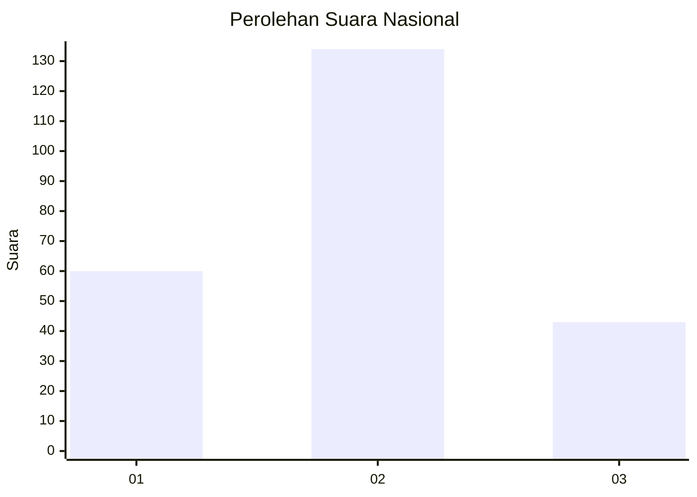
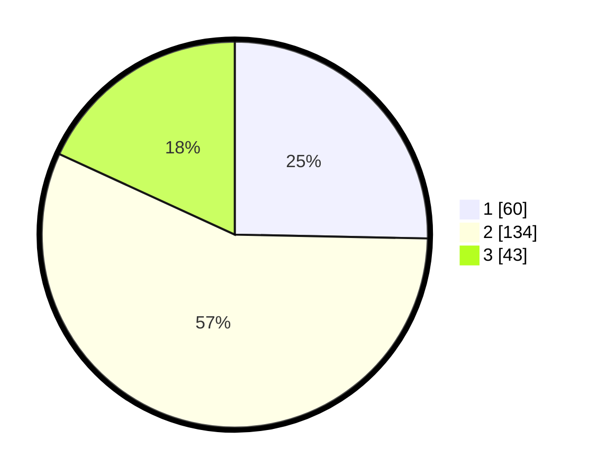

# Hasil

## Grafik

## Tabel

| No.    | Nama Paslon    | Suara | Suara (raw) | Persentase |
|:------ |:-------------- | -----:| -----------:| ----------:|
| 100025 | ANIES MUHAIMIN | 60    | [60][p-1]   | 25,32      |
| 100026 | PRABOWO GIBRAN | 134   | [134][p-2]  | 56,54      |
| 100027 | GANJAR MAHFUD  | 43    | [43][p-3]   | 18,14      |

[p-1]: https://github.com/gigit-pemilu/pemilu-2024/blob/main/pilpres/hitung-suara/sub/31-dki-jakarta/sub/73-jakarta-barat/sub/01-cengkareng/sub/1005-kapuk/sub/329-tps/sub/paslon-1.txt
[p-2]: https://github.com/gigit-pemilu/pemilu-2024/blob/main/pilpres/hitung-suara/sub/31-dki-jakarta/sub/73-jakarta-barat/sub/01-cengkareng/sub/1005-kapuk/sub/329-tps/sub/paslon-2.txt
[p-3]: https://github.com/gigit-pemilu/pemilu-2024/blob/main/pilpres/hitung-suara/sub/31-dki-jakarta/sub/73-jakarta-barat/sub/01-cengkareng/sub/1005-kapuk/sub/329-tps/sub/paslon-3.txt

## Foto C Plano

https://sirekap-obj-formc.kpu.go.id/a3a9/pemilu/ppwp/31/73/01/10/05/3173011005329-20240214-232906--f3203be5-11e2-4df2-99b1-efd379493c34.jpg

https://sirekap-obj-formc.kpu.go.id/a3a9/pemilu/ppwp/31/73/01/10/05/3173011005329-20240214-224316--1b644db6-de33-48ec-b867-d905a2e501f0.jpg

https://sirekap-obj-formc.kpu.go.id/a3a9/pemilu/ppwp/31/73/01/10/05/3173011005329-20240214-224447--0020e5ef-19d2-440b-8872-abe03a0ead39.jpg

## Metadata

| Key        | Value               |
| ---------- | ------------------- |
| Time Stamp | 2024-02-19 06:16:00 |

