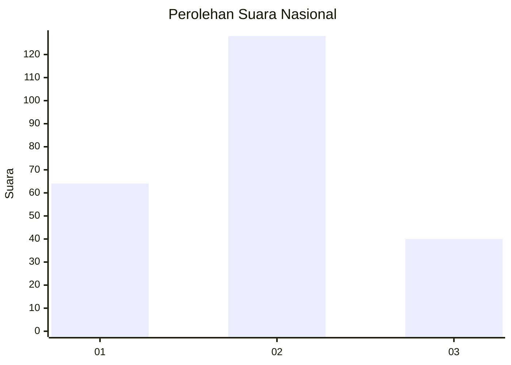
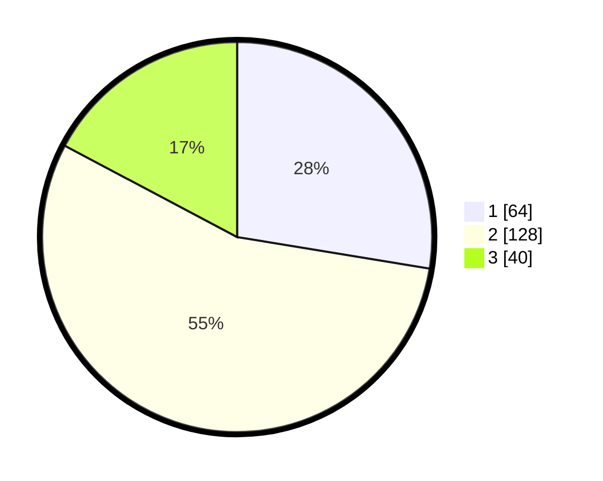

# Hasil

## Grafik

## Tabel

| No.    | Nama Paslon    | Suara | Suara (raw) | Persentase |
|:------ |:-------------- | -----:| -----------:| ----------:|
| 100025 | ANIES MUHAIMIN | 64    | [64][p-1]   | 27,59      |
| 100026 | PRABOWO GIBRAN | 128   | [128][p-2]  | 55,17      |
| 100027 | GANJAR MAHFUD  | 40    | [40][p-3]   | 17,24      |

[p-1]: https://github.com/gigit-pemilu/pemilu-2024/blob/main/pilpres/hitung-suara/sub/31-dki-jakarta/sub/73-jakarta-barat/sub/01-cengkareng/sub/1005-kapuk/sub/332-tps/sub/paslon-1.txt
[p-2]: https://github.com/gigit-pemilu/pemilu-2024/blob/main/pilpres/hitung-suara/sub/31-dki-jakarta/sub/73-jakarta-barat/sub/01-cengkareng/sub/1005-kapuk/sub/332-tps/sub/paslon-2.txt
[p-3]: https://github.com/gigit-pemilu/pemilu-2024/blob/main/pilpres/hitung-suara/sub/31-dki-jakarta/sub/73-jakarta-barat/sub/01-cengkareng/sub/1005-kapuk/sub/332-tps/sub/paslon-3.txt

## Foto C Plano

https://sirekap-obj-formc.kpu.go.id/0c1e/pemilu/ppwp/31/73/01/10/05/3173011005332-20240214-202548--c5a8da58-62b5-4a48-a2b2-a4561df0357b.jpg

https://sirekap-obj-formc.kpu.go.id/0c1e/pemilu/ppwp/31/73/01/10/05/3173011005332-20240214-202704--93f5a90b-75f9-4342-82af-ec6a398312fb.jpg

https://sirekap-obj-formc.kpu.go.id/0c1e/pemilu/ppwp/31/73/01/10/05/3173011005332-20240214-202825--39441c8a-1107-4fbb-b515-dffc0e85a52b.jpg

## Metadata

| Key        | Value               |
| ---------- | ------------------- |
| Time Stamp | 2024-02-15 20:30:46 |

