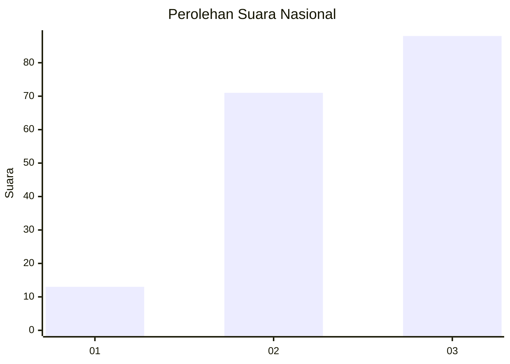
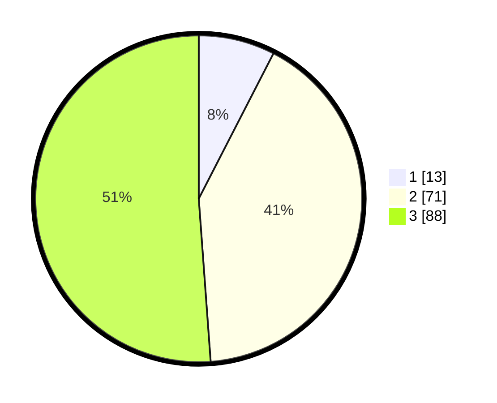

# Hasil

## Grafik

## Tabel

| No.    | Nama Paslon    | Suara | Suara (raw) | Persentase |
|:------ |:-------------- | -----:| -----------:| ----------:|
| 100025 | ANIES MUHAIMIN | 13    | [13][p-1]   | 7,56       |
| 100026 | PRABOWO GIBRAN | 71    | [71][p-2]   | 41,28      |
| 100027 | GANJAR MAHFUD  | 88    | [88][p-3]   | 51,16      |

[p-1]: https://github.com/gigit-pemilu/pemilu-2024/blob/main/pilpres/hitung-suara/sub/31-dki-jakarta/sub/73-jakarta-barat/sub/01-cengkareng/sub/1005-kapuk/sub/361-tps/sub/paslon-1.txt
[p-2]: https://github.com/gigit-pemilu/pemilu-2024/blob/main/pilpres/hitung-suara/sub/31-dki-jakarta/sub/73-jakarta-barat/sub/01-cengkareng/sub/1005-kapuk/sub/361-tps/sub/paslon-2.txt
[p-3]: https://github.com/gigit-pemilu/pemilu-2024/blob/main/pilpres/hitung-suara/sub/31-dki-jakarta/sub/73-jakarta-barat/sub/01-cengkareng/sub/1005-kapuk/sub/361-tps/sub/paslon-3.txt

## Foto C Plano

https://sirekap-obj-formc.kpu.go.id/9bc5/pemilu/ppwp/31/73/01/10/05/3173011005361-20240215-012116--e69ba39d-44c3-438e-9c89-7a8f4ce852b2.jpg

https://sirekap-obj-formc.kpu.go.id/9bc5/pemilu/ppwp/31/73/01/10/05/3173011005361-20240215-012255--47988340-25d6-49d5-8fcb-e196185570cb.jpg

https://sirekap-obj-formc.kpu.go.id/9bc5/pemilu/ppwp/31/73/01/10/05/3173011005361-20240215-012418--b82dc04e-91fc-46d6-9ccd-fb6b9acaed63.jpg

## Metadata

| Key        | Value               |
| ---------- | ------------------- |
| Time Stamp | 2024-02-19 21:00:00 |

