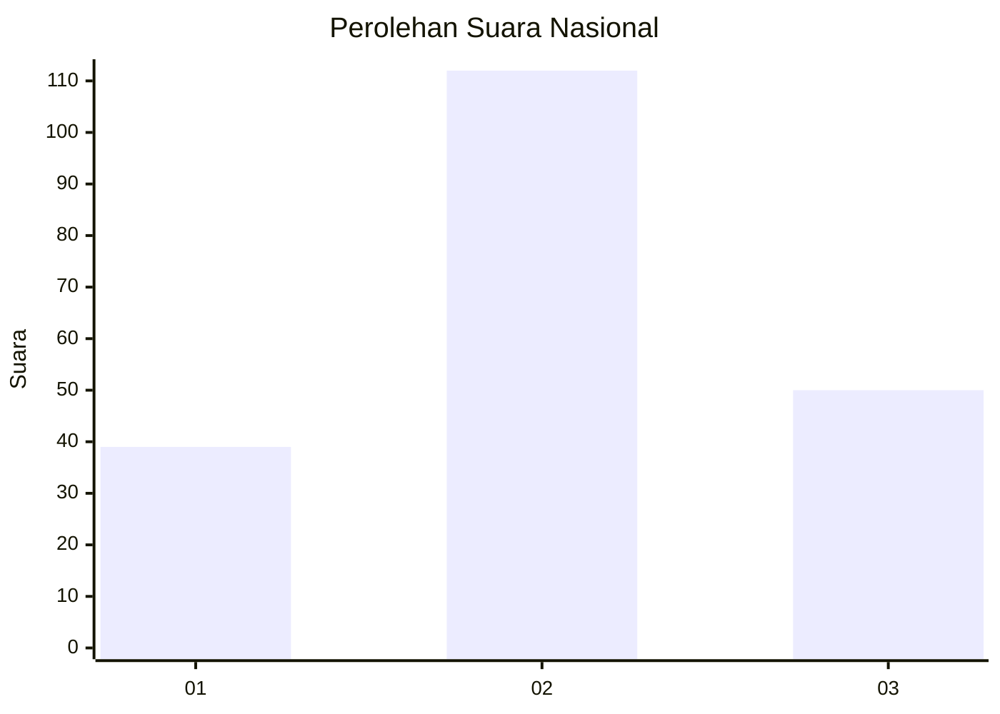
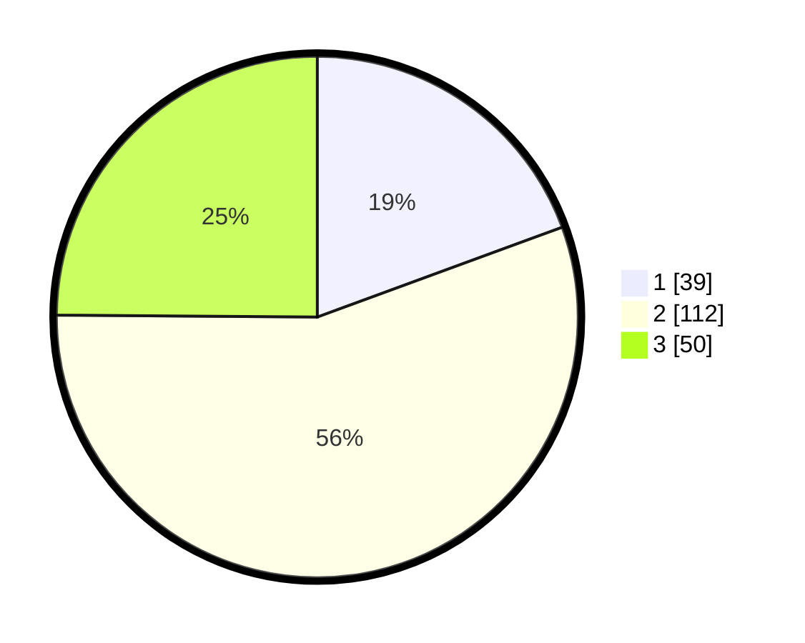

# Hasil

## Grafik

## Tabel

| No.    | Nama Paslon    | Suara | Suara (raw) | Persentase |
|:------ |:-------------- | -----:| -----------:| ----------:|
| 100025 | ANIES MUHAIMIN | 39    | [39][p-1]   | 19,40      |
| 100026 | PRABOWO GIBRAN | 112   | [112][p-2]  | 55,72      |
| 100027 | GANJAR MAHFUD  | 50    | [50][p-3]   | 24,88      |

[p-1]: https://github.com/gigit-pemilu/pemilu-2024/blob/main/pilpres/hitung-suara/sub/31-dki-jakarta/sub/73-jakarta-barat/sub/01-cengkareng/sub/1005-kapuk/sub/366-tps/sub/paslon-1.txt
[p-2]: https://github.com/gigit-pemilu/pemilu-2024/blob/main/pilpres/hitung-suara/sub/31-dki-jakarta/sub/73-jakarta-barat/sub/01-cengkareng/sub/1005-kapuk/sub/366-tps/sub/paslon-2.txt
[p-3]: https://github.com/gigit-pemilu/pemilu-2024/blob/main/pilpres/hitung-suara/sub/31-dki-jakarta/sub/73-jakarta-barat/sub/01-cengkareng/sub/1005-kapuk/sub/366-tps/sub/paslon-3.txt

## Foto C Plano

https://sirekap-obj-formc.kpu.go.id/d76a/pemilu/ppwp/31/73/01/10/05/3173011005366-20240214-230117--12b18abd-94a9-4abf-a24f-6a7be0b0212b.jpg

https://sirekap-obj-formc.kpu.go.id/d76a/pemilu/ppwp/31/73/01/10/05/3173011005366-20240215-025030--2879aa49-6f19-49f5-b2c3-6c390d576bc2.jpg

https://sirekap-obj-formc.kpu.go.id/d76a/pemilu/ppwp/31/73/01/10/05/3173011005366-20240214-230249--b2ce96fc-c775-4708-9765-5d7881e9294f.jpg

## Metadata

| Key        | Value               |
| ---------- | ------------------- |
| Time Stamp | 2024-02-19 21:00:00 |

