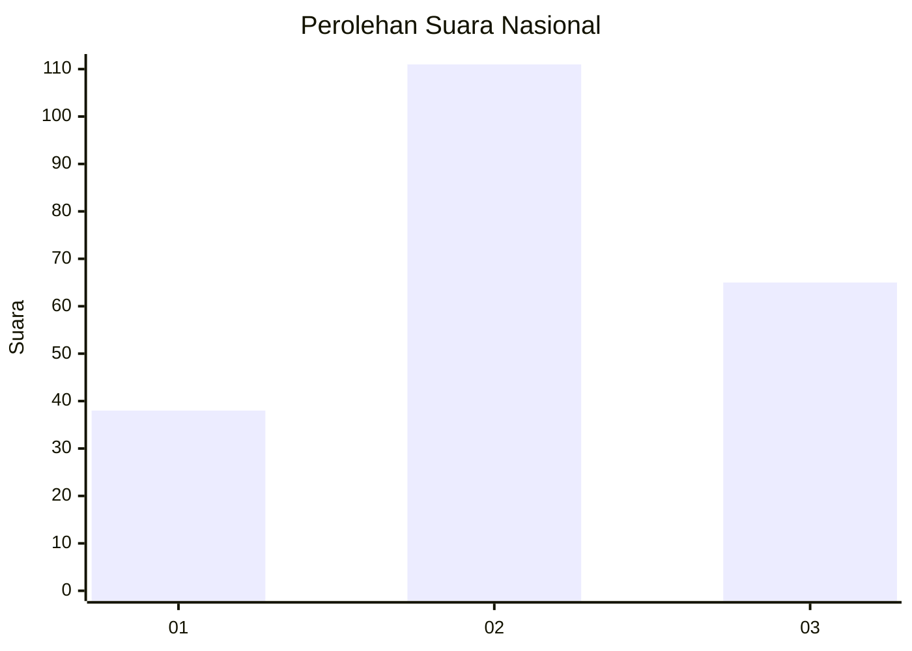
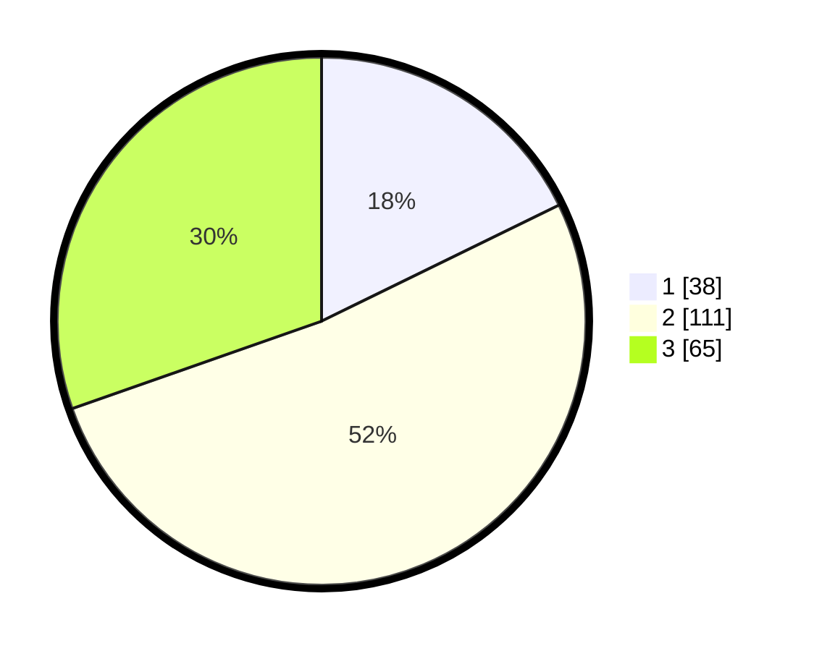

# Hasil

## Grafik

## Tabel

| No.    | Nama Paslon    | Suara | Suara (raw) | Persentase |
|:------ |:-------------- | -----:| -----------:| ----------:|
| 100025 | ANIES MUHAIMIN | 38    | [38][p-1]   | 17,76      |
| 100026 | PRABOWO GIBRAN | 111   | [111][p-2]  | 51,87      |
| 100027 | GANJAR MAHFUD  | 65    | [65][p-3]   | 30,37      |

[p-1]: https://github.com/gigit-pemilu/pemilu-2024/blob/main/pilpres/hitung-suara/sub/31-dki-jakarta/sub/73-jakarta-barat/sub/01-cengkareng/sub/1005-kapuk/sub/372-tps/sub/paslon-1.txt
[p-2]: https://github.com/gigit-pemilu/pemilu-2024/blob/main/pilpres/hitung-suara/sub/31-dki-jakarta/sub/73-jakarta-barat/sub/01-cengkareng/sub/1005-kapuk/sub/372-tps/sub/paslon-2.txt
[p-3]: https://github.com/gigit-pemilu/pemilu-2024/blob/main/pilpres/hitung-suara/sub/31-dki-jakarta/sub/73-jakarta-barat/sub/01-cengkareng/sub/1005-kapuk/sub/372-tps/sub/paslon-3.txt

## Foto C Plano

https://sirekap-obj-formc.kpu.go.id/8e11/pemilu/ppwp/31/73/01/10/05/3173011005372-20240214-232004--9b3274c3-789d-42e2-b6b4-ad50d20f427b.jpg

https://sirekap-obj-formc.kpu.go.id/8e11/pemilu/ppwp/31/73/01/10/05/3173011005372-20240214-232029--b8f5239e-0c6c-4e83-a8cb-38d5a9cc2634.jpg

https://sirekap-obj-formc.kpu.go.id/8e11/pemilu/ppwp/31/73/01/10/05/3173011005372-20240214-232105--495ab275-b3ad-4972-a8b6-b354fa99a61e.jpg

## Metadata

| Key        | Value               |
| ---------- | ------------------- |
| Time Stamp | 2024-02-19 06:16:00 |

