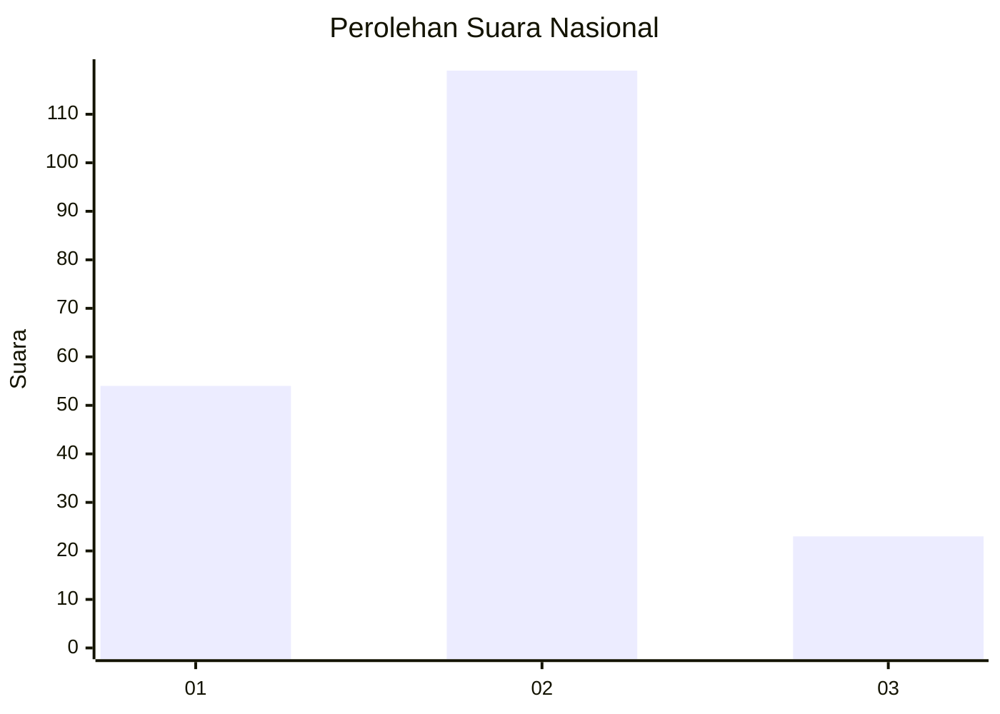
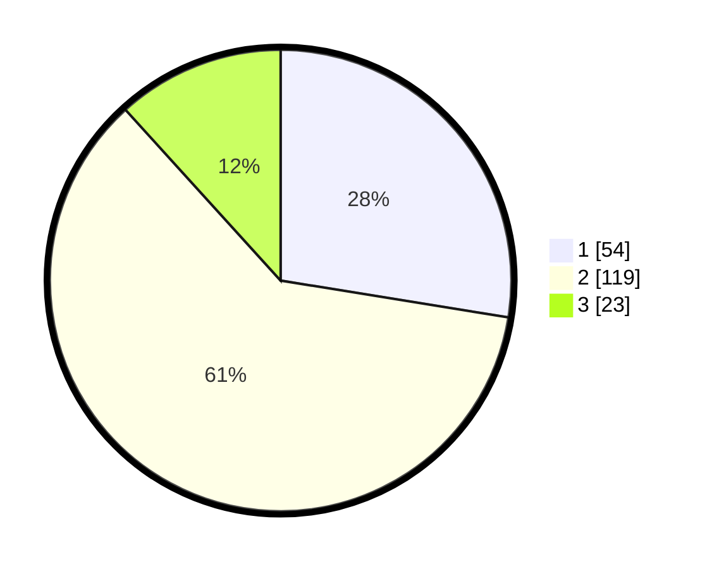

# Hasil

## Grafik

## Tabel

| No.    | Nama Paslon    | Suara | Suara (raw) | Persentase |
|:------ |:-------------- | -----:| -----------:| ----------:|
| 100025 | ANIES MUHAIMIN | 54    | [54][p-1]   | 27,55      |
| 100026 | PRABOWO GIBRAN | 119   | [119][p-2]  | 60,71      |
| 100027 | GANJAR MAHFUD  | 23    | [23][p-3]   | 11,73      |

[p-1]: https://github.com/gigit-pemilu/pemilu-2024/blob/main/pilpres/hitung-suara/sub/31-dki-jakarta/sub/73-jakarta-barat/sub/01-cengkareng/sub/1005-kapuk/sub/392-tps/sub/paslon-1.txt
[p-2]: https://github.com/gigit-pemilu/pemilu-2024/blob/main/pilpres/hitung-suara/sub/31-dki-jakarta/sub/73-jakarta-barat/sub/01-cengkareng/sub/1005-kapuk/sub/392-tps/sub/paslon-2.txt
[p-3]: https://github.com/gigit-pemilu/pemilu-2024/blob/main/pilpres/hitung-suara/sub/31-dki-jakarta/sub/73-jakarta-barat/sub/01-cengkareng/sub/1005-kapuk/sub/392-tps/sub/paslon-3.txt

## Foto C Plano

https://sirekap-obj-formc.kpu.go.id/ece6/pemilu/ppwp/31/73/01/10/05/3173011005392-20240215-014822--f9cf2462-3541-4f7a-9d38-cb9141ed5f5e.jpg

https://sirekap-obj-formc.kpu.go.id/ece6/pemilu/ppwp/31/73/01/10/05/3173011005392-20240215-050148--f7a7714b-d346-477e-9bda-0b621f44434e.jpg

https://sirekap-obj-formc.kpu.go.id/ece6/pemilu/ppwp/31/73/01/10/05/3173011005392-20240215-042655--ff6a45d6-fc24-4a0e-9dc0-0c7d69eefbc3.jpg

## Metadata

| Key        | Value               |
| ---------- | ------------------- |
| Time Stamp | 2024-02-19 06:16:00 |

