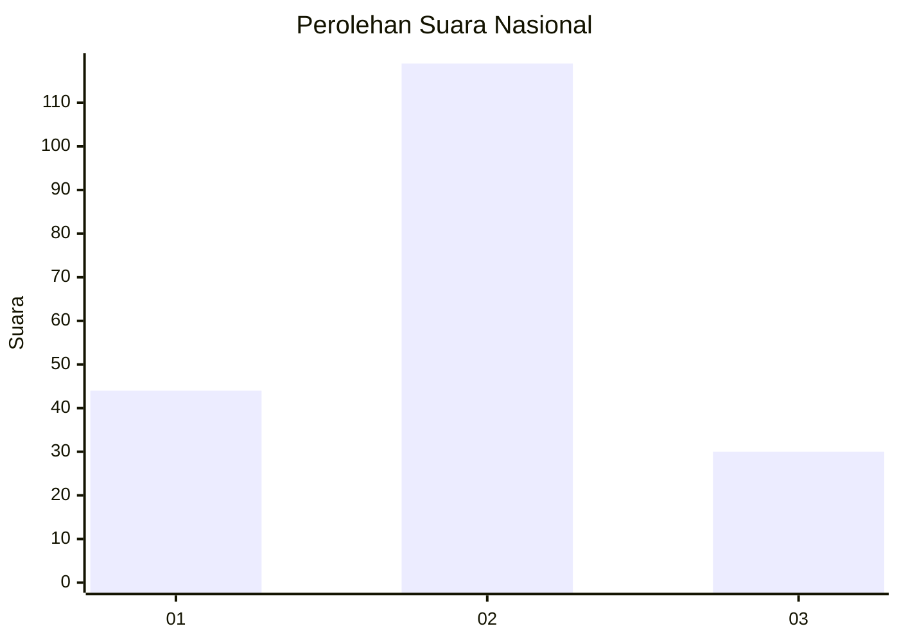
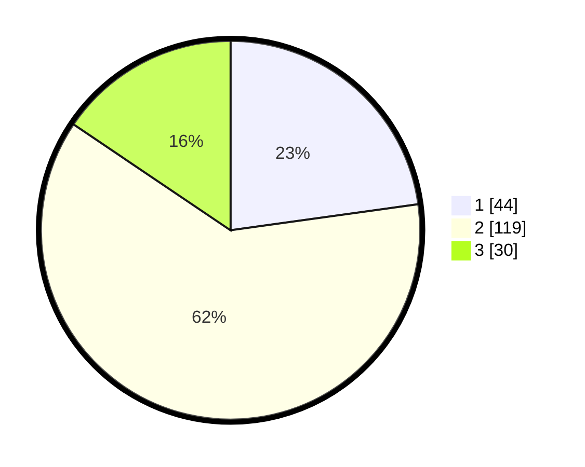

# Hasil

## Grafik

## Tabel

| No.    | Nama Paslon    | Suara | Suara (raw) | Persentase |
|:------ |:-------------- | -----:| -----------:| ----------:|
| 100025 | ANIES MUHAIMIN | 44    | [44][p-1]   | 22,80      |
| 100026 | PRABOWO GIBRAN | 119   | [119][p-2]  | 61,66      |
| 100027 | GANJAR MAHFUD  | 30    | [30][p-3]   | 15,54      |

[p-1]: https://github.com/gigit-pemilu/pemilu-2024/blob/main/pilpres/hitung-suara/sub/31-dki-jakarta/sub/73-jakarta-barat/sub/01-cengkareng/sub/1005-kapuk/sub/393-tps/sub/paslon-1.txt
[p-2]: https://github.com/gigit-pemilu/pemilu-2024/blob/main/pilpres/hitung-suara/sub/31-dki-jakarta/sub/73-jakarta-barat/sub/01-cengkareng/sub/1005-kapuk/sub/393-tps/sub/paslon-2.txt
[p-3]: https://github.com/gigit-pemilu/pemilu-2024/blob/main/pilpres/hitung-suara/sub/31-dki-jakarta/sub/73-jakarta-barat/sub/01-cengkareng/sub/1005-kapuk/sub/393-tps/sub/paslon-3.txt

## Foto C Plano

https://sirekap-obj-formc.kpu.go.id/dfd3/pemilu/ppwp/31/73/01/10/05/3173011005393-20240215-023840--9b9dce7e-5682-4914-a892-58348655794a.jpg

https://sirekap-obj-formc.kpu.go.id/dfd3/pemilu/ppwp/31/73/01/10/05/3173011005393-20240215-023942--e96388ab-65e1-4e73-973c-c1296e3f51d7.jpg

https://sirekap-obj-formc.kpu.go.id/dfd3/pemilu/ppwp/31/73/01/10/05/3173011005393-20240215-024450--55e396b7-35e7-4f54-8a52-c77186177935.jpg

## Metadata

| Key        | Value               |
| ---------- | ------------------- |
| Time Stamp | 2024-02-19 21:00:00 |

