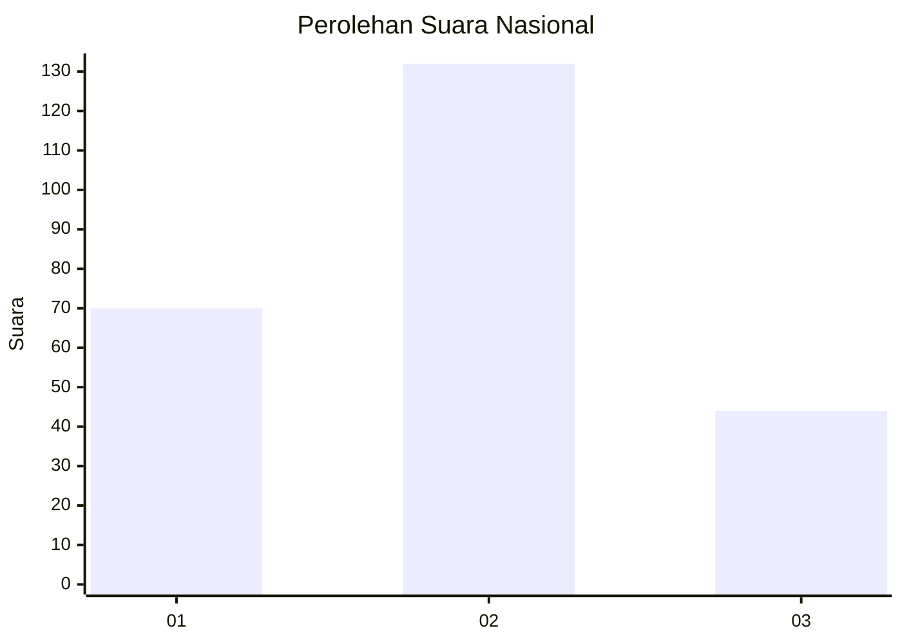
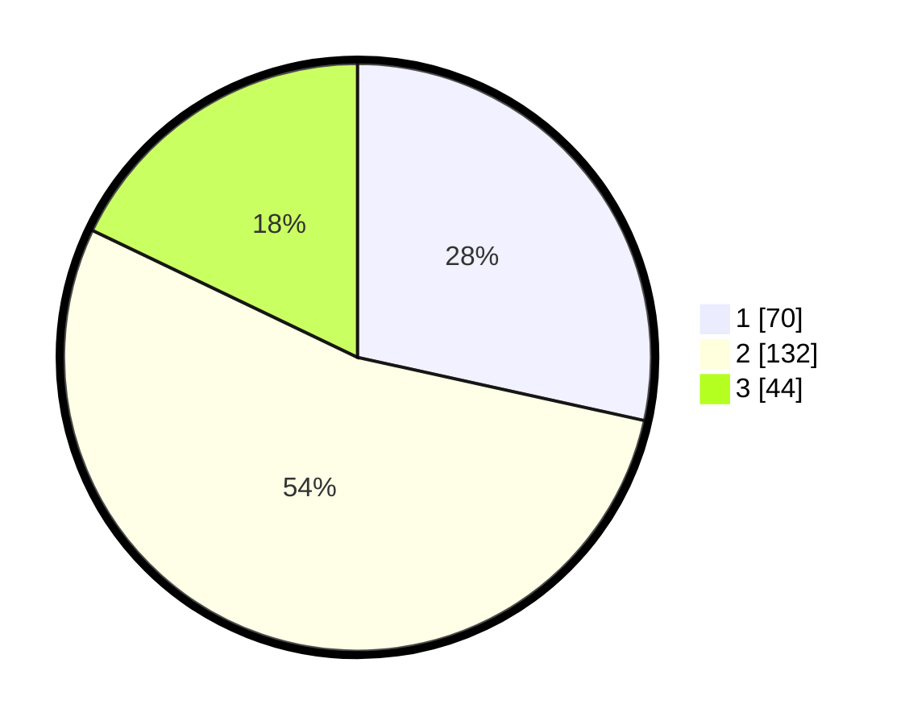

# Hasil

## Grafik

## Tabel

| No.    | Nama Paslon    | Suara | Suara (raw) | Persentase |
|:------ |:-------------- | -----:| -----------:| ----------:|
| 100025 | ANIES MUHAIMIN | 70    | [70][p-1]   | 28,46      |
| 100026 | PRABOWO GIBRAN | 132   | [132][p-2]  | 53,66      |
| 100027 | GANJAR MAHFUD  | 44    | [44][p-3]   | 17,89      |

[p-1]: https://github.com/gigit-pemilu/pemilu-2024/blob/main/pilpres/hitung-suara/sub/31-dki-jakarta/sub/73-jakarta-barat/sub/01-cengkareng/sub/1005-kapuk/sub/400-tps/sub/paslon-1.txt
[p-2]: https://github.com/gigit-pemilu/pemilu-2024/blob/main/pilpres/hitung-suara/sub/31-dki-jakarta/sub/73-jakarta-barat/sub/01-cengkareng/sub/1005-kapuk/sub/400-tps/sub/paslon-2.txt
[p-3]: https://github.com/gigit-pemilu/pemilu-2024/blob/main/pilpres/hitung-suara/sub/31-dki-jakarta/sub/73-jakarta-barat/sub/01-cengkareng/sub/1005-kapuk/sub/400-tps/sub/paslon-3.txt

## Foto C Plano

https://sirekap-obj-formc.kpu.go.id/9772/pemilu/ppwp/31/73/01/10/05/3173011005400-20240215-003205--dfdefd79-f3a1-4529-818e-f3a749ede874.jpg

https://sirekap-obj-formc.kpu.go.id/9772/pemilu/ppwp/31/73/01/10/05/3173011005400-20240215-003604--7545a6e3-ea93-4938-89a8-e806c029d87f.jpg

https://sirekap-obj-formc.kpu.go.id/9772/pemilu/ppwp/31/73/01/10/05/3173011005400-20240215-004336--a7c6c25e-f62a-42a4-a50f-aea8e074a40e.jpg

## Metadata

| Key        | Value               |
| ---------- | ------------------- |
| Time Stamp | 2024-02-19 06:16:00 |

