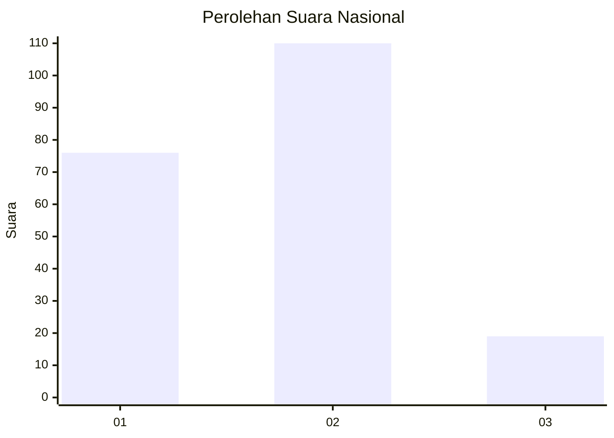

# Hasil

## Grafik

## Tabel

| No.    | Nama Paslon    | Suara | Suara (raw) | Persentase |
|:------ |:-------------- | -----:| -----------:| ----------:|
| 100025 | ANIES MUHAIMIN | 76    | [76][p-1]   | 37,07      |
| 100026 | PRABOWO GIBRAN | 110   | [110][p-2]  | 53,66      |
| 100027 | GANJAR MAHFUD  | 19    | [19][p-3]   | 9,27       |

[p-1]: https://github.com/gigit-pemilu/pemilu-2024/blob/main/pilpres/hitung-suara/sub/31-dki-jakarta/sub/73-jakarta-barat/sub/01-cengkareng/sub/1005-kapuk/sub/441-tps/sub/paslon-1.txt
[p-2]: https://github.com/gigit-pemilu/pemilu-2024/blob/main/pilpres/hitung-suara/sub/31-dki-jakarta/sub/73-jakarta-barat/sub/01-cengkareng/sub/1005-kapuk/sub/441-tps/sub/paslon-2.txt
[p-3]: https://github.com/gigit-pemilu/pemilu-2024/blob/main/pilpres/hitung-suara/sub/31-dki-jakarta/sub/73-jakarta-barat/sub/01-cengkareng/sub/1005-kapuk/sub/441-tps/sub/paslon-3.txt

## Foto C Plano

https://sirekap-obj-formc.kpu.go.id/57a0/pemilu/ppwp/31/73/01/10/05/3173011005441-20240214-222831--9f402f0a-84a3-4c3f-85ea-b604b1e106ab.jpg

https://sirekap-obj-formc.kpu.go.id/57a0/pemilu/ppwp/31/73/01/10/05/3173011005441-20240214-223006--ec81edab-81bf-4a7a-9583-fa7bacfa8aad.jpg

https://sirekap-obj-formc.kpu.go.id/57a0/pemilu/ppwp/31/73/01/10/05/3173011005441-20240214-223204--3989ff9d-aae1-49a9-8ccf-d88d8d47c4e1.jpg

## Metadata

| Key        | Value               |
| ---------- | ------------------- |
| Time Stamp | 2024-02-19 21:00:00 |

